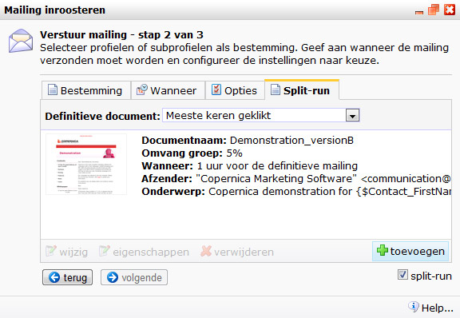
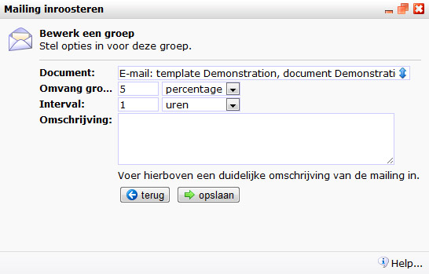

# Testen
Voordat je je e-mail gaat sturen wil je deze uiteraard even testen. De punten hieronder behandelen op welke dingen je dient te letten, zodat jou mail goed bij de klant aankomt!

## Personalisatie testen

Als je bezig bent met het ontwikkelen van een gepersonaliseerde mailing, dan
wil je vaak even een *sneak preview* zien om te controleren of de personalisatie 
wel uitpakt zoals je dat hebt bedoeld. Voor dit doel is er een *standaardbestemming*.

### De bewerkmodus instellen

Onderaan een document, naast de button voor de 
[personalisatieinstellingen](emailings-publisher-personalisatie#personalization_settings), vind je de button
voor de bewerkmodus. Met deze button kun je de weergave van het document
veranderen.

Er zijn vier mogelijke instellingen, en ze spreken allemaal nogal voor zich:

    * bewerkmode, met gepersonaliseerde content
    * bewerkmode, nog niet gepersonaliseerd (smarty variabelen zijn zichtbaar)
    * preview mode, met gepersonaliseerde content
    * preview mode, nog niet gepersonaliseerd
    
Eigenlijk zijn het twee verschillende instellingen: (1) wil je het document 
weergeven in bewerkmodes of previewmodus, en (2) wil je dat de Smarty variabelen
direct worden ingevuld of niet?

Als je het document in bewerkmodus weergeeft, dan zijn de contentblokken 
aanklikbaar. Dit is meestal de handigste mode omdat je direct de teksten die 
je wilt wijzigen kunt aanklikken. Af en schakel je over naar de previewmodus 
om te zien hoe de ontvanger het bericht zal zien.

Daarnaast kun je kiezen of je de ruwe Smarty variabelen wilt zien of niet. 
Als je kiest voor het tonen van variabelen, dan zie je de variabelen
precies zoals je ze hebt ingevoerd (dus {$voornaam}, {$achternaam}, enzovoort).
Als je echter omschakelt naar de gepersonaliseerde modus, dan worden al deze
variabelen vervangen door de echte waardes van een profiel uit je database.

### De standaardbestemming instellen

In je database kun je één profiel aanwijzen als *standaardbestemming*. Dit
is het profiel dat wordt gebruikt om de variabelen in te vullen. Als je
variabelen in een document opneemt (zoals {$voornaam} en {$achternaam}), en
je schakelt de gepersonaliseerde modus in, dan zullen de voor- en achternaam
van dit profiel worden getoond op de plaats van de variabelen.

Je kunt op twee manieren de standaardbestemming invoeren: vanuit het profielenbeheer
en vanuit het helpmenu. In het profielenbeheer open je het profiel dat je voor
de standaardbestemming wilt gebruiken, en daarna kies je voor de optie 
"standaardbestemming instellen".

Vanuit het helpmenu kan het ook. Als je de de link "welkom <jouw naam>" klikt,
kom je bij een dialoogvenstertje met jouw persoonlijke instellingen. Hier is
ook een tabblad om de standaardbestemming in te stellen.

De standaardbestemming is gekoppeld aan je persoonlijke login. Een collega
die toegang heeft tot hetzelfde account zou een heel andere standaardbestemming
kunnen hebben.

## Test mail versturen
Het makkelijskte manier is een testmail naar de standaardbestemming te sturen, vaak ben je dit zelf. Om een testmail te sturen ga je naar **mailings > testmail verzenden**, klik vervolgens als de instellingen goed staan op verzenden. 
Het is ook mogelijk een testmail naar meerdere mensen te sturen. Maak een [selectie](./database-selections-introduction) aan die alle test profielen bevat en stuur hier vervolgens een [bulkmail](./emailings-publisher-sending) naartoe. 
Om verschillende varianten van een mail te testen kan een split-run gebruikt worden, hieronder wordt er meer uitgelegd over de split-run.

## Split-run

Bij een split-run e-mailing (vaak ook A/B-test genoemd) is het mogelijk
verschillende documenten op te stellen voor dezelfde bulkmailing. De
verschillende versies worden eerst naar een beperkt aantal contacten
verstuurd om te zien welke versie het meeste resultaat oplevert onder
die contacten. Op basis van de resultaten van deze testmailings, stuurt
de applicatie vervolgens de hoogst scorende versie naar de overige
contacten.

Test bijvoorbeeld eens:

-   Hoe verschillende onderwerpregels scoren
-   Twee compleet verschillende lay-outs van de e-mail nieuwsbrief.
    Bijvoorbeeld een oude versus een nieuwe lay-out
-   Een andere tone of voice of benadering
-   Een gepersonaliseerde en een niet-(of minder uitgebreid)
    gepersonaliseerde versie
-   Of jouw relaties eerder geneigd zijn op een blauwe dan op een groene
    knop te drukken
-   Vul hier een eigen creatief idee in…

Je kan het winnende document laten bepalen aan de hand van kliks,
impressies of fouten. Ook is het mogelijk zelf een script te schrijven
met de Javascript editor.

De resultaten van de testdocumenten en de individuele mailing zijn
natuurlijk terug te vinden bij de statistieken.

### Opzetten van een split-run mailing
Zorg eerst dat je de verschillende documenten klaar hebt staan. Je kan
zoveel documenten in de test betrekken als je zelf wilt. Maar drie
documenten lijkt ons wetenschappelijk het meest verantwoord (twee
testversies, en een controleversie).

Geef de documenten onderscheidende namen, bijvoorbeeld document A,
document B, en document C, zodat je later goed kunt terugzien welk
document het meest succesvol was.

Zorg dat alle documenten zijn voorzien van afzenderinformatie en een
onderwerp

### Instellen van de split-run mailing

Het versturen van een split run werkt hetzelfde als het versturen van
een normale bulk e-mailing, maar met een extra stap. Selecteer een van
de documenten, en open het bulk-mailing venster. Selecteer de
doelselectie of –miniselectie, en selecteer rechts onderin de optie
split-run. Er verschijnt een nieuw tabblad Split-run. Open deze.

### Documenten toevoegen

In de bovenste helft van het split-run dialoogvenster staan de
documenten die worden gebruikt voor de split-run mailing. Klik op
*'toevoegen'* om documenten toe te voegen. \
\

Selecteer een document en kies de omvang van de testgroep en de interval
van versturen van het document.

**Omvang groep:** stel de grootte van de testpopulatie in.

**Interval:** hiermee geef je aan na hoeveel tijd er moet worden
overgegaan tot de definitieve verzending.

-   Als je een document A instelt met een interval van 1 uur, dan wordt
    het document 1 uur voor de definitieve verzending verstuurd.
-   Als je een document B instelt met een interval van 2 uur, dan wordt
    dit document 2 uur voor de definitieve verzending verstuurd.
-   Wanneer je beide documenten een gelijke interval geeft, dan worden
    deze tegelijkertijd verzonden naar de testgroep. 

**Let op:** wanneer je een mailing inroostert voor latere verzending,
wordt er teruggerekend vanaf het tijdstip waarop de mailing voor
verzending ingeroosterd staat. Dus wanneer je een mailing inroostert
voor verzending op dinsdag 12u00, met een interval van 1 uur, dan wordt
het test-document op dinsdag om 11u00 verzonden.

Optioneel kan je een omschrijving geven aan het testdocument. De
omschrijving is alleen voor gebruikers van de applicatie inzichtelijk.

### Versturen van de split-run

Om het document te versturen, klik je in het dialoogvenster op
**volgende**. Is deze knop nog gedeactiveerd? Bekijk alle instellingen nog
even na. Is er een doelselectie geselecteerd, en heeft deze de juiste gebruikersmogelijkheden?

Controleer voordat je gaat versturen de gegevens en instellingen in het
overzicht, en als je zeker van je zaak bent, geef je een tedere aai over
de verzendknop. Na bevestiging van deze actie, zal de mailing verstuurd
worden.

### Bekijken van de resultaten

Om de resultaten van de split-run mailing te bekijken, ga je naar
*Mailings \>***Statistieken**. Zoek de mailing in de lijst, en open het
rapport. Hier kan je per document informatie terugvinden over de kliks,
impressies, fouten en dergelijke. Uiteraard zie je ook welk document
gewonnen heeft, en hoe deze uiteindelijk heeft gescoord.

## Spamrating

Een goed opgemaakte e-mailcampagne moet natuurlijk op een
goede deliverability kunnen rekenen. Door op een paar simpele punten te
letten verlaag je de spamrating en waardoor e-mailings beter aankomen.

### Wat is spamrating?

Spamfilters onderscheppen inkomende e-mails en bepalen aan de hand van
verschillende tests of een e-mail het label spam krijgt toegewezen. De
e-mail krijgt strafpunten voor elke test waar hij niet voor slaagt.
Teveel strafpunten (spamrating) en de e-mail wordt geblokkeerd.

### Afzender en onderwerp

De eerste stap in het creëren van een spamvrije e-mail is het correct
instellen van de afzender en het onderwerp. Gebruik als afzender een
bestaand e-mailadres en vul een goed, niet te lang onderwerp in. Let
goed op de gebruikte woorden.

### Tekst in de e-mailing

Vermijd in het onderwerp en in de rest van de e-mailing het gebruik van
spamgevoelige woorden. Dit geldt niet alleen voor merknamen zoals
Viagra, maar ook voor woorden als "gratis" en "speciaal aanbod". Ook het
gebruik van onnodige spaties tussen letters geeft extra strafpunten, net
als teveel hoofdletters en uitroeptekens.

Misschien sta je er niet direct bij stil, maar een normale Nederlandse
naam als Dick de Cock geeft onbedoeld een hele hoge spamrating.

Een tekstversie van je HTML-nieuwsbrief is niet alleen handig voor
e-mailprogramma's die geen HTML ondersteunen, het verlaagt tevens je
spamrating. Zorg dat beide versies zo goed mogelijk overeenkomen.
Schrijf de hyperlinks uiteraard wel volledig uit. "Meld je nu aan" werkt
niet in de tekstversie, gebruik daar bijvoorbeeld "Meld je aan op
www.copernica.com".

### Gebruik van afbeeldingen

Teveel afbeeldingen in een e-mailing, of alleen maar afbeeldingen,
levert veel strafpunten op. Zorg voor een goede balans tussen de
hoeveelheid tekst en afbeeldingen. Er is geen harde regel, maar gebruik
tenminste één paragraaf aan tekst voor elke afbeelding.

Voor een mooie opmaak van de e-mailing is het soms noodzakelijk om een
opvulafbeelding te gebruiken, de zogenaamde spacer. Voorheen heette deze
bijvoorbeeld spacer.gif of pixel.gif. Het is beter om deze namen te
vermijden en deze afbeelding bijvoorbeeld nixel.gif te noemen.

Ook te lange bestandsnamen zijn spamgevoelig. Een afbeelding genaamd
"Copernica\_logo\_groot.jpg" is wel duidelijk, maar namen als "1.jpg" en
"2.jpg" komen beter door de spamkeuring. Als je de spamscore zo laag
mogelijk wilt houden, gebruik je best afbeeldingsnamen van max. 3
karakters. Wil je de afbeelding toch een volledige naam meegeven, voeg
deze dan toe in de alt-tag van de afbeelding.

### Check je spamrating

Een spamrating is op verschillende manieren te controleren. Het kan
ingebouwd zijn in een e-mailverzendprogramma. Copernica Marketing
Software checkt e-mails automatisch op spamgevoeligheid. Je kunt ook een
spamchecker installeren voor je browser.

### Spam score: LINK_TEXT_DOES_NOT_MATCH_LINK

Deze waarschuwing wordt regelmatig weergegeven bij het bekijken van de
spamscore van een document en levert bij veel gebruikers vragen op.
Temeer omdat er twee strafpunten aan verbonden zijn. Gelukkig is de
melding vrij eenvoudig te verhelpen.

Je krijgt deze melding als in het e-mail document dat je wilt versturen
een hyperlink is gevonden die de link URL als link tekst heeft.

    <a href="http://www.google.com">http://www.google.com</a>

#### Wat moet ik doen?

Gebruik geen hyperlink -of iets dat daar op lijkt- in de hyperlink
tekst.Gebruik in plaats daarvan een omschrijving van de link.

    <a href="http://www.google.com">Ga naar de homepage van Google</a>

