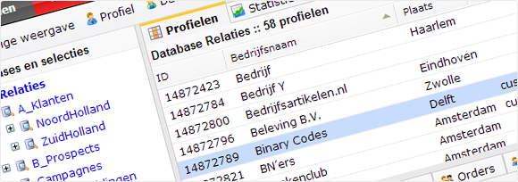

Email marketing is een belangrijke manier om je doelgroep te informeren
en bezoekers naar je website te krijgen. Met de email marketing software
van Copernica maak, test en verzend je snel en gemakkelijk professionele
en slimme email marketing campagnes.

Bepaal je eigen email marketing strategie
-----------------------------------------

Je eigen database is een onmisbare email marketing tool. Met Copernica
richt je jouw eigen
[database](http://www.copernica.com/nl/functies/profielen/maak-je-eigen-database "Maak je eigen database")
in zoals jij dat wilt. Bovendien houd je hem gemakkelijk actueel door
gebruik te maken van
[opvolgacties](http://www.copernica.com/nl/functies/e-mailings/automatiseer-je-campagnes "Automatiseer je campagnes").
Zo heb je altijd een actueel overzicht van je laatste relatiegegevens
die je kunt gebruiken bij het opstellen van een email marketing
strategie.

Creëer je eigen email campagnes
-------------------------------

Gebruik Copernica en stel je gemakkelijk diverse email marketing
campagnes op. Ontwerp je email campagne in onze software, of importeer
een al bestaande template om te gebruiken voor je email campagne. Hulp
nodig bij het ontwerp of bij het gebruik van HTML? In ons
[partnernetwerk](http://www.copernica.com/nl/ondersteuning/vind-een-partner "Vind een partner")
is altijd wel een geschikte partij te vinden die je kan helpen bij het
behalen van meer email marketing succes.

Personaliseer email marketing
-----------------------------

Met Copernica [personaliseer je email
campagnes](http://www.copernica.com/nl/functies/e-mailings/maak-zelf-slimme-e-mailings "Maak zelf slimme e-mailings")
op basis van verschillende waarden uit je database. Spreek een ontvanger
persoonlijk aan, of vermeld zijn bedrijfsnaam in de tekst. Maar het
personaliseren van email campagnes kan ook op basis van andere
informatie dan persoonsgegevens. Kies er bijvoorbeeld voor een speciale
aanbieding alleen te tonen aan klanten die al zes maanden niets meer
hebben gekocht in je webwinkel.

Test je email campagnes
-----------------------

Testen is onmisbaar in email marketing. Met behulp van
[split-run-tests](http://www.copernica.com/nl/functies/e-mailings/test-voor-je-verzendt "Test voor je verzendt")
bepaal je eenvoudig en snel welke email campagne het beste bij je
doelgroep past.

Verstuur automatisch emails met marketing automation
----------------------------------------------------

Waarom moeite steken in email campagnes handmatig te verzenden als het
ook automatisch kan? Met de [follow
up-manager](http://www.copernica.com/nl/functies/e-mailings/automatiseer-je-campagnes "Automatiseer je campagnes")
van Copernica verloopt je email marketing volledig automatisch. Stuur
iemand bijvoorbeeld een email een week nadat hij een product heeft
gekocht. Feliciteer relaties op hun verjaardag. Of herinner iemand aan
een achtergelaten winkelwagen in jouw webshop. Het zijn slechts enkele
voorbeelden van de vele mogelijkheden die Copernica biedt om meer uit je
e-commerce te halen met marketing automation.

Bekijk uitgebreide email statistieken
-------------------------------------

Meten is weten. In Copernica beschik je over uitgebreide [email
statistieken](http://www.copernica.com/nl/functies/e-mailings/bekijk-gedetailleerde-e-mailstatistieken "Bekijk gedetailleerde e-mailstatistieken")
die helpen je email marketing campagnes te optimaliseren. Welke
nieuwsbrief heeft de meeste opens? Op welke hyperlink wordt vaak
geklikt? Welke inhoud levert de meeste traffic naar je website op? Meet
het allemaal met Copernica.

Maak gebruik van integraties
----------------------------

Wil je jouw CMS koppelen aan je email marketing software? Of koppel je
liever je webshop om bijvoorbeeld een abandoned shopping cart-mail te
versturen? Copernica biedt, samen met zijn partners, een groot aantal
[integraties](http://www.copernica.com/nl/ondersteuning/integraties "Integraties")
die je kunt gebruiken om verschillende systemen aan Copernica te
koppelen en zo het beste uit meerdere werelden te halen.

