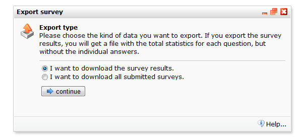

De resultaten van de ingevulde enquêtes kunnen worden geëxporteerd.
Bijvoorbeeld om deze verder te analyseren met SPSS of Excel.

Je exporteert de resultaten via het menu *Enquête* \> **Resultaten
exporteren**

Je hebt hier de volgende twee opties:

-   **alleen de resultaten exporteren.**Dit geeft een som weer van hoe
    vaak elk antwoord op elke vraag is gegeven. Vergelijkbaar met het
    resultaatoverzicht in de applicatie zelf.
-   **alle antwoorden exporteren.**Dit geeft een compleet overzicht van
    de antwoorden per respondent.

Beide exports kan je doen naar een XML of een tabgescheiden bestand.
Tabgescheiden is het meest geschikt voor bijvoorbeeld Excel.

*Afbeelding: het exporteervenster met de exporteer opties*
