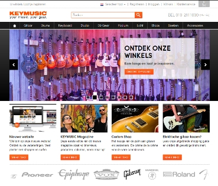

Met de EPiServer integratie ben je in staat alle gebruikersdata vanuit
EPiServer automatisch te synchroniseren met je gebruikersprofielen
binnen Copernica Marketing Software. Met behulp van de integratie zet je
gemakkelijk gerichte marketingcampagnes op binnen Copernica op basis van
data die je haalt uit EPiServer CMS. Bij Copernica beschikken we
momenteel over twee verschillende EpiServer integraties, de EpiServer
CMS6 integratie en de EpiServer CMS7 + Commerce integratie.

\

[Download de integraties](#episerver-integrations "Download de EPiServer integraties")

De kracht van de EPiServer integraties
--------------------------------------

-   Gebruik al je klant - en ordergegevens vanuit EPiServer Commerce om
    je [e-mailings te
    personaliseren](./maak-zelf-slimme-email-templates.md "Maak en personaliseer zelf e-mailings")
-   Automatische synchronisatie tussen de EPiServer en Copernica
    Marketing Software
-   Volg [verlaten
    winkelwagentjes](./automatiseer-je-campagnes.md "Automatiseer je campagnes")
    automatisch op per e-mail
-   Stuur je trouwste klanten een persoonlijke kortingscode die ze
    kunnen gebruiken in je webshop
-   Geschikt voor zowel CMS6 als CMS7

Enkele voorbeelden van EPiServer webwinkels
-------------------------------------------

Diverse bekende webwinkels maken gebruik van EPiServer en Copernica
Marketing Software, zoals:

+-------------------------------------------------------------------------------------------+
| ### Keymusic                                                                              |
+-------------------------------------------------------------------------------------------+
|                |
+-------------------------------------------------------------------------------------------+
| ### Nationale Apotheek                                                                    |
+-------------------------------------------------------------------------------------------+
|  |
+-------------------------------------------------------------------------------------------+
| [Download de                                                                              |
| integraties](#episerver-integrations "Download de EPiServer integraties")                 |
+-------------------------------------------------------------------------------------------+

Inspiratie voor jouw EPiServer webwinkel
----------------------------------------

Wil je nog meer leren over de mogelijkheden van Copernica en EPiServer?
Wij schrijven op regelmatige basis ook artikelen over de inzet van
e-mailmarketing door webwinkeliers. Hieronder vind je een greep uit deze
content:

-   [5 tips voor extra omzet uit je verlaten
    winkelwagen](./5-tips-voor-extra-omzet-via-je-verlaten-winkelwagen-e-mail.md)
-   [Hoe versterkt e-mailmarketing je eCommerce
    activiteiten?](./hoe-versterkt-e-mailmarketing-je-e-commerce-activiteiten.md)
-   [Haal meer omzet uit je bezoekers: 3 valkuilen om op te
    letten](./haal-meer-omzet-uit-je-bezoekers-3-valkuilen-om-op-te-letten.md)

Naast artikelen organiseren we ook op regelmatige basis interessante
[productdemonstraties](./productdemonstraties.md)
en seminars voor de Ecommerce branche. Hieronder vind je de komende data
waarop deze evenementen plaatsvinden. Wil je hier graag bij zijn?
Schrijf je dan in via [de
aanmeldpagina](./aanmelden-productdemonstratie.md).

-   Dinsdag 25 maart: Seminar EPiServer & Copernica, Amsterdam

Copernica partners
------------------

De integratie met EPiServer is ontwikkeld en wordt onderhouden door onze
registered partner
[Arlanet](https://www.copernica.com/nl/partners/profile/7017139).

Over EPiServer CMS6
-------------------

De integratie met EPiServer CMS6 wordt binnen de Administratie modus
gefaciliteerd, waarmee er snel een eenmalige of synchroniserende
koppeling kan worden gelegd met Copernica. Vanuit deze koppeling kunnen
de velden eenvoudig worden uitgebreid en gekoppeld worden met de
profielendatabase.

EPiServer wordt met name ingezet door high-end websites vanwege de
sterke community functionaliteit en personalisatie-mogelijkheden.

*Deze Copernica integratie is ontwikkeld door een derde partij.
Copernica is daarom niet verantwoordelijk voor de goede werking van de
integratie.*

Download
--------

**Ontwikkeld door:** [Arlanet](http://www.arlanet.nl/ "Arlanet")\
**Datum:** 26 oktober, 2012\
**Versie:** 1.0.0\
**Licentie:** OSL\
**Bestandsgrootte:** 13,3 MB\
[Handleiding](Copernicacom/Copernica-Episerver-Manual.pdf "Handleiding EPiServer")\
\
[Download](Copernicacom/EpiServerCopernicaPlugin.rar.rar "Download EPiServer plugin")

Over EPiServer CMS7 + Commerce
------------------------------

De integratie met EPiServer wordt als plugin geleverd, waarmee er snel
een automatische koppeling kan worden gelegd met Copernica. Vanuit deze
koppeling kunnen de velden via een mapping veld eenvoudig worden
uitgebreid en gekoppeld worden met de het CMS of de Commerce instantie.

EPiServer wordt met name ingezet door high-end websites vanwege de
sterke community functionaliteit en personalisatie-mogelijkheden.

*Deze Copernica integratie is ontwikkeld door een derde partij.
Copernica is daarom niet verantwoordelijk voor de goede werking van de
integratie.*

Download
--------

**Ontwikkeld door:** [Arlanet](http://www.arlanet.nl/ "Arlanet")\
**Datum:** 4 november, 2013\
**Versie:** 1.0.0\
**Licentie:** OSL\
**Bestandsgrootte:** 6,24 MB\
[Handleiding](Copernicacom/Episerver-commerce-handleiding.pdf "Handleiding EPiServer")\
\
[Download](Copernicacom/EPiServer-Commerce-koppeling.zip "Download EPiServer plugin")
