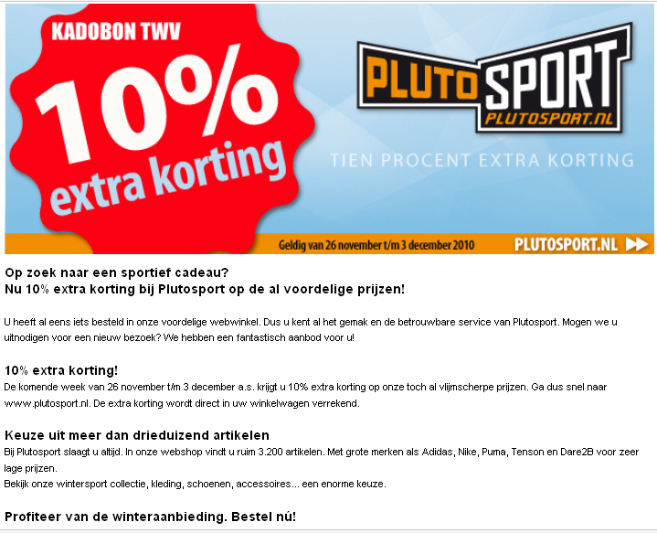
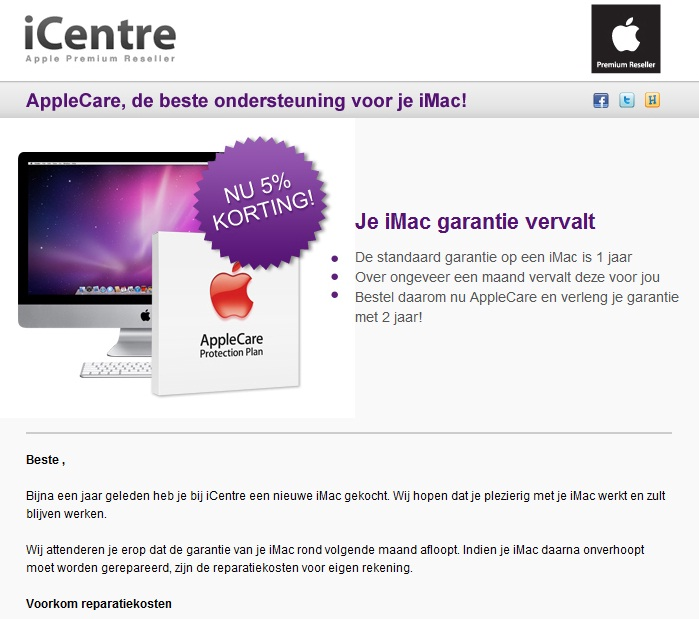
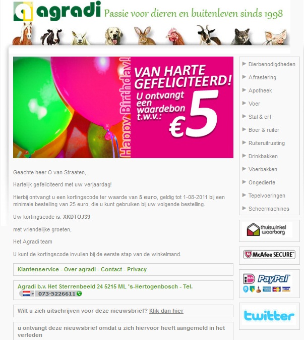

Heb jij al eens een e-mail ontvangen waarin een organisatie jou een
gelukkige verjaardag wenste? Of een mail waarin werd aangeraden bepaalde
producten te kopen die jou wel leuk leken? Deze vorm van
[e-mailmarketing](./email-marketing-functionaliteiten.md "Copernica e-mailings")
noemt men ook wel event driven campagnes. Hoe werkt een event driven
campagne en wat kun je er mee?

Ouderwetse klantenservice in een nieuw jasje
--------------------------------------------

Wat is er nou leuker aan winkelen dan een verkoper die jou precies de
juiste informatie weet te geven? Maar welke verkoper houdt dat nou
allemaal bij? Ben je een loyale klant, weten ze hooguit je voor- of
achternaam en misschien wat van je voorkeuren. Maar gegevens als
verjaardag, specifieke interesses, eerdere aankopen. Dat is nogal wat
informatie om te onthouden.

Daar komen nou juist event driven e-mailcampagnes bij kijken. Heb je al
langer een webwinkel of website met vaste bezoekers/nieuwsbriefabonnees?
Dan beschik je ook vast over een uitgebreide database met klantgegevens.
Gebruik je deze ook in je communicatie? Als het antwoord op die vraag
negatief is, wordt het dringend tijd dat je dit wel gaat doen.

-   Event driven e-mails die worden verzonden na relevante on-site
    zoekopdrachten behaalden open rates van wel 200% hoger en een hogere
    CTR van wel 50% in tegenstelling tot LowFares.com's standaard
    nieuwsbrief. -MarketingSherpa (2011)
-   Abandoned shopcartmailings genereren tot wel 55% meer conversie dan
    reguliere e-mailcampagnes. ©SeeWhy research (2011)
-   Niet-gerichte e-mailcampagnes kosten tot wel 3.6 keer meer dan
    gerichte e-mailcampagnes. -Relevancy Group "Realizing the Value of
    Email Marketing" (2010)

Enkele voorbeelden van event driven e-mailcampagnes
---------------------------------------------------

Genoeg over de voordelen van event driven e-mailcampagnes. Laten we eens
wat concrete voorbeelden aanhalen die jij misschien ook kan gebruiken.

### Winbackcampagnes

Consumenten die gedurende lange tijd niet meer actief zijn geweest op je
website of die je nieuwsbrief niet meer openen kan je heractiveren. Denk
bijvoorbeeld aan het sturen van een speciaal aanbod richting alle
consumenten die 6 maanden lang niets hebben ondernomen. Met behulp van
je marketingsoftware en analyse kom je er gemakkelijk achter wie deze
consumenten zijn. Door deze consumenten met een specifieke
e-mailcampagne te benaderen kan je twee dingen bereiken, ofwel
heractiveer je de consument en komt dit je conversie/websitebezoek ten
goede. Ofwel meldt hij zich af en komt dit de kwaliteit van je database
ten goede. (Voorbeeld: winbackmail PlutoSport)

### Reminders

Je kan campagnes opstellen waarmee je de consument herinnert aan
bepaalde evenementen of gebeurtenissen. Hiermee faciliteer je niet
alleen je eigen werk maar je biedt je consument ook een toegevoegde
waarde. Zo kan je consumenten een automatische reminder sturen wanneer
er nog een factuur openstaat, zijn garantie vervalt (Voorbeeld:
remindermail iCentre) of een reminder wanneer een recent aangeschafte
wagen binnen moet voor een onderhoudsbeurt.

### Agradi verjaardagsmailing

Ken je de geboortedatum van je klant, dan stuur je hem een
verjaardagsmailing. Stel binnen je klantendatabase een selectie op
waardoor elke dag de jarige mensen een verjaardagsmail krijgen
toegestuurd. In dit geval maak je gebruik van een dynamische selectie
(een selectie binnen je relatiedatabase die altijd up-to-date is omdat
hij wijzigingen in je database automatisch bijhoudt). Kijk daarnaast of
je de e-mailcampagne beperkt tot de verjaardagswensen of een
incentive/korting toevoegt als 'verjaardagscadeau' (Voorbeeld:
verjaardagsmail Agradi.nl)

Event driven e-mailcampagnes: ook iets voor jou?
------------------------------------------------

Beschik je over uitgebreide informatie over je klanten en ben je hier
nog niet actief mee aan de slag? Dan zijn event driven e-mailcampagnes
wel degelijk iets voor jou. Twijfel je er toch nog over? Probeer het dan
gewoon eens te testen. Tegenwoordig kan je met behulp van split-run
tests er gemakkelijk achter komen wat wel en wat niet werkt.

Event-driven e-mailcampagnes zijn dus een vorm van uitgebreide
klantenservice. Kijken we nog eens naar die analogie die ik in het begin
aanhaalde, valt er nog iets anders op te merken. Net zoals het in een
echte winkel irritant is wanneer een verkoper te opdringerig is, of
juist niet genoeg is geïnformeerd, geld dit ook bij event driven
e-mailcampagnes. Klopt de informatie die je gebruikt voor segmentatie of
personalisatie niet, of stuur je teveel e-mails uit richting je klant,
dan leidt dit ook tot irritatie. Let hier dus mee op! Een klant is
namelijk met 1 klik weg en kan zich ook zo uitschrijven voor jouw
e-mails. Luister daarom goed naar je klant, analyseer zijn gegevens en
gedrag en optimaliseer zodoende je event driven e-mailcampagnes.\

