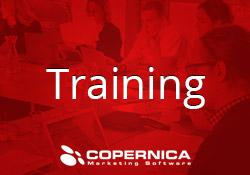
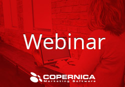

Copernica organiseert zelf of samen met
[partners](https://www.copernica.com/nl/partners/overview "Copernica's partners")
interessante evenementen over e-mailmarketing. Zo zijn er regelmatig
gratis [seminars en
webinars](https://www.copernica.com/nl/ondersteuning/seminars-webinars "Seminars/Webinars")
die gaan over thema's als [marketing
automation](https://www.copernica.com/nl/blog/marketing-automation-met-manchester-united "Marketing Automation met Manchester United"),
[customer
lifecycle](https://www.copernica.com/nl/blog/hoe-maak-je-succesvol-gebruik-van-je-customer-lifecycle-met-e-mailmarketing "Hoe maak je succesvol gebruik van je customer lifecycle met e-mailmarketing?")
en [lead
nurturing](https://www.copernica.com/nl/blog/lead-nurturing-in-de-praktijk-case-exact-software "Lead nurturing in de praktijk: case Exact Software").
Daarnaast is Copernica regelmatig te vinden op interessante beurzen die
gaan over eCommerce, multichannel-marketing en marketingcommunicatie. In
het onderstaande overzicht kan je zien welke evenementen we zelf
organiseren of waar wij aanwezig zijn. Deze kalender wordt continu
geupdate.

Copernica evenementenkalender 2016
----------------------------------

September 2016
--------------

### Emerce eFashion

8 september 2016 | Pakhuis de Zwijger - Amsterdam

Emerce eFashion is hét congres voor decision makers en professionals in
fashion die verantwoordelijk zijn voor online en/of e-commerce.
Daarnaast is eFashion hét netwerkevent van het jaar binnen de online
fashion industrie. Meer dan 350 marketing, online en e-commerce managers
van retailers, brands en pure players zijn bij eFashion 2016
aanwezig.Jeroen Schimmel (oprichter A2Concepts en Interim Online
Marketing Manager bij Coolcat) zal tijdens eFashion inzage geven in de
Coolcat-casus

[Meer info](http://emerce.nl/efashion/)

### Fundamental & Advanced training

13 september 2016 | Copernica Amsterdam

Iedere maand organiseren wij meerdere trainingen voor onze gebruikers.
We bieden twee trainingen aan: de fundamental training en de advanced
training. De fundamental training gaat in op de basiskennis van
Copernica (database, versturen van een e-mail etc.) terwijl de advanced
training ingaat op geavanceerde e-mailmarketingcampagnes die je met
Copernica (automatisch) kan versturen. Alle trainingen worden gegeven
door geselecteerde Copernica-experts.

[Meer info](./copernica-training.md)

### Online webinar: Advanced training

15 september 2016 | Online Webinar

Lukt het je niet om bij een van de trainingen op locatie aan te sluiten,
dan bieden we je de mogelijkheid om aan te sluiten bij de trainingen die
worden gegeven met behulp van een webinar. Omdat deze trainingen met
name zijn bedoeld voor onze internationale gebruikers, maken we je er op
attent dat zowel de Fundamental Training als de Advanced Training in het
Engels worden gegeven.

[Meer info](./copernica-training.md)

### Fundamental & Advanced training

22 september 2016 | Copernica Amsterdam

Iedere maand organiseren wij meerdere trainingen voor onze gebruikers.
We bieden twee trainingen aan: de fundamental training en de advanced
training. De fundamental training gaat in op de basiskennis van
Copernica (database, versturen van een e-mail etc.) terwijl de advanced
training ingaat op geavanceerde e-mailmarketingcampagnes die je met
Copernica (automatisch) kan versturen. Alle trainingen worden gegeven
door geselecteerde Copernica-experts.

[Meer info](./copernica-training.md)

Oktober 2016
------------

### Fundamental & Advanced training

11 oktober 2016 | Copernica Amsterdam

Iedere maand organiseren wij meerdere trainingen voor onze gebruikers.
We bieden twee trainingen aan: de fundamental training en de advanced
training. De fundamental training gaat in op de basiskennis van
Copernica (database, versturen van een e-mail etc.) terwijl de advanced
training ingaat op geavanceerde e-mailmarketingcampagnes die je met
Copernica (automatisch) kan versturen. Alle trainingen worden gegeven
door geselecteerde Copernica-experts.

[Meer info](./copernica-training.md)

### Online webinar: Fundamental training

13 oktober 2016 | Online Webinar

Lukt het je niet om bij een van de trainingen op locatie aan te sluiten,
dan bieden we je de mogelijkheid om aan te sluiten bij de trainingen die
worden gegeven met behulp van een webinar. Omdat deze trainingen met
name zijn bedoeld voor onze internationale gebruikers, maken we je er op
attent dat zowel de Fundamental Training als de Advanced Training in het
Engels worden gegeven.

[Meer info](./copernica-training.md)

### Seminar Marketing Automation

13 oktober 2016 | Copernica, Amsterdam

Tijdens het seminar marketing automation op donderdag 13 oktober leggen
Ralph van den Broeck (Marketing Executive, Copernica) en Bert-Jan van
Rein (CEO, Qamel) samen met andere marketeers de link tussen marketing
automation, het maturity model, de customer journey en inbox placement.
In 3 uur leer je de quickwins die jij kunt toepassen om marketing
automation te implementeren. Het seminar marketing automation wordt
georganiseerd door Copernica in samenwerking met Qamel.

[Meer info](https://www.copernica.com/nl/blog/seminar-marketing-automation-de-perfecte-aanpak-in-3-uur)

### Online webinar: Advanced training

20 oktober 2016 | Online Webinar

Lukt het je niet om bij een van de trainingen op locatie aan te sluiten,
dan bieden we je de mogelijkheid om aan te sluiten bij de trainingen die
worden gegeven met behulp van een webinar. Omdat deze trainingen met
name zijn bedoeld voor onze internationale gebruikers, maken we je er op
attent dat zowel de Fundamental Training als de Advanced Training in het
Engels worden gegeven.

[Meer info](./copernica-training.md)

### Fundamental & Advanced training

27 oktober 2016 | Copernica Amsterdam

Iedere maand organiseren wij meerdere trainingen voor onze gebruikers.
We bieden twee trainingen aan: de fundamental training en de advanced
training. De fundamental training gaat in op de basiskennis van
Copernica (database, versturen van een e-mail etc.) terwijl de advanced
training ingaat op geavanceerde e-mailmarketingcampagnes die je met
Copernica (automatisch) kan versturen. Alle trainingen worden gegeven
door geselecteerde Copernica-experts.

[Meer info](./copernica-training.md)

November 2016
-------------

### Fundamental & Advanced training

8 november 2016 | Copernica Amsterdam

Iedere maand organiseren wij meerdere trainingen voor onze gebruikers.
We bieden twee trainingen aan: de fundamental training en de advanced
training. De fundamental training gaat in op de basiskennis van
Copernica (database, versturen van een e-mail etc.) terwijl de advanced
training ingaat op geavanceerde e-mailmarketingcampagnes die je met
Copernica (automatisch) kan versturen. Alle trainingen worden gegeven
door geselecteerde Copernica-experts.

[Meer info](./copernica-training.md)

### Online webinar: Fundamental training

10 november 2016 | Online Webinar

Lukt het je niet om bij een van de trainingen op locatie aan te sluiten,
dan bieden we je de mogelijkheid om aan te sluiten bij de trainingen die
worden gegeven met behulp van een webinar. Omdat deze trainingen met
name zijn bedoeld voor onze internationale gebruikers, maken we je er op
attent dat zowel de Fundamental Training als de Advanced Training in het
Engels worden gegeven.

[Meer info](./copernica-training.md)

### Online webinar: Advanced training

17 november 2016 | Online Webinar

Lukt het je niet om bij een van de trainingen op locatie aan te sluiten,
dan bieden we je de mogelijkheid om aan te sluiten bij de trainingen die
worden gegeven met behulp van een webinar. Omdat deze trainingen met
name zijn bedoeld voor onze internationale gebruikers, maken we je er op
attent dat zowel de Fundamental Training als de Advanced Training in het
Engels worden gegeven.

[Meer info](./copernica-training.md)

### Fundamental & Advanced training

24 november 2016 | Copernica Amsterdam

Iedere maand organiseren wij meerdere trainingen voor onze gebruikers.
We bieden twee trainingen aan: de fundamental training en de advanced
training. De fundamental training gaat in op de basiskennis van
Copernica (database, versturen van een e-mail etc.) terwijl de advanced
training ingaat op geavanceerde e-mailmarketingcampagnes die je met
Copernica (automatisch) kan versturen. Alle trainingen worden gegeven
door geselecteerde Copernica-experts.

[Meer info](./copernica-training.md)

### Marketing & Technology

24 november 2016 | Copernica Amsterdam

Op 24 november aanstaande gaat u tijdens het enige, echte
Marketing&Technology Event horen en ervaren hoe u uw marketingstrategie
technologyproof kunt maken. In de vorige editie stonden we uitgebreid
stil bij de relatie tussen CTO en CMO. Tijdens dit event focussen we
nadrukkelijk op de tools en trends die u verder helpen bij het
optimaliseren van uw marketingstrategie. U als marketeer staat voor de
uitdaging om de marketing van uw merk te verrijken met moderne
technologie. Juist om de connectie met uw klant nog optimaler te maken.

[Meer info](http://marketingentechnology.nl/)

December 2016
-------------

### Fundamental & Advanced training

13 december 2016 | Copernica Amsterdam

Iedere maand organiseren wij meerdere trainingen voor onze gebruikers.
We bieden twee trainingen aan: de fundamental training en de advanced
training. De fundamental training gaat in op de basiskennis van
Copernica (database, versturen van een e-mail etc.) terwijl de advanced
training ingaat op geavanceerde e-mailmarketingcampagnes die je met
Copernica (automatisch) kan versturen. Alle trainingen worden gegeven
door geselecteerde Copernica-experts.

[Meer info](./copernica-training.md)

### Online webinar: Fundamental training

8 december 2016 | Online Webinar

Lukt het je niet om bij een van de trainingen op locatie aan te sluiten,
dan bieden we je de mogelijkheid om aan te sluiten bij de trainingen die
worden gegeven met behulp van een webinar. Omdat deze trainingen met
name zijn bedoeld voor onze internationale gebruikers, maken we je er op
attent dat zowel de Fundamental Training als de Advanced Training in het
Engels worden gegeven.

[Meer info](./copernica-training.md)

### Online webinar: Advanced training

15 december 2016 | Online Webinar

Lukt het je niet om bij een van de trainingen op locatie aan te sluiten,
dan bieden we je de mogelijkheid om aan te sluiten bij de trainingen die
worden gegeven met behulp van een webinar. Omdat deze trainingen met
name zijn bedoeld voor onze internationale gebruikers, maken we je er op
attent dat zowel de Fundamental Training als de Advanced Training in het
Engels worden gegeven.

[Meer info](./copernica-training.md)
