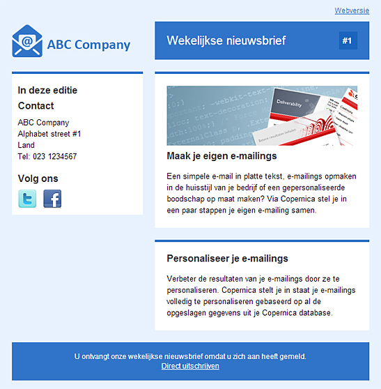

De e-mailtemplates zijn gratis te gebruiken en zijn getest in de meest
populaire e-mail clients zoals Outlook 2003, 2007, 2010, Gmail, Hotmail,
Apple Mail en nog veel meer. Deze kunnen worden gedownload en gebruikt
voor de creatie van uw eigen e-mail campagnes binnen Copernica.

Twee kolommen lay-out met een zijbalk aan de linkerkant
-------------------------------------------------------

Download
--------

**Ontwikkeld door:** Copernica BV\
**Layout:** Twee kolommen\
\
[Download](Copernicacom/two-col-left-sidebar-blue-nl.zip "Download")

* * * * *

Twee kolommen lay-out met een zijbalk aan de rechterkant
--------------------------------------------------------

Download
--------

**Ontwikkeld door:** Copernica BV\
**Layout:** Twee kolommen\
\
[Download](Copernicacom/two-col-right-sidebar-blue-nl.zip "Download")
