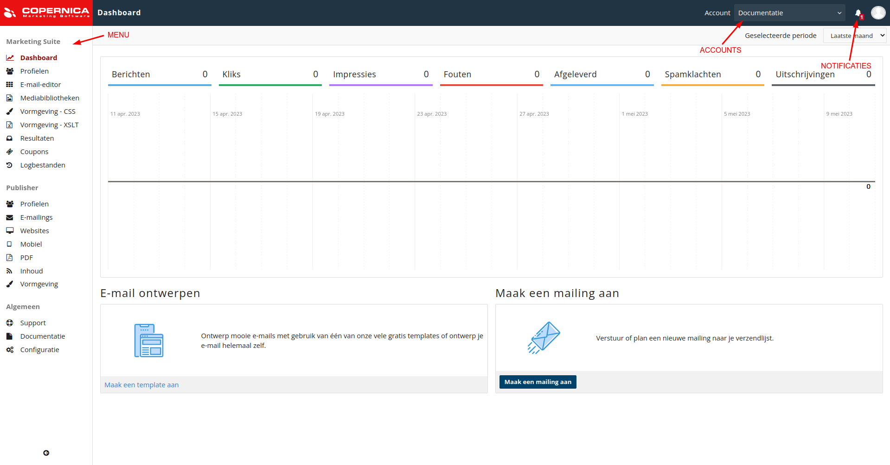

# Eerste login
Wanneer je een Copernica-account hebt aangemaakt log je in via [Marketing Suite](https://ms.copernica.com). 

De eerste keer dat je inlogt word je gevraagd om de GDPR-overeenkomst te tekenen. Je kunt deze overeenkomst zelf ondertekenen of dit laten doen door je Data Protection Officer (DPO).

Zodra je de bovenstaande stappen hebt doorlopen kom je in het Marketing Suite-dashboard terecht.

## Menu
Je vindt het Marketing Suite-menu aan de linkerkant. Het hoofdmenu is onderverdeeld in drie submenu's: 

* Marketing Suite;
* Publisher;
* Algemeen.

### Verschil Publisher & Marketing Suite
De Copernica-software bestaat uit twee interfaces: Publisher en Marketing Suite. De [Publisher-interface](https://publisher.copernica.com) is het langst bestaande Copernica-product. De [Marketing Suite-interface](https://ms.copernica.com) is gebruiksvriendelijker en maakt gebruik van verbeterde technologieën. Daardoor worden gegevens sneller ingeladen.

Publisher-modules worden momenteel overgebracht naar Marketing Suite. Op dit moment zijn enkele modules uitsluitend via Publisher beschikbaar. Om die reden zijn beide interfaces zichtbaar in het menu.

De modules zijn als volgt ingericht:

### Marketing Suite

* __Dashboard:__ bevat algemene statistieken over verzonden mailings.  
* __Profielen:__ hier beheer je databases en profielen ([meer informatie](./database-profiles)).  
* __E-mail designer:__ bevat een [Drag-and-drop Editor](https://ms.copernica.com/#/templates) voor het opstellen van mailings.  
* __HTML-templates:__ hier creëer je geavanceerde HTML-templates.  
* __Vormgeving - CSS:__ biedt mogelijkheden voor het beheren van CSS-opmaakbestanden.  
* __Vormgeving - XSLT:__ biedt mogelijkheden voor het beheren van XSLT-opmaakbestanden.  
* __Resultaten:__ hier bekijk je de resultaten van verzonden mailings en beheer je toekomstige mailings.  
* __Logbestanden:__ hier zoek je informatie op in de ruwe logbestanden van Copernica. 

### Publisher

* __Profielen:__ hier beheer je databases en profielen ([meer informatie](./database-profiles)).  
* __E-mailings:__ biedt mogelijkheden voor het beheren van templates en documenten.  
* __Websites:__ hier maak je websites en webpagina's aan.  
* __Mobiel:__ biedt mogelijkheden voor het opmaken en versturen van SMS-berichten.  
* __PDF:__ hier maak je gepersonaliseerde PDF-bestanden aan.
* __Inhoud:__ biedt mogelijkheden voor het beheren van feeds, webformulieren, mediabibliotheken en enquêtes.  

### Algemeen

* __Support:__ wanneer je een vraag hebt maak je hier een ticket aan voor onze Support-afdeling.  
* __Documentatie:__ wanneer je op zoek bent naar extra informatie raadpleeg je hier de documentatie per onderwerp.  
* __Configuratie:__ hier beheer je de algemene instellingen van je bedrijf, account en gebruiker.

## Account
De naam van het account waarop je momenteel actief bent is hier zichtbaar. Wanneer je toegang hebt tot meerdere accounts heb je de mogelijkheid om te schakelen tussen verschillende accounts.

## Notificaties
Zodra er bij het bel-icoontje een getal zichtbaar is heb je een [notificatie](https://ms.copernica.com/nl/#/admin/user/notifications) ontvangen over je bedrijf, account of gebruiker. Je stelt zelf in welke notificaties je wilt ontvangen.
