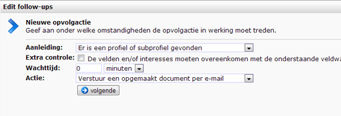

In Copernica kun je gemakkelijk geautomatiseerde reacties maken op
webformulieren. Elke keer dat een webformulier wordt ingevuld, kan er
een opvolgactie worden geactiveerd. Je stelt in onder welke voorwaarden
deze opvolgactie moet worden geactiveerd en welke actie moet volgen.

Om een nieuwe opvolgactie te maken (of een bestaande te bewerken), ga je
naar het webformulier onder Content, kies dan **Opvolgacties...** van
het webformulier menu. Deze zijn ook toegankelijk vanaf het
**Opvolgacties** tabblad op het webformulier.

Aanleiding en actie
-------------------

Een opvolgactie bestaat uit twee gedeeltes: een aanleiding en een actie.
Allereerst wordt er gevraagd om een aanleiding te definiëren.

### Aanleiding

Je kunt kiezen uit drie verschillende aanleidingen:

-   **Het formulier is ingevuld en verzonden** - de opvolgactie wordt
    altijd gepland (tenzij het formulier niet verzonden kon worden)
-   **Er is een nieuw profiel of subprofiel aangemaakt** - de
    opvolgactie wordt gepland wanneer er een nieuw (sub)profiel is
    aangemaakt (niet gewijzigd).
-   **Er is een profiel of subprofiel gevonden** - de opvolgactie wordt
    alleen gepland als een bestaande gebruiker uit de database in staat
    is om zichzelf te identificeren (door het sleutelveld in het
    webformulier).

### Extra controle

Gebruik deze optie als je de opvolgactie alleen wilt laten uitvoeren als
de veldwaarden van het ingevulde formulier overeenkomen met de
veldwaarden die je hier opgeeft.

### Wachttijd

Hier stel je in hoe lang na de Oorzaak, de opvolgactie in werking moet
treden. Bij een directe actie is dat uiteraard 0 minuten.

### Actie

Verschillende acties kunnen uitgevoerd worden als opvolging:

-   **Verstuur een opgemaakt document per e-mail**\
     Hierbij selecteer je een document uit het onderdeel E-mailings om
    te verzenden naar een geadresseerde of een profiel.
-   **Verstuur een opgemaakt PDF-document als fax-bericht**\
     Selecteer een document uit het onderdeel PDF om als fax-bericht te
    verzenden naar een geaddresseerde of een profiel.
-   **Verstuur een opgemaakt sms-document**\
     Selecteer een document uit het onderdeel Mobile om als sms te
    verzenden naar een geadresseerde of een profiel.
-   **Verstuur een tekstueel e-mailbericht**\
     Type een tekst zonder opmaak die wordt verzonden naar een
    geadresseerde of een profiel. Afzender, onderwerp en tekst zijn vrij
    in te voeren.
-   **Verstuur een sms-bericht**\
     Type een sms-bericht (255 karakters max.) om te versturen aan een
    geadresseerde of een profiel.
-   **Neem contact op met de geadresseerde**\
     Hiermee maak je een actiepunt aan onder het profiel van de
    geadresseerde.
-   **Wijzig gegevens van de geadresseerde**\
     Pas de waarde aan van een veld uit het (sub)profiel van de
    geadresseerde.\
     Selecteer de juiste database en veldnaam en geef de nieuwe waarde
    aan die het veld moet krijgen als gevolg van de opvolgactie.

Aanvullende voorwaarden voor de opvolgacties
--------------------------------------------

In bepaalde situaties wil je voorkomen dat er een opvolgactie wordt
gepland. Bijvoorbeeld, als de opvolgactie alleen moet worden gepland als
de indiener van het formulier een klant is en bijvoorbeeld geen
leverancier. Of om te voorkomen dat een opvolgactie wordt uitgevoerd
voor iemand die zich in de tussentijd heeft afgemeld.

Er kunnen dagen, weken of zelfs jaren tussen het plannen en de
daadwerkelijke uitvoering van een opvolgactie zitten. Daarom hebben we
een onderscheid gemaakt tussen **aanleidingsvoorwaarden** en
**actievoorwaarden.**

-   Maak een **aanleidingsvoorwaarde** om ervoor te zorgen dat de
    opvolgactie alleen onder bepaalde omstandigheden zal worden gepland.
-   Maak een **actievoorwaarde** om ervoor te zorgen dat de opvolgactie
    wordt uitgevoerd onder bepaalde voorwaarden.

Personalisatie in follow-ups voor webformulieren
------------------------------------------------

Indien een opvolgactie plaatsvindt naar aanleiding van een ingevuld
webformulier, dan zijn naast de profiel- en subprofielgegevens ook de
ingevulde gegevens in het formulier beschikbaar. Al deze gegevens zijn
op te vragen via de variabele 'webform'.

In de variabele 'webform.fields.veldnaam' staat de waarde van een
ingevuld veld in het formulier. De naam van het veld komt overeen met de
naam van het veld in de database waaraan het formulierveld is gekoppeld.
Dus als in de database de velden 'voornaam' en 'achternaam' voorkomen,
en deze velden in het aanmeldformulier zijn voorzien van de labels 'Uw
voornaam:' en 'Uw achternaam:' dan moet je de ingevulde waardes toch
opvragen als 'webform.fields.voornaam' en 'webform.fields.achternaam'.
Als er ook collectievelden in het formulier zaten, dan kunnen deze
worden uitgelezen via de variabele
'webform.fields.collectienaam.veldnaam'. Interesses kunnen worden
uitgelezen als 'webform.interests.interessenaam'.

Net als bij enquetes zijn deze variabelen ook beschikbaar binnen de
Smarty engine. Je kunt ze dus ook gebruiken in mailings die als
opvolgactie naar aanleiding van een ingevuld formulier worden verstuurd.
De gegevens kun je uitlezen via {\$webform.fields.veldnaam}.

Meer informatie
---------------

-   [Follow-up
    manager](./follow-up-manager.md "De follow-up manager")
-   [Condities voor
    opvolgacties](./conditions-for-follow-ups.md "Condities voor opvolgacties - beperk het activeren of uitvoeren van een opvolgactie")

