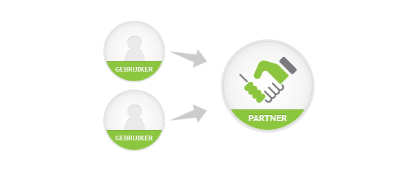

Een partnerlicentie is veel meer dan alleen een gebruikslicentie
Copernica Marketing Software. Naast de mogelijkheden van de software
zelf, biedt de partnerlicentie ook unieke mogelijkheden om het maximale
te halen uit de inzet van Copernica Marketing Software.

Haal het maximale uit de partnerlicentie door toepassing van het
volgende:

-   [Registreer je als partner](#registreer-je-als-partner)
-   [Vermeld het partnership op je website](#vermeld-het-partnership-op-je-website)
-   [Word een Copernica expert](#word-een-copernica-expert)
-   [Leer relaties te overtuigen](#leer-relaties-te-overtuigen)
-   [Profileer je als expert op het gebruikersforum](#profileer-je-als-expert-op-het-gebruikersforum)
-   [Zet Copernica in voor eigen marketingactiviteiten](#zet-Copernica-in-voor-je-eigen-marketingactiviteiten)
-   [Vraag tevreden klanten om een review](#vraag-tevreden-klanten-om-een-review)
-   [Publiceer gezamenlijke content](#publiceer-gezamenlijke-content)
-   [Organiseer een gezamenlijk seminar](#organiseer-een-gezamenlijk-seminar)
-   [Neem deel aan een beurs](#neem-deel-aan-een-beurs)

### Registreer je als partner

Profileer je bureau richting de ruim 5.000 Copernica gebruikers.
Registreren als partner gaat snel en eenvoudig. [Log daarvoor in op je
account](https://www.copernica.com/nl/userprofile "inloggen op Copernica.com")
binnen Copernica.com en klik op Service center. Hier voorzie je je
profiel van relevante content in de talen waarin je actief bent. Direct
na de registratie als partner van Copernica, ben je op basis van de
geselecteerde expertises vindbaar in het [overzicht van
partners](./vind-een-partner.md "vind een partner").
Hierdoor kan een gebruiker van Copernica contact met je opnemen voor
ondersteuning bij het opzetten van integraties, ontwikkelen van
templates en formulieren, trainingen en overige diensten.

Ook aan de slag met een partnerlicentie? [Vraag de partnertarieven
aan](http://www.copernica.com/nl/partners/vraag-partnerprijzen-aan "Vraag de partnertarieven aan")
of bezoek één van de [speciale bijeenkomsten voor potentiële
partners](http://www.copernica.com/nl/ondersteuning/productdemonstraties).

### Geef de Registered partner reward een prominente plek

Als Registered partner heb je recht op een Registered partner reward.
Natuurlijk ben je trots op deze blijk van waardering, geef de reward dus
een prominente plek in bijv. de presentatieruimte op je kantoor. Ben je
geregistreerd als partner en heb je nog geen Registered partner reward
ontvangen? [Neem dan contact met ons
op.](./neem-contact-met-ons-op.md "Neem contact met ons op")

### Vermeld het partnership op je website

Als registered partner mag je het [Copernica Registered partner
logo](./media-resources.md "Registered partner logo") op
je website plaatsen. Dit is niet enkel een kwaliteitskeurmerk, het
linken van het logo naar je partnerprofiel op Copernica.com zorgt ook
voor herkenning bij je websitebezoekers.

Plaats daarnaast op je website informatie [over Copernica Marketing
Software](./media-resources.md "Over Copernica Marketing Software")
en de toegevoegde waarde van je bureau.

### Word een Copernica expert

Een eerste vereiste om Copernica Marketing Software succesvol in te
zetten, is bekend raken met [de functies van de
software](./features.md). Als onderdeel
van de partnerlicentie biedt Copernica uitgebreide mogelijkheden om je
productkennis te vergroten. Naast de
[videotutorials](./videos.md "Videotutorials"),
[helpdocumentatie](./helpdocumentatie.md "helpdocumentatie")
en [ondersteuningstool](./ondersteuningstool.md "Ondersteuningstool")
organiseert Copernica, op het hoofdkantoor in Amsterdam, maandelijks
[basistrainingen](./copernica-training.md)
en [gevorderdentrainingen](./copernica-training.md).

### Leer relaties te overtuigen

Om relaties te overtuigen van de beste oplossing, is het belangrijk om,
naast productkennis, ook te beschikken over verkoopkennis. Ieder
kwartaal organiseert Copernica een partnerdag waarin onder meer de
volgende onderwerpen aan bod komen:

-   Algemene werking en mogelijkheden partnerlicentie
-   Manieren om inkomsten te genereren met Copernica
-   Toepassingen van de software
-   Unieke functies van Copernica
-   Onderscheidende waarde t.o.v. andere aanbieders
-   Omgaan met (mogelijke) bezwaren

Deelname aan een partnerdag is kosteloos voor geregistreerde partners.
Bekijk een overzicht van [ingeplande
partnerdagen](./evenementen.md "evenementen")
en meld je aan.

### Profileer je als expert op het gebruikersforum

Op het [gebruikersforum](https://www.copernica.com/nl/forum/) wordt er
door Copernica-gebruikers dagelijks gediscussieerd over de software en
e-mail marketing. Ben jij een email marketing expert? Deel dan jouw
kennis en kom in contact met potentiele klanten.

### Zet Copernica in voor eigen marketingactiviteiten

Natuurlijk zet je Copernica Marketing Software ook in voor de
marketingactiviteiten van je eigen bureau. Zo doe je belangrijke
praktijkervaring op en bovendien demonstreer je op deze manier de
krachtige mogelijkheden van Copernica aan je eigen relaties. Stuur
bijvoorbeeld regelmatig een nieuwsbrief met je meest recente cases of
zet een uitnodigingstraject op voor een seminar.

### Vraag tevreden klanten om een review

Zorg jij ervoor dat je klanten tevreden over je zijn? En durf je dat te
bewijzen? Vraag je klanten dan een review op het partneroverzicht achter
te laten. Weinig is zo krachtig als een positieve beoordeling,
[beoordeel het zelf](https://www.copernica.com/nl/partners/profile/4541127 "reviews").

### Publiceer gezamenlijke content

Partners kunnen op Copernica.com en op externe blogsites inhoudelijke
artikelen publiceren, over succesvolle cases rondom de inzet van
bijvoorbeeld [email marketing](./email-marketing-functionaliteiten.md "Email marketing"),
[mobile](./mobile.md "Mobile") en
[social](./social.md "Social").

Een gepubliceerde case op Copernica.com heeft een positieve uitwerking
op je partnerprofiel. In sommige gevallen is het ook mogelijk om de case
te publiceren op een externe blogsite.

Hieronder vind je een aantal eerder gepubliceerde artikelen:

-   Marketingfacts: [Hoe maak je succesvol gebruik van je customer
    lifecycle met
    e-mailmarketing?](http://www.marketingfacts.nl/berichten/hoe-maak-je-succesvol-gebruik-van-je-customer-lifecycle-met-e-mailmarketing "Hoe maak je succesvol gebruik van je customer lifecycle met e-mailmarketing?")
-   Marketingfacts: [Sodeknetter hoge conversie bij Wijnvoordeel met
    e-mailmarketing en big
    data](http://www.marketingfacts.nl/berichten/sodeknetter-hoge-conversie-bij-wijnvoordeel-met-e-mailmarketing-en-big-data "Sodeknetter hoge conversie bij Wijnvoordeel met e-mailmarketing en big data")

Copernica levert ondersteuning bij het opstellen en redigeren van de
teksten. Ook kan Copernica, dankzij de goede contacten met verschillende
uitgevers, ervoor zorgen dat de gezamenlijke content online wordt
gepubliceerd op blogsites.

Ook
[artikelen](./nieuws.md "Kennis artikelen door Copernica")
die eerder door Copernica zijn geschreven, mag je als partner op je
website plaatsen. We vragen je dan wel duidelijk te vermelden dat de
content afkomstig is van Copernica via de juiste links.

### Organiseer een gezamenlijk seminar

Een seminar is een ideale manier om een groot aantal relaties in één
keer te bereiken. Tijdens een seminar deel je als partner je unieke
visie, ervaring, expertise en onderscheidende waarde. De [sprekers van
Copernica](./onze-sprekers.md "onze sprekers")
presenteren tijdens een seminar naast de marktontwikkelingen graag de
mogelijkheden en toepassingen van Copernica Marketing Software.

Copernica zorgt via het overzicht van
[evenementen](./evenementen.md "evenementenkalender")
en [nieuwsbrieven](http://www.copernica.com/nl/nieuwsbrief/aanmelden-nieuwsbrief "meld je aan voor onze nieuwsbrief")
voor de nodige aandacht rondom het seminar.

### Neem deel aan een beurs

Copernica neemt regelmatig samen met partners deel aan prominente
vakbeurzen. Als deelnemende partner krijg je een eigen desk op de
Copernica-stand met vermelding van je eigen logo. Tegen een bijdrage in
de kosten neemt Copernica de gehele organisatie voor haar rekening en
biedt rondom de beurs professionele begeleiding. Door gezamenlijke
deelname aan een vakbeurs doe je een groot aantal nieuwe contacten op.

Kijk op de [evenementenpagina](./evenementen.md "evenementen")
voor een overzicht van beschikbare plaatsen.

Naast deelname aan vakbeurzen, organiseert Copernica jaarlijks samen met
de partners ook het [Copernica Summit](./copernica-summit.md "Copernica Summit").
Met meer dan 800 bezoekers is het Copernica Summit voor partners de plek
om zich te profileren als dé Copernica-expert.

Samen een seminar organiseren? [Neem direct contact
op](mailto:partnermanagement@copernica.com?subject=Seminar%20organiseren)
