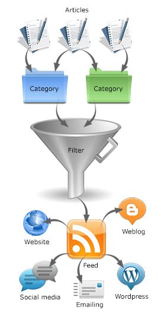
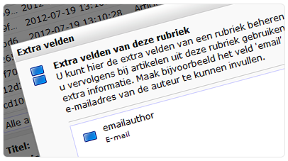

In het onderdeel **Content** kan je artikelen maken en beheren. Deze
artikelen kunnen vervolgens worden opgenomen in e-mailings en
webpagina's. Dit publiceren gaat via een Atom of een RSS feed**. **Dit
zijn gestandaardiseerde methodes voor het opmaken van digitale
informatie, en kunnen daarom door vrijwel iedere feed reader worden
ingelezen. 

Het voordeel van deze manier van werken is dat je content op een
centrale plek beheert, en op oneindig veel kanalen kan publiceren. Feeds
zijn dynamisch. Lezers van een feed zien dus automatisch de nieuwste
artikelen.

-   Je kan de filtercriteria natuurlijk zo instellen, dat de feed een
    statische lijst van artikelen bevat en dus altijd dezelfde artikelen
    worden getoond.

**Rubrieken:** Om een artikel te publiceren in een feed, moet deze
worden opgenomen in een rubriek. De beschikbare rubrieken worden getoond
in het linker overzicht, onder *Artikel rubrieken.*

-   Wanneer je nog geen rubriek(en) hebt, kun je deze aanmaken via
    het *Artikel* menu

**Taal:** Bij ieder artikel een taal worden opgegeven waarin het artikel
geschreven is. De vertalingen van de artikelen kan je in een later
stadium aan elkaar koppelen, en zo de kopij in verschillende talen
aanbieden. Op dit moment kan je alleen vertalingen maken voor
Nederlands, Engels, Duits en Frans.

**Trefwoorden**: Per artikel kan je één of meerdere trefwoorden
instellen. Het is de bedoeling dat je deze trefwoorden later kan gaan
gebruiken voor bijvoorbeeld SEO-doeleinden, of bij het filteren van
artikelen voor een feed.

**Samenvatting:**Dit veld kan je gebruiken voor het invoeren van een
korte samenvatting of inleiding voor het artikel.

Artikel rubrieken
-----------------

Om een artikel uiteindelijk te publiceren, moet deze zijn opgenomen in
een rubriek. Je kan bijvoorbeeld een rubriek *Nieuwsbrief* aanmaken. Elk
artikel dat je uiteindelijk in een nieuwsbrief wil publiceren, plaats je
in de deze rubriek.

-   Hetzelfde artikel kan in meerdere rubrieken worden opgenomen.
-   Niet-gerubriceerde artikelen kunnen niet worden opgenomen in een
    feed.

**Niet-gerubriceerd artikel plaatsen in rubriek**

-   Klik in het linker overzicht op* Alle artikelen*
-   Selecteer het artikel in de lijst
-   Klik in de onderste werkbalk op *Rubrieken instellen…*
-   Selecteer 1 of meerdere rubrieken waarin het artikel geplaatst moet
    worden.

**Nieuw artikel aanmaken onder rubriek**

-   Klik in het linker overzicht op de rubriek waaraan je het artikel
    wil toevoegen
-   Klik in het menu *Artikel* op *Artikel toevoegen*.

**Nieuw artikel aanmaken zonder rubriek**

-   Klik in het linker overzicht op *Artikelen zonder rubriek*
-   Klik in het menu Artikel op *Artikel toevoegen*.

Extra velden
------------

Een *Content feed* artikel bestaat standaard uit een *titel, volledig
artikel* en een *samenvatting*. Als je hiernaast nog extra informatie
aan een artikel wilt toevoegen, dan kan je hiervoor extra velden
aanmaken. Deze extra velden kunnen vervolgens worden getoond in
publicaties van artikelen. Je kan bijvoorbeeld een extra
veld *E-mail* aanmaken, om bij een artikel het e-mailadres van de auteur
te tonen.

Extra velden maak je bij een **rubriek**. Je kan deze extra velden
daarna invullen bij elk artikel uit de rubriek.

**Extra veld maken:**

-   Selecteer de rubriek waarvoor je de extra velden wilt instellen
-   Kies in het menu **Artikel** voor *Extra velden instellen…*
-   Creëer een nieuw veld.

In het dialoogvenster voor het bewerken van een artikel uit deze rubriek
is er nu een nieuw tabblad **Extra velden** verschenen.
