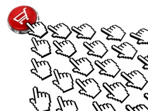

Webwinkeliers hebben een hekel aan verlaten winkelwagentjes, inactieve
klanten en dalende conversieratio’s. Veel webwinkeliers laten nog teveel
kansen onbenut. Voornamelijk omdat hun e-commerceplatform geen goede
e-mailmarketingactiviteiten aanbiedt en ondersteunt.

[E-mailmarketing](./email-marketing-functionaliteiten.md "E-mailmarketing")
is één van de sterkste online marketingkanalen om meer te halen uit je
relaties en uiteindelijk meer conversie te genereren. In dit artikel
benoemen we vijf punten die je e-commerce activiteiten met
e-mailmarketing naar een hoger niveau tillen.

1. Schrijf een e-mailmarketingplan specifiek voor jouw webwinkel
----------------------------------------------------------------

Omdat steeds meer webwinkels het belang van e-mailmarketing als kanaal
inzien, is de inbox een plek geworden waar wordt gestreden om aandacht.
Je moet tot het uiterste gaan om de klant zover te krijgen je e-mail te
openen. Het is dus noodzaak om vooraf goed na te denken over je
e-mailmarketingstrategie. Wanneer je e-mailmarketing serieus wilt
inzetten om meer business te genereren, start je met het schrijven van
een e-mailmarketingplan. Laat in je e-mailmarketingplan minimaal de
volgende punten terugkomen:

-   Analyseer je huidige e-mailmarketinginzet en -strategie
-   Verken je markt en stel je doelgroep vast
-   Bepaal de segmentatiecriteria en de mate van
    [segmentatie](http://www.frankwatching.com/archive/2010/12/10/segmentatie-of-personalisatie-thats-the-question/)
    van je doelgroep
-   Formuleer doelstellingen (SMART) voor je e-mailmarketingactiviteiten
-   Ontwikkel een e-mailmarketingstrategie waarmee je deze
    doelstellingen kunt behalen
-   Bepaal het type, de inhoud en de frequentie van de e-mailings per
    doelgroep

2. Klanten inzetten voor een beter productinformatiemanagement (PIM)
--------------------------------------------------------------------

 Zet
e-mailmarketing in om klanten te vragen reviews te schrijven. Dit bied
je naast waardevolle klantinzichten ook inzicht in de prestatie van je
webwinkel. Beloon deze klanten met een incentive na het schrijven van
een review. Nodig ze bijvoorbeeld drie weken na aankoop van het product
uit om een review te schrijven. Bij geen reactie van de klant kun je een
herinnering met vermelding van de incentive versturen.

De achtergelaten informatie kun je als webwinkel uitstekend gebruiken
bij het optimaliseren van de productinformatie binnen je webwinkel.
Verrijk bijvoorbeeld je producten in de front-end met informatie als:
“dit product heeft al 13 positieve reacties. Lees ze hieronder” en in de
back-end: “product X verhoudt zich optimaal in combinatie van product
A”. Dit laatste gebruik je bijvoorbeeld bij het opzetten van cross- en
upsellcampagnes.

Een bijkomend voordeel is dat deze reviews bijdragen aan de positie van
je webwinkel in zoekmachines, door de relevante unieke content die de
klanten toevoegen aan je webwinkel. Tevens maak je het met deze
user-generated content aantrekkelijker voor potentiële klanten een
aankoop te verrichten in je webwinkel. Uit [recent
onderzoek](http://www.thuiswinkel.org/ondanks-crisis-9-groei-online-verkoop)
blijkt namelijk dat in de eerste helft van 2012 één op de drie online
klanten gebruik maakten van online reviews voor zij overgingen tot een
online aankoop.

3. E-mailmarketing inzetten ter ondersteuning van het ordermanagement
---------------------------------------------------------------------

Eén van de succesfactoren van webwinkels is de mate van
servicegerichtheid richting klanten. E-mailmarketing wordt nog te weinig
gebruikt om servicevragen als WISMO (Where Is My Order?) te
beantwoorden. Dit stuk ordermanagement vul je perfect in met behulp van
e-mailmarketing. Om hoge distributiekosten (bijvoorbeeld extra kosten
omdat de klant niet thuis is) tegen te gaan en het serviceniveau van je
webwinkel te verhogen, moet je WISMO-vragen reduceren. Het belangrijkste
advies hierin is blijven communiceren met je klanten.

In combinatie met een goede landingspagina waarop de klant zijn
orderstatus kan volgen en proactieve e-mails met veranderingen op de
orderstatuspagina, houd je de klant perfect op de hoogte. Hierdoor
worden vragen als ‘wanneer kan ik mijn order verwachten’ afgehandeld en
kunnen mensen tijd vrijmaken in hun agenda om thuis te zijn wanneer de
order wordt afgeleverd.

4. Heractivatie van je slapende e-mailmarketingbestand
------------------------------------------------------

In
vrijwel elke webwinkel zijn er klanten die gedurende lange tijd niet
meer actief zijn geweest in de webwinkel of die de nieuwsbrief niet meer
openen. Deze groep is inactief en op dit moment nutteloos voor je
webwinkel. Dit is een gemiste kans. Onderzoek van Smart Insights uit
november 2011 heeft aangetoond dat bij verschillende webwinkels 14% van
de omzet afkomstig is van klanten die gedurende lange tijd inactief
waren.

Stuur bijvoorbeeld een heractiveringsmail naar klanten die de
nieuwsbrief 10 keer niet hebben geopend of die gedurende zes maanden of
een jaar niks meer hebben gekocht in je webwinkel. Door deze klanten met
een heractiveringscampagne te benaderen, kun je de klant heractiveren
wat de conversie/webwinkelbezoek ten goede komt. Wat doe je dan met de
klanten die niet op je heractiveringsverzoek ingaan? Je hebt hierbij
twee keuzes:

-   Verwijder ze uit je verzendlijst. Hier hangt wel het nadeel aan vast
    dat je de gegevens van deze klanten definitief kwijt bent.
-   Plaats deze klanten in een aparte lijst binnen je database. Zo maak
    je een duidelijk onderscheid tussen je actieve en inactieve klanten.

Beide stappen zorgen ervoor dat je een duidelijke en actieve groep
ontvangers behoudt, wat de kwaliteit van je database ten goede komt.

5. Conversieverhoging middels gerichte segmentering en communicatie
-------------------------------------------------------------------

Hoe kun je meer conversie behalen met e-mailmarketing? Je moet inzien
dat e-mailmarketing meer is dan een wekelijkse standaard nieuwsbrief
naar je gehele klantendatabase. Webwinkels hebben algemeen gezien veel
klanteninformatie, dus benut deze optimaal. Stem je communicatie
optimaal af op je (gesegmenteerde) doelgroep. Denk hierbij aan [event
driven e-mails](./event-driven-e-mailcampagnes-gebruik-jij-ze-al.md)
zoals verjaardagsmailings, jubileummailings, klantenwaardering of vaste
klanten belonen met incentives. Persoonlijke aanbiedingen dragen ook bij
aan een toename in conversie. Alles valt of staat bij actuele
klantgegevens. Hoe vollediger de klantgegevens, hoe specifieker je de
doelgroepen kunt benaderen.

Bijvoorbeeld in een fietsenwebwinkel: heeft de klant een gezin of woont
hij alleen? Welke fietsmaat en groeipatroon past bij zijn kinderen?
Wanneer deze klantgegevens bekend zijn, verstuur je makkelijker gerichte
e-mailings afgestemd op de situatie van de klant. Een gepersonaliseerde
mailing leidt tot een hogere respons en levert een goede bijdrage aan je
(omzet) doelstellingen.

*Geschreven door Niek Leegwater van
[Bluedesk](https://www.copernica.com/nl/partners/profile/4537956),
Registered Partner van Copernica Marketing Software*

*Dit artikel is eerder verschenen op
[Frankwatching](http://www.frankwatching.com/archive/2012/10/23/hoe-versterkt-e-mailmarketing-je-e-commerce-activiteiten/);
Hoe versterkt e-mailmarketing jouw e-commerce activiteiten?*
