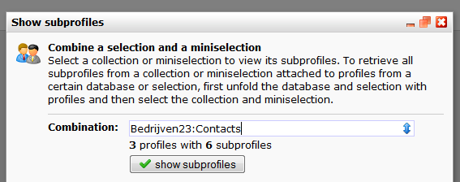

Om een overzicht te tonen van de subprofielen uit een miniselectie, kies
je in het menu Huidige weergave voor **Subprofielen weergeven**

Om de regels en condities van de miniselectie zelf te bekijken of
wijzigen ga je naar *Database management \>***Selecties beheren**. Klik
vervolgens op de miniselectie in de lijst.

