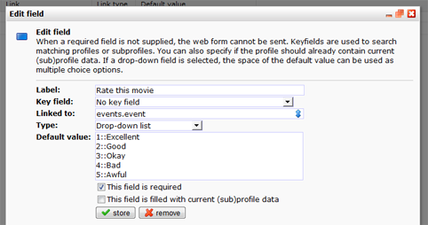

# hoe maak je een keuzerondje

Het is mogelijk in een uitschuifkeuzelijst of checkbox andere waardes te
gebruiken dan de waardes die je wegschrijft in de database.

Veronderstel dat bezoekers van jouw website een film door middel van een
5-punt schaal kunnen waarderen met de waardes 'Schitterend' tot
'Verchrikkelijk' en je wilt de waardes 1 tot 5 wegschrijven naar de
database, dan kan dit door 2 dubbele punten (::) tussen de twee waardes
bij de standaardwaarde van het webformulier te plaatsen. Dit doet je
alsvolgt:

