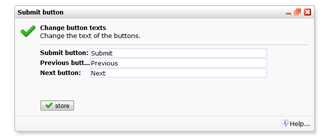

De knoppen van een enquête kunnen worden gewijzigd. Je vindt deze
functie in het Enquête menu onder Content.

Het invullen van een enquête eindigt met een knop op de 'submitknop',
waarmee de invuller zijn antwoorden verzendt. Welke tekst er op deze
knop wordt getoond bepaal je zelf. Dit stel je in met de functie *Tekst
submitknop aanpassen* onder menu *Enquête*.

Op eenzelfde wijze wijzig je de 'Volgende' en 'Vorige' knop waarmee de
invuller tussen de verschillende pagina's navigeert in enquêtes die
meerdere pagina's heeft.

