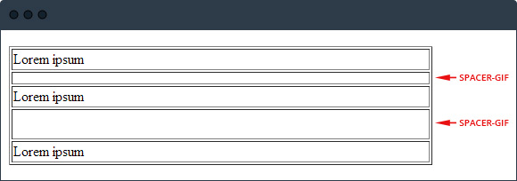

Sommige mensen zeggen dat HTML-e-maildesign moeilijk is. Persoonlijk
vind ik dat niet. Natuurlijk, de laatste HTML- en CSS-technieken worden
niet ondersteund door de meeste e-mailclients. Maar dat is niet erg, dat
betekent alleen maar dat je minder druk hoeft te maken om de toeters en
bellen. Want het gaat uiteindelijk om de content, toch?

In de afgelopen zes jaar heb ik een paar dingen geleerd over het
ontwikkelen van HTML-e-mails, kennis die ik graag met je deel. Ben je
nieuw in de wondere wereld van HTML voor e-mail? Dan is dit echt een
artikel voor jou. Ben je inmiddels een doorgewinterde HTML-e-mail
expert? Wie weet kan ik jou nog iets nieuws leren of jij mij.

Veel succes!

Gebruik tabellen voor de layout van je e-mail
---------------------------------------------

Allereerst en erg belangrijk, gebruik tabellen voor alles wat te maken
heeft met de layout van je e-mail. De reden hiervoor is simpel: tabellen
worden het best ondersteund en de weergave komt het meest consequent
over in de verschillende e-mailclients. Wil je toch een `div` rechts
uitlijnen met `float: right`? Vergeet het maar. In veel e-mailclients
werkt dit niet.

**Voorbeeld van een layout met een kolom:**

    <table>
        <tr>
            <td>Hallo wereld!</td>
        </tr>
    </table>

**Voorbeeld van een layout met twee kolommen:**

    <table width="100%">
        <tr>
            <td width="40%">Column 1</td>
            <td width="10%">&nbsp;</td> <!-- *1 -->
            <td width="40%">Columns 2</td>
        </tr>
    </table>

*1: De tweede `<td>` is nodig om extra witruimte te creëren tussen de
twee kolommen.*

**Tip:** Normaliseer de volgende tabelattributen voor het beste
resultaat in e-mailclients:

-   cellpadding="0"
-   cellspacing="0"
-   border="0"
-   voeg de CSS `border-collapse: collapse;` toe aan ieder tabel

Door deze attributen te normaliseren, verhoog je de consistentie in de
verschillende e-mailclients. De standaard-cellpadding kan in Microsoft
Outlook bijvoorbeeld groter zijn dan in Gmail, waardoor jouw perfect
afgemeten kolommen niet naast elkaar komen te staan in Outlook. Er
onstaan dan bijvoorbeeld gaten, oftewel gaps, in de layout van je e-mail
in Outlook.

**Leestip:** [Remove unwanted gaps in Microsoft
Outlook](https://www.copernica.com/en/blog/remove-unwanted-gaps-in-microsoft-outlook "Remove unwanted gaps in Microsoft Outlook")

**Voorbeeld van het normaliseren van tabel attributen:**

    <table border="0" cellpadding=0" cellspacing="0" style="border-collapse: collapse;">
        <tr>
            <td>Hello World!</td>
        </tr>
    </table>

Breedte van je e-mail
---------------------

Helaas is er geen magisch getal voor de perfecte breedte die ik kan
aanbevelen, maar ik raad je aan om niet breder te gaan dan 640px. Niet
al te lang geleden zou ik een maximumbreedte van 590 tot 600px aanraden
maar tijden veranderen, monitors worden steeds groter en men gebruikt
steeds vaker de mobiele telefoon om een e-mail te lezen. Daarom is het
ook belangrijk om je [e-mails klaar te stomen voor
mobiel](./responsive-design-je-e-mails-klaarstomen-voor-mobile.md "e-mails klaar te stomen voor mobiel")
met behulp van responsive design. En altijd je [e-mail
testen](./weergave-e-maildocument-testen-met-de-litmus-email-preview.md "e-mail testen")
als je niet zeker van je zaak bent.

**Tip:** [Maak je eigen responsive HTML
e-mail](https://www.copernica.com/en/blog/how-to-create-a-responsive-html-email-from-scratch "How to create a responsive HTML email from scratch")
(artikel is in het Engels)

Plaats de CSS inline
--------------------

Schrijf de CSS altijd inline, of gebruik een hulpmiddel die dat
automatisch voor je doet. Sommige e-mailserviceproviders hebben zo'n
hulpmiddel. Ik wil geen namen namen noemen, maar denk aan Copernica ;).

Waarom inline? Omdat sommige e-mailclients, zoals Gmail, de `<head>`
waarin de CSS staat uit je HTML-e-mail verwijderen, waardoor je
toegepaste styling verloren gaat.

Voorbeeld van inline CSS (hoe het **wel** moet):

    <table>
        <tr>
            <td style="color: red;">
                Using inline CSS
            </td>
        </tr>
    </table>

Voorbeeld van (embedded) CSS (hoe het dus **niet** moet):

    

    <table>
        <tr>
            <td class="fooBar">
                Using inline CSS
            </td>
        </tr>
    </table>

*Begrijp me niet verkeerd, het is natuurlijk toegestaan om CSS in de
`<head>` van je HTML e-maildocument te plaatsen. Maar zorg er wel voor
dat je de CSS ook inline schrijft. Handmatig of geautomatiseerd.*

### CSS-eigenschappen om te vermijden

Helaas werken niet alle CSS-eigenschappen in elke e-mailclient. Daarom
kun je het beste de volgende CSS-eigenschappen vermijden om
inconsistenties in de opmaak te voorkomen:

-   float
-   position
-   margin
-   padding (werkt niet voor `
` en `
`)
-   background-image

### Alternatieven voor niet te gebruiken CSS-eigenschappen

Hier volgen een aantal alternatieven op de CSS-eigenschappen die niet
ondersteund worden door e-mailclients.

**Alternatief voor float en position** Een afbeelding uitlijnen (1):

    <table width="640">
        <tr>
            <td width="540">
                Lorem ipsum dolor sit amet, consectetur adipiscing elit.
            </td>
            <td width="100" align="right">
                
            </td>
        </tr>
    </table>

Een afbeelding uitlijnen (2):

    <table>
        <tr>
            <td valign="top">
                Lorem ipsum dolor sit amet, consectetur adipiscing elit.
                
            </td>
        </tr>
    </table>

**Alternatief voor margin (1)** Als alternatief voor `margin` kun je
`padding` gebruiken. Simpel toch? Helaas werkt `padding` alleen niet op
`
` en `
` tags. Pas daarom `padding` alleen toe op `<td>` tags.

Voorbeeld van extra witruimte aan de onderkant met `padding` op een
`<td>`:

    <table>
        <tr>
            <td style="padding: 0 0 20px 0;"> <!-- *2 -->
                Titel van je artikel
            </td>
        </tr>
        <tr>
            <td>Volledig artikel</td>
        </tr>
    </table>

\*\*2: Dit kan ook op de volgende manier: `padding-bottom: 20px;`\*

**Alternatief voor margin (2)** Je kunt ook een lege `<td>` met een
ingestelde hoogte gebruiken. Wel met CSS-eigenschappen, anders snapt
Outlook er niets van en krijg je rare dingen te zien.

Voorbeeld van extra witruimte met een lege `<td>`:

    <table>
        <tr>
            <td style="line-height: 0; font-size: 0;" height="10">&nbsp;</td>
        <tr>
    </table>

Het trucje hierachter is dat je alle mogelijke hoogte-eigenschappen van
een HTML-element normaliseert naar 0, zodat je deze opnieuw kunt
instellen door de `<td>` een hoogte te geven. En voor de volledigheid
vul je de `<td>` met een *non breaking space*, oftewel *&nbsp*. Met een
non breaking space voorkom je dat de `<td>` inklapt en je de hoogte
kwijt bent in sommige e-mailclients.

Wel moet ik erbij vermelden dat dit alleen werkt met een `<td>`.

**Alternatief voor margin (3)** Als de vorige twee alternatieven geen
uitkomst bieden, kun je altijd terugvallen op de oudste truc in het
boekje van HTML, de
[spacer-GIF](http://en.wikipedia.org/wiki/Spacer_.GIF "spacer-GIF"), een
1x1px transparante afbeelding.

Voorbeeld van extra witruimte met spacer-GIF:

    <table>
        <tr>
            <td>Lorem ipsum</td>
        </tr>
        <tr>
            <td></td>
        </tr>
        <tr>
            <td>Lorem ipsum</td>
        </tr>
        <tr>
            <td></td>
        </tr>
    </table>

Je kunt witruimte vullen met een spacer-GIF afbeelding door de hoogte
en/of breedte aan te passen. Wil je witruimte van 10px hoog, dan geef je
de spacer-GIF een hoogte van 10px.

**Tip:** Geef een spacer-GIF altijd een hoogte en breedte mee. Hiermee
voorkom je dat Microsoft Outlook 2007+ dat zelf doet, wat niet altijd
goed uitpakt. Gebruik je bijvoorbeeld een spacer voor de hoogte, stel de
breedte dan in op bijvoorbeeld 1px en vice versa.

Bijvoorbeeld:

    <!-- Spacer-GIF -->
    

**Alternatief voor background-image** Er is geen alternatief voor
`background-image`, behalve dat je een vergelijkbare achtergrondkleur
instelt als terugval. Ik weet het, het is wellicht niet de oplossing die
je nodig hebt, maar het is nou eenmaal niet anders. (Tenzij je het niet
erg vindt dat je lezers met Microsoft Outlook je achtergrond niet zien.)

Voorbeeld van een achtergrondafbeelding met een achtergrond kleur als
terugval:

    <table>
        <tr>
            <td style="background-image: url(http://placehold.it/100x100); background-color: red;">
                Hello world!
            </td>
        </tr>
    </table>

Afbeeldingen
------------

Je gebruikt ongetwijfeld afbeeldingen in je e-mail. Houd daarom rekening
met het volgende:

-   Gebruik `style="display: block;"` om whitespace aan de onderkant te
    verwijderen als de mail wordt geopenend in Hotmail (nu Outlook.com)
-   Probeer altijd afmetingen mee te geven om te voorkomen dat de
    e-maillayout gaat verschuiven tijdens het inladen van de
    afbeeldingen
-   Gebruik altijd de `alt` tag om je afbeelding te beschrijven. Sommige
    e-mailclients tonen de inhoud van de `alt` tags als de afbeeldingen
    niet automatisch worden geladen.

Extra dingen om te vermijden
----------------------------

Om te voorkomen dat je e-mails in de spamfolder belanden, zijn bepaalde
dingen ten zeerste af te raden in de HTML van je e-mail. Zo weigeren
veel e-mailcients Javascript om de verspreiding van kwaadaardige
software te voorkomen.

Hieronder nog een aantal dingen om te vermijden:

-   Flash
-   Javascript (inline, embedded of extern)
-   HTML `<form>` elementen
-   Embedded videos (wel mogelijk, [maar nog niet
    foolproof](./video-in-e-mail-nu-eindelijk-wel-e-mailmarketingtrend-van-het-jaar.md "Video in e-mail: nu eindelijk wel e-mailmarketingtrend van het jaar?"))

That's it!
----------

Ik hoop dat je verder kunt. Mocht ik iets zijn vergeten toe te voegen,
laat het even weten in de comments. En anders: Happy HTML E-mail Coding!
