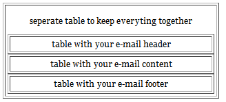
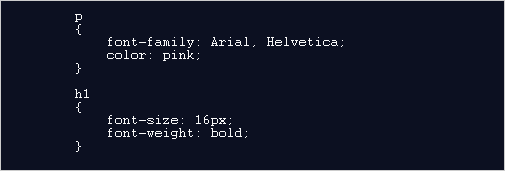
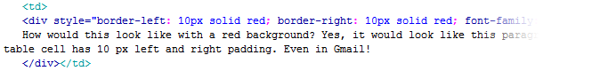
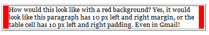
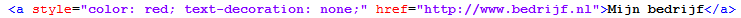
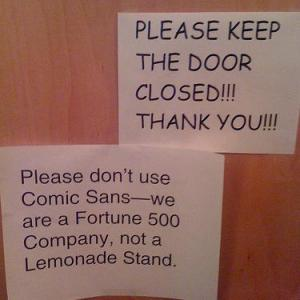
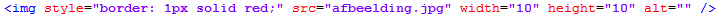
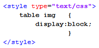
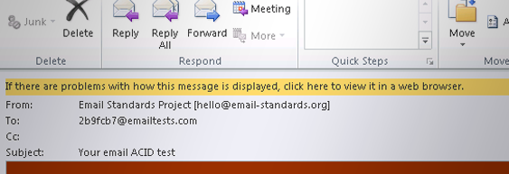

Dit artikel gaat over de ondersteuning van HTML en CSS door diverse
e-mailprogramma's zoals Gmail en Outlook. De regels van
e-mailprogramma's wat betreft HTML en CSS gebruik verschillen onderling
behoorlijk en zijn daarnaast voortdurend aan verandering onderhevig. Wij
raden aan een e-mailtemplate/document -voordat je deze gaat versturen-
ook te testen in de LitmusApp e-mail preview. U ontvangt dan screenshots
van uw document zoals deze wordt weergegeven in alle mogelijke
e-mailprogramma's en internetbrowsers.

Gebruik HTML tabellen voor de layout van de e-mailing
-----------------------------------------------------

Tabellen worden het beste ondersteund door de meeste e-mail programma’s
dus is het aan te raden om de layout volledig uit tabellen te laten
bestaan in plaats van gepositioneerde ‘divs’.

**Tip:**Gebruik altijd een aparte tabel om de boel bij elkaar te houden.
Zo voorkom je dat er onwenselijke ruimte ontstaat tussen de overige
tabellen.

Voeg CSS altijd direct toe aan het HTML element
-----------------------------------------------

Sommige e-mailprogramma's (Gmail is er een van) negeren alle informatie
die je in de HTML header meestuurt. Eventuele CSS code die je binnen de
\<head\>...\</head\> tags opneemt, wordt dus niet ingeladen. De juiste
manier om toch CSS te gebruiken in een HTML e-mailing is om deze inline
op te nemen.

[Toch met een los stylesheet werken, en deze automatisch omzetten naar
inline
attributen](http://beta.copernica.com/index.php?pxc=113251&current=help&pxd=.p.help.article&article=emailings.dialogs.newtemplate.convertingstyles&language=english&article=emailings.dialogs.newtemplate.convertingstyles)

**Niet juist:** de CSS block element stijlregels zijn in de header
opgenomen. Dit wordt genegeerd door veel e-mailprogramma's

**Zeer zeker wel juist:** De stijlregels zijn direct aan de HTML tags
toegevoegd (inline style). De meeste inline style regels kunnen worden
omgezet, behalve de zogenoemde pseudo elementen (herkenbaar aan de naam
van het element, gevolgd door een dubbele punt teken, zoals *a:link*).

De software beschikt over een functie om alle CSS uit een header, of een
gekoppeld stylesheet, automatisch om te zetten naar inline CSS. Zo
behoud je het gemak van een extern stylesheet en wordt het document toch
correct weergegeven in de inbox.  [Lees meer over het automatisch
converteren van
CSS](https://www.copernica.com/nl/ondersteuning/css-style-blokken-automatisch-omzetten-naar-inline-css)

**CSS styleregels die niet (goed) worden ondersteund**
------------------------------------------------------

Onderstaand de meest belangrijke zaken wanneer je CSS gebruikt in je
HTML template en document

### Gebruik geen CSS margin en padding

Padding en margins worden helaas genegeerd door enkele e-mailprogramma’s
en/of e-maildiensten. Maak daarom gebruik van transparante 1x1px
afbeeldingen, beter bekend als spacer.gif of pixel.gif. Verschillende
Spamprogramma’s checken helaas op het overmaat gebruik van spacer.gif,
dus is het wel aan te raden om een andere benaming hiervoor te gebruiken
zoals 1.gif.

Een andere manier om margins en padding te simuleren is het gebruik van
**CSS-borders**, die wel goed worden ondersteund.

Onderstaande HTML laat zien hoe je met borders een padding kan simuleren

Zal resulteren in het volgende:

### Vermijd het gebruik van achtergrondafbeeldingen

Vraag ons niet waarom, maar Microsoft Outlook is gestopt met het
ondersteunen van het gebruik van achtergrondafbeeldingen sinds Outlook
2007. De meeste HTML en CSS attributen werken helaas niet. Als je alsnog
achtergrondafbeeldingen wilt gebruiken (wat wij volledig kunnen
begrijpen), moet je niet vergeten ook een achtergrondkleur
(vergelijkbaar met de kleur van de gebruikte afbeelding) te definiëren.
Dus als er tekst geplaatst wordt over een afbeelding zal deze nog
leesbaar zijn ook voor de Outlook-gebruikers. De inhoud zal ook leesbaar
blijven als de ontvanger besluit geen afbeeldingen te downloaden (veel
ontvangers doen dit). Daarom is het definiëren van een achtergrondkleur
sowieso een goed idee.

### Laat geen tabelcellen leeg en houd je tabellen erg eenvoudig

Als je gebruik maakt van lege tabelcellen om witte ruimtes toe te voegen
aan je ontwerp, let dan op dat deze cellen niet echt leeg zijn, maar een
transparante gif afbeelding bevat met de gewenste breedte en/of hoogte.
Het wordt niet aanbevolen om 1px afbeelden te upscalen. Als een tabelcel
10 pixels hoog moet zijn, plaats een transparante afbeelding erin van 10
pixels hoog, dit omdat Outlook de ingestelde breedte en hoogte van een
afbeelding negeert en gebruik maakt van de oorspronkelijke afmetingen.

Zorg ervoor dat je tabellen eenvoudig blijven. Probeer het gebruik van
colspan en rowspan te voorkomen.

### Maak geen gebruik van pseudo classes

Pseudo classes worden veel gebruikt om het uiterlijk van bijvoorbeeld
hyperlinks manipuleren. Met het gebruik van pseudo classes kun je in dit
voorbeeld bijvoorbeeld de onderstreping van een hyperlink verwijderen.
Dit is alleen niet mogelijk in e-mail templates.

### Gebruik websafe lettertypen

Wij adviseren om alleen lettertypen te gebruiken die standaard zijn
opgenomen in alle besturingssystemen. Als je een ander lettertype wilt
gebruiken, wordt deze vervangen door een standaard systeem lettertype
(hoogstwaarschijnlijk Times of Arial). Als je de e-mail leesbaar wilt
houden, raden wij het gebruik van Arial, Verdana, Georgia of Trebuchet
MS aan. Gebruik alsjeblieft niet (of eigenlijk nooit) Comic Sans, tenzij
je natuurlijk limonade verkoopt.

Een lijst met web save lettertypes kan hier gevonden worden:
http://dustinbrewer.com/fonts-on-the-web-and-a-list-of-web-safe-fonts/

Bekende problemen en vraagstukken
---------------------------------

### Geen afbeelding borders in Outlook

Afbeelding borders worden niet ondersteund door Outlook. Daar kunnen wij
helaas ook niks aan doen.

Normaal zouden we een border direct aan een afbeelding koppelen.
Bijvoorbeeld zo:

Dit is een bekend probleem. Het kan opgelost worden door de afbeelding
in een container te zetten, en dan deze container een border te geven.
In het onderstaande voorbeeld wordt er gebruik gemaakt van een
container, maar dit kan natuurlijk ook in een div element.

### Witruimte onder elke afbeelding in Hotmail

Hotmail heeft de neiging om 1 pixel witruimte onder elke afbeelding toe
te voegen. Dit kan worden opgelost door het toevoegen van de volgende
styling aan de header van de e-mail (Hotmail verwijderd nooit de header
uit je HTML-template).

### Als er problemen zijn met de manier waarop dit bericht wordt weergegeven...

Het lijkt erop dat Microsoft zich eindelijk begint te realiseren dat een
gemiddelde broodrooster een betere HTML rendering heeft dan Outlook 2007
(en hoger). Maar in plaats van dit probleem bij de wortel aan te pakken
(d.w.z. het vervangen van de huidge HTML-engine naar een veel betere),
kwamen ze met dit geweldige idee: 'Waarom niet een extra knop toevoegen
aan de software die e-mail geadresseerden kunnen klikken om direct de
HTML-mail in hun favoriete internet browser (IE?) te bekijken'. We love
it! Maar de afzender moet deze knop eerst activeren door het toevoegen
van een geheime code aan de HTML-header van je e-mail. Omdat we je
natuurlijk graag helpen, komt hier deze geheime code:

**\#ForceOutlook2010BrowserLink span  {paddin: 0px;}**

en hier is het resultaat!

Extra tips:
-----------

-   Handhaaf een maximale breedte van 740 pixels voor uw e-mail
    templates.
-   Stel de tabel breedte van de container tabel op 98% in.
-   Gebruik geen float om div's en andere elementen te positioneren.
    Gebruik daarvoor het ouderwetse align="left" of "right".
-   Gebruik geen korte notatie voor inline stijlen, bijvoorbeeld:
    border: 1px solid red. Gebruik de volledige notatie: border 1px;
    border-color: red; border-style: solid.
-   Gebruik nooit Javascript, of embeded video's in je e-mailing. Dit
    zal ten eerste niet werken en zal ook nog eens je afzender reputatie
    verminderen. Houd het simpel. Een alternatief voor de embeded
    video's is het plaatsen van een screenshot van de video die als een
    hyperlink verwijst naar de webpagina van de desbetreffende video.
    Als je een link naar een Youtube-video plaatst, zal Gmail deze
    automatisch in je e-mail insluiten.
-   Voeg altijd alt attributen toe aan afbeeldingen en title attributen
    aan de hyperlinks.
-   Voeg altijd summary attributen toe aan tabellen (table
    summary=header). Dit maakt je e-mails minder aantrekkelijk voor
    spamfilters.
-   Test uitgebreid je template op alle gangbare e-mail clients en
    internet browsers (bijvoorbeeld via Litmus)!

Een aantal nuttige referenties:
-------------------------------

1.  **Email-standards.org**\
     Email-standards.org werkt met e-mail client ontwikkelaars en de
    design gemeenschap aan universele webstandaarden en betere e-mail
    toegankelijkheid. Het is een zeer nuttige referentie voor HTML
    template designers aangezien ze alle e-mail clients en hun (gebrek
    aan) ondersteuning voor HTML en CSS vermeld.\
     [http://www.email-standards.org/](http://www.email-standards.org/)
2.  **CSS en HTML ondersteuning Microsoft Outlook**\

    [http://msdn.microsoft.com/en-us/library/aa338201.aspx](http://msdn.microsoft.com/en-us/library/aa338201.aspx)
3.  **CSS and email, kissing in a tree**\
     Artikel over het gebruik van CSS inline stijl in e-mail templates\

    [http://www.alistapart.com/articles/cssemail/](http://www.alistapart.com/articles/cssemail/)

