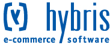

Maak je gebruik van Hybris als e-commerce-platform? Dan is het mogelijk
de koppeling te maken met Copernica dankzij de Hybris-integratie.
Synchroniseer de data vanuit Hybris met Copernica door gebruik te maken
van Copernica's SOAP API. Hierdoor houd je onder andere je klantgegevens
up-to-date en ben je in staat gerichte e-mailcampagnes te verzenden.

-   **Verzorgd door:**[Softlution Nederland
    BV](http://www.copernica.com/nl/partners/profile/4536494), [Bluedesk
    E-Business
    BV](http://www.copernica.com/nl/partners/profile/4537956), [Xplore
    Group NV](http://www.copernica.com/nl/partners/profile/7000117)

Over Hybris
-----------

De integratie maakt het bijvoorbeeld mogelijk volgende campagnes in te
zetten:

-   Achtergelaten winkelwagentjes: Stuur klanten een e-mailing om ze te
    herinneren aan een aankoop die nog niet is afgerond.
-   Loyaliteitscampagnes: Stuur je trouwe klanten een e-mail met daarin
    een gepersonaliseerde kortingsbon waarmee ze naar je fysieke winkel
    kunnen.
-   Winbackcampagnes: Heractiveer klanten die bijvoorbeeld 6 maanden
    niet meer in je webwinkel zijn geweest en stuur ze een persoonlijk
    aanbod.

