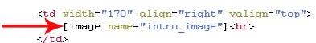

# Image tags

In een template kun je met behulp van [image] tags opgeven waar afbeeldingen 
mogen worden geplaatst. Als de template wordt gebruik voor het samenstellen 
van een document, kan op elke plek waar je [image] tag hebt gezet door de
gebruiker een afbeelding worden ingevoerd.

Ook hier geldt weer, net als bij de andere *tags* die je in een template kunt
plaatsen, dat het sterk is aan te raden om een attribuut *name* aan de tag
toe te voegen. Hierdoor kunnen op documentniveau de afbeeldingen worden
gekoppeld aan de juiste image tags, zelfs als je later de template wijzigt
en de volgorde van de tags verandert.

Als je *name* attributen gebruikt, moet elke afbeelding binnen de template een
unieke naam hebben.

## Formaat

De afbeelding die op documentniveau door de gebruiker wordt ingevoerd, wordt
normaal gesproken ongewijzigd overgenomen - zelfs als de afbeelding veel te
groot is en daardoor de vormgeving uit zijn verband trekt. Maar dit kun je 
voorkomen.

Er zijn allerlei attributen om het formaat van een afbeelding af te dwingen,
of om een minimum- en/of maximumgrootte op te geven. Als je er zeker van wilt 
zijn dat een afbeelding altijd 100x100 pixels groot is, ook als een groter of 
kleiner plaatje wordt geüpload, dan kun je dit doen door middel van de volgende
code:

`[image name="example" width="100" height="100"]`

Je kunt ook een minumum- of maximumgrootte opgeven. Als de breedte van een
afbeelding binnen de 100 en 150 pixels moet blijven, doe je dit als volgt:

`[image name="example" minwidth="100" maxwidth="150"]`

Hetzelfde geldt voor de *minheight* en *maxheight* attributs. Afbeeldingen die
niet voldoen aan de opgegeven limieten worden vergroot of verkleind, waarbij
de verhoudig tussen breedte en hoogte zoveel mogelijk wordt behouden: een foto
wordt dus niet uitgerekt.

## Optionele afbeeldingen

Als een gebruiker besluit om een afbeelding leeg te laten onstaat een
lege plek in het document. Een [image] tag die niet wordt ingevuld, wordt
namelijk standaard voorzien van een doorzichtige afbeelding. Er komt dus
in het uiteindelijke document in principe altijd een &lt;img&gt; tag op de 
plaats van de [image] tag. 

Maar het kan ook anders. Als je aangeeft dat een afbeelding *optioneel* is,
dan wordt er alleen een afbeelding in het document geplaatst als de gebruiker
ook zelf expliciet op documentniveau een afbeelding op de plaats van de
[image] tag plaatst. Als de gebruiker geen afbeelding uploadt, dan zal er ook
geen &lt;img&gt; tag in het uiteindelijke document staan.

`[image name="example" optional="yes"]`

## Inleidende en afsluitende HTML code

Als op documentniveau een afbeelding wordt geüpload, dan wordt in het document 
een &lt;img&gt; tag geplaatst met deze afbeelding. Voor en na deze &lt;img&gt;
tag wordt de HTML code geplaatst die je in de "begin" en "end" attributen
hebt gezet:

`[image name="example" begin="&lt;div class=x&gt;" end="&lt;/div&gt;"]`

Met bovenstaande code zorg je er voor dat er altijd een &lt;div&gt; element 
rond de afbeelding wordt gezet. 

