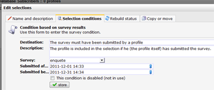

Als je een selectie wilt maken gebaseerd op de gegeven antwoorden, dan
is het antwoord **nee**.

Als je een selectie wilt maken op profielen of subprofielen die een
enquete wel of niet hebben ingevuld, dan is het antwoord **ja**.

Maak een nieuwe selectieregel aan, en kies de conditie 'Check op
enqueteresultaten'

Dit type conditie is ook beschikbaar voor miniselecties.

Use the condition type **Check on survey results** to create a selection
based on whether a profile or subprofile has submitted a survey or not.
