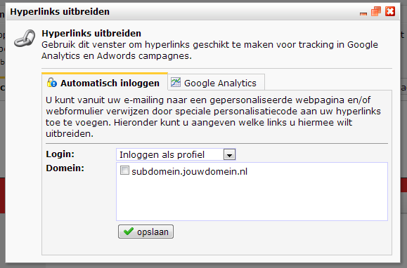

#Naar webpagina linken vanuit emailing
Veel gebruikers van Copernica maken webpagina's voor gebruik in hun
e-mail campagnes. Bijvoorbeeld een link naar een webpagina met een
formulier of enquête. Linken naar webpagina's wordt gedaan met normale
hyperlinks. Om in sommige gevallen webformulieren te laten functioneren,
is het vereist dat de indiener kan worden gekoppeld aan een profiel in
de database.

Om ervoor te zorgen dat je abonnees direct ingelogd zijn wanneer ze
klikken op de hyperlink van de webpagina, moet je deze link met een
inlogcode uitbreiden. Deze code toevoegen heeft verschillende voordelen.

-   webformulieren kunnen van te voren al worden ingevuld met
    profielgegevens
-   resultaten van de enquête worden automatisch opgeslagen in het
    profiel of subprofiel
-   de webpagina kan worden gepersonaliseerd met (sub)profielgegevens
-   de abonnee hoeft niet eerst in te loggen op webpagina's die een
    login vereisen.

Om een gebruiker automatisch te laten inloggen, voeg je de volgende code
toe aan de link in het e-mail document:

http://subdomein.jouwdomein.nl/webpaginanaam?profile={$profile.id}&code={$profile.code}

of wanneer de mailing wordt verstuurd naar subprofielen:

http://subdomein.jouwdomein.nl/webpaginanaam?subprofile={$subprofile.id}&code={$subprofile.code}

Als je deze code niet handmatig wilt toevoegen, kun je ook gebruik maken
van de functie **Hyperlinks uitbreiden** in het **Template** menu onder
**Emailings**.

