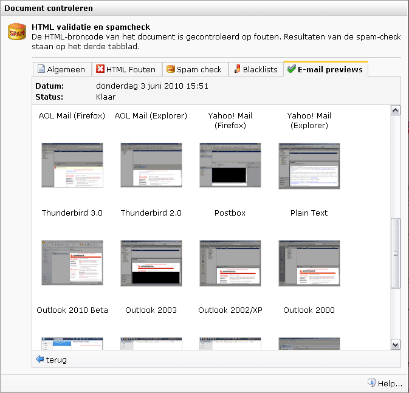
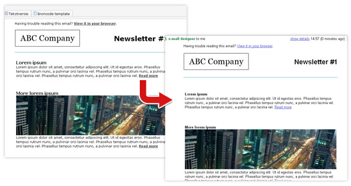
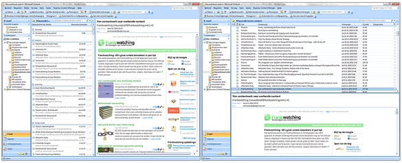

Het gaat in e-mailmarketing nogal eens fout bij de weergave van
berichten: een afbeelding die uit proportie raakt, een achtergrond die
niet wordt ingeladen of een zorgvuldig gestylde opmaak die volledig
wordt vernaggeld door een ISP. Wanneer leren marketeers het nu? Je moet
testen voor je e-mailings uitstuurt. Je wilt tenslotte graag beheersen
hoe de ontvanger jouw e-mail ziet.

[Litmus](http://litmus.com/email-previews "Litmus") biedt hulp. Deze
tool geeft e-mailmarketeers een preview van hun e-mail in de meest
voorkomende ISP’s en e-mailclients. Naast webbased e-mailclients als
Gmail, Hotmail en Yahoo! zie je ook hoe je e-mail eruit ziet binnen
desktopbased e-mailclients als Outlook, Lotus Notes en Apple Mail en kan
je ook zien hoe je mail op mobiele apparaten verschijnt.

Let wel: Litmus is een tool die tegen betaling wordt aangeboden. Als
kleine verzender ben je beter af om vooraf testmails te sturen aan de
meest voorkomende e-mail clients in je verzendbestand zoals Hotmail,
Gmail en Outlook. Of: geef je ESP een por in de ribben om deze service
te integreren in zijn pakket.   

Wat kan je o.a. testen met Litmus?
----------------------------------

-   De display van titels bij afbeeldingen wanneer plaatjes niet zijn
    ingeladen
-   De display van afzender, subjectline & tagline. In hoeverre wordt je
    subjectline weergegeven? Het kan gebeuren dat een e-mailclient een
    lange subjectline afkapt.
-   Spacing: de ene browser past jouw spacing aan volgens de
    standaardweergave van de browser terwijl een andere deze laat staan
    zoals oorspronkelijk aangegeven in de broncode van je HTML-document.
-   Lettertypes: ook deze kunnen bij verschillende browsers anders
    worden weergegeven. Zowel voor spacing als lettertypes voorkom je
    dit door gebruik te maken van stylesheets.
-   In welke mate wordt jouw mail weergegeven binnen het browservenster
    of venster van de e-mailclient? Dit kan je snel en gemakkelijk
    testen.
-   Je kan kijken of je mail mogelijk een ‘waarschuwing’ oproept. Bv.:
    *This message is from an unknown sender.*

Wat kan je niet testen?
-----------------------

Litmus laat jou enkel screenshots zien als preview van je mail. Dit
houdt in dat de afbeelding niet dynamisch is. Je kan het volgende niet
testen:

-   Checken of de toegevoegde title-tag werkt wanneer je met je muis
    over een afbeelding of hyperlink beweegt.
-   Zijn hyperlinks of opvolgacties binnen je e-mail geactiveerd?
-   Bij het extern inladen van plaatjes wordt in sommige gevallen (m.n.
    Explorerm Outlook) de ‘foto’ gemaakt voordat ze zijn ingeladen
    waardoor je onterecht denkt dat deze niet goed overkomen
-   Dynamische content: personalisatie werkt wel, maar slechts voor 1
    bestemming. Als je dus een hoge personalisatiegraad toepast in je
    mail of ingeladen content hebt, moet je veel (en dure) tests
    uitvoeren

Naast hetgeen je wel en niet kan testen brengt Litmus de volgende
voordelen met zich mee voor de e-mailmarketeer:

-   Tijdsbesparing: Door het vertonen van een preview van je mail in
    verschillende weergaven bespaart de tool een hoop tijd aan testen
-   Kwaliteit: De tijd die je voorheen kwijt was aan het optimaliseren
    van lay-out en het bepalen van het juiste formaat kan je nu besteden
    aan de kwaliteit van de gebruikte content
-   Usability: De tool biedt de mogelijkheid een foutloos document voor
    elke ontvanger op te stellen.

Veelvoorkomende weergave missers en hoe ze te voorkomen
-------------------------------------------------------

Als voorschot op de verbeteringen die je met Litmus kunt maken, noemen
we hieronder een aantal veelvoorkomende fouten en de oplossing voor een
goede e-mailing.

### Hyperlinks staan in de verkeerde kleur

Browsers hanteren bij het tonen van content een standaardweergave. Deze
kan echter verschillen van browser tot browser. Ook e-mailclients kunnen
de weergave van je e-mail anders inladen. Hotmail heeft er bijvoorbeeld
een handje van om hyperlinks altijd blauw te maken, ook al heb je ze
zelf zwart of rood opgemaakt. Dit kan je voorkomen door de link te
voorzien van een inline style (zie voorbeeld) in de broncode van je
HTML-document. Op deze manier wordt de hyperlink overal op dezelfde
wijze weergegeven.

Voorbeeld:

\< a style=”color: \#333333; text-decoration: underline;”
href=”http://www.domainname.com \> Read more\< /a \>

### Afbeeldingen worden niet getoond

De meeste e-mail clients staan zo ingesteld dat ze afbeeldingen niet
automatisch weergeven. Maak daarom bij alle afbeeldingen gebruik van
alt-teksten. Een alt-tekst geeft een korte beschrijving van wat
afgebeeld is. Wanneer de afbeeldingen niet getoond worden, dan ziet de
ontvanger wel de alt-tekst en ziet hij alsnog een omschrijving van de
afbeelding.

Een ander nadelig effect is dat de teksten in de nieuwsbrief gaan
verspringen omdat de plaatjes ze niet meer op hun plek houden. Om dit te
voorkomen moet je de afbeeldingen een vaste hoogte en breedte meegeven.
Deze ruimte wordt dan gereserveerd, ook als de afbeelding zelf wegvalt.

Een correcte hyperlink rondom een afbeelding ziet er als volgt uit:\
 \< a href="https://www.copernica.com" title="Naar de Copernica BV
website" target="\_blank" \>\
 \< img src="logo.gif" width="261" height="41" alt="Copernica BV
website" border="0" / \>\
 \< /a \>

### Achtergrond weg = tekst weg

De meeste e-mail clients kunnen tegenwoordig goed overweg met het
gebruik van achtergrondafbeeldingen. Helaas zijn er ook koppige
ontwikkelaars zoals Microsoft (Outlook 2007, maar ook 2010) die dat niet
kunnen (willen). Wanneer een afbeelding niet ondersteund wordt en je
hier juist ook je tekstkleur op had afgestemd, valt ook de tekst weg of
wordt slecht leesbar. Je voorkomt dit het best door naast de
achtergrondafbeelding ook een standaard achtergrondkleur in te stellen
waarbij de tekst duidelijk zichtbaar blijft.

### Preview kapt vreemd af

In de meeste e-mail clients heeft de gebruiker standaard een ‘preview
pane’ van je mail zonder deze te openen. De vorm van deze preview pane
hangt af van de instellingen van de gebruiker zelf. Indien jouw mail
niet binnen het formaat van het voorbeeldvenster past, wordt deze
verkeerd weergegeven. Met behulp van Litmus anticipeer je hierop en
bekijk je hoe bijv. Outlook de mail weergeeft binnen het
voorbeeldvenster.

Daarnaast kan je voorkomen dat een e-mail client je mailing vreemd
afkapt door het juiste formaat voor je ontwerp aan te houden. De
standaard is 600 x 650 pixels.

Door de kern van je informatie links en bovenaan je e-mailing te
plaatsen zorg je ervoor dat je voornaamste triggers en boodschap in
ieder geval gezien worden.

### Verspringend lettertype

Lettergrootte en -type wisselen wanneer je als marketeer bijvoorbeeld
uit Word knipt en plakt. Daarnaast worden bepaalde lettertypes die niet
voorkomen op de computer van de ontvanger door Outlook anders
weergegeven. Gebruik daarom altijd een platte tekst editor bij
kopieerwerk en controleer handmatig dat geen non-html code is
meegekopieerd in teksten. Je kunt ook werken met een stylesheet die bij
het verzenden van een e-mailing alle teksten naloopt en de juiste
in-line HTML styling toevoegt. Deze styling overschrijft dan eventuele
fouten. Sommige ESP’s bieden deze functionaliteit geïntegreerd aan.

*Dit artikel is reeds verschenen op
[Frankwatching](http://www.frankwatching.com/archive/2010/11/23/litmus-previews-van-e-mail-wat-stuur-ik-uit/ "Frankwatching").*
