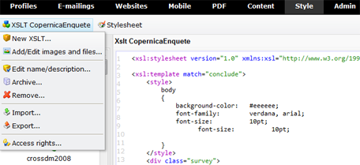

XSLT files are managed under **Style**. Content items such as surveys
and feeds are provided with a default XSLT when published. This converts
the XML coding to HTML appropriate to the publication and also allows it
to adapt to the styling of the HTML file (your templates).

Add an XSLT to the publication if you wish to divert from the default
styling of content items. The possibilities are near infinite if you
have knowledge of XML and XSLT language. For example you may wish to
provide all multiple choice questions of a survey with drop-down menu's,
leave out headers from all RSS articles or break off all articles after
4 sentences, etcetera.

you can find the actions from this article in the XSLT menu under Style

Custom XSLTs can be easily **previewed** from the Preview tab under
content.
**Assign a XSLT to a Content item** (e.g., a web form) as follows:

`{webform xslt="yourcustomxslt"}`

Creating an XSLT
----------------

**The XSLT menu under Style provides the option to make a new XSLT
file.**

Choose whether you want to use the XSLT for Survey, Atom feeds, RSS
feeds, web forms or something else.

You can choose to pre fill the file with example code. This can be used
as a base for creating your own custom XSLT.

Archiving an XSLT
-----------------

An XSLT which is no longer in active use can be archived. That way the
coding is preserved, but moved from the list of XSLTs to a separate tab.
This allows you to keep better track of active files.

**Note:** publications of the archived XSLT will still function.

Removing an XSLT
----------------

An XSLT which is removed from Style is irretrievable. Publications
making use of it will no longer function.

You may remove the file through the XSLT menu, but you may wish to
archive instead to preserve a copy of the file.

Exporting an XSLT
-----------------

An XSLT file can be exported from the application and saved on your
computer through the export function from the XSLT menu.

Define if you wish to save or open the file. It will be in XML format.

Edit XSLT name and description
------------------------------

An existing XSLT can be renamed, given a different target and
description with the '**edit name/description**' function from the XSLT
menu.

**Note:**Make certain that publications referring to the XSLT are also
changed.

Further reading
---------------

-   [A great reference on
    XSLT](http://www.zvon.org/xxl/XSLTreference/Output/index.html)
-   [W3C XSL Tutorial](http://www.w3schools.com/xsl/)
-   Creating XSLT files requires knowledge of [XML](http://w3schools.com/xsl/default.asp).

