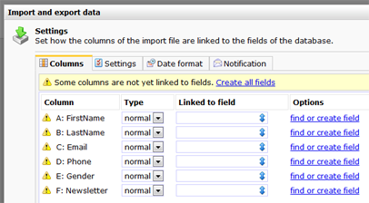
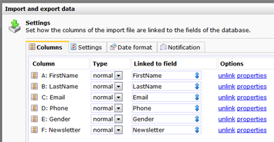
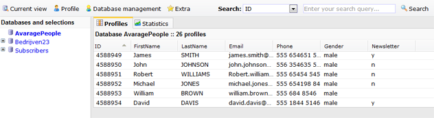

Normale import (altijd profielen aanmaken)
==========================================

Deze handleiding helpt je bij het importeren van profielen naar een
database in de marketing software. Raadpleeg voor de eerste stappen het
[bovenliggende artikel](#).

**Let op:**met deze import worden profielen ALTIJD AANGEMAAKT. Wanneer u
de gegevens in uw database wilt bijwerken gegevens uit het
importbestand, raadpleegt dan dit [artikel](#).

### De import instellingen

Het import dialoogvenster heeft 4 tabbladen. Bij een import waarbij
altijd nieuwe profielen moeten worden aangemaakt, is eigenlijk alleen
het eerste tabblad **Kolommen** van belang. Hier kan je de kolommen uit
het importbestand koppelen aan de kolommen in de database.

-   Namen van kolommen die overeenkomen met veldnamen in uw database,
    worden automatisch gekoppeld.
-   Gegevens uit kolommen die niet gekoppeld zijn, worden niet
    geïmporteerd.
-   Om een verkeerd gekoppelde kolom weer te ontkoppelen, drukt u op
    ontbind

als er geen corresponderende velden worden gevonden, dan kunnen deze
automatisch worden gekoppeld

Je kan ontbrekende databasevelden direct creëren door op ‘zoek of creëer
veld’ te drukken. Standaard is een databaseveld in de software van het
type **Tekstveld**. Kies vervolgens voor eigenschappen om het nieuw aan
te maken veld van de juiste instellingen te voorzien.

Je kan hier bijvoorbeeld instellen dat in het veld alleen numerieke
waardes mogen worden opgeslagen. De eigenschappen van de databasevelden
kunne uiteraard ook op een later moment worden gewijzigd vanuit
*Databasebeheer*.

In een tekstveld kunnen alle soorten waardes worden opgeslagen, dus ook
alphanumerieke, datums, Chinese tekens en wiskundige formules.

de velden zijn gekoppeld. De import kan gestart worden

Let op, met deze tutorial maakt je altijd nieuwe profielen aan. Wanneer
je estaande gegevens wilt bijwerken met gegevens uit het importbestand,
dan dien je een of meerdere sleutelvelden aan te wijzen en nog enkele
[extra instellingen](#).

### Instellingen tabblad

Voor een normale (eerste) import waarbij altijd nieuwe profielen moeten
worden aangemaakt, zijn de standaardinstellingen afdoende.

### Datumnotatie

Mocht u straks bij het starten van de import een melding krijgen over
onverenigbare datumvelden, raadpleeg dan dit artikel.

### Notificatie

Indien gewenst kunt u instellen dat er een email notificatie moet worden
verstuurd zodra de import gereed is.

### Import starten

Wanneer alles is ingesteld, kunt u de import starten. Het bestand wordt
dan direct geimporteerd. Let wel, dit kan afhankelijk van de grootte van
het importbestand enige tijd duren. Het dialoogvenster kunt u na het
importeren sluiten. Dit heeft geen gevolgen voor het verloop van de
verdere import.

Klik op **Start import**om de import te starten.

### 

wanneer de import is voltooid zijn de geimporteerde profielen
beschikbaar in de database

 
