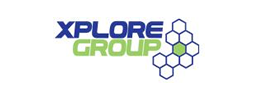
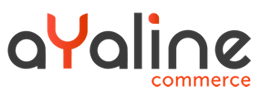

Op donderdag
11 oktober vind de 7^e^ editie van het [Digital Marketing
First](http://www.digitalmarketingfirst.be/) in Brussel plaats.
Copernica is ondertussen een vaste waarde op deze beurs en zal tijdens
deze editie aanwezig zijn met drie internationale partners. Voor het
eerst wordt Copernica op een beurs vertegenwoordigd door partners uit
Nederland, België en Frankrijk.

Kom jij ook naar de beurs? Bezoek dan zeker Copernica en zijn partners
op stand D09 voor een korte demonstratie van de software of stel je
gerichte vragen over digital marketing. Onze medewerkers en partners
staan je graag te woord.

**aYaline: Waarom de conversie van webshops is gekoppeld aan technische
prestaties?**

Tijdens deze presentatie gaat onze partner uit Frankrijk aYaline dieper
in op de verschillende manieren waarmee webshophouders meer conversie
halen uit hun platform. Op basis van voorbeelden en een praktijkcase
lichten zij toe hoe je bv. je verkoopfunnel verbetert, hoe je het
aankoopproces verbetert en hoe je een betere opvolging verzorgt voor je
achtergelaten winkelwagentjes.

**Aanwezige partners**

***Bookerz***

Bookerz is
specialist in emotiemarketing. Bookerz ondersteunt u bij het overbrengen
van uw boodschap en zorgt voor een creatieve invalshoek. Zowel online
als offline. U focust zich op de praktijk, terwijl Bookerz zich richt op
uw (toekomstige) klanten. Op vlak van concept en design, zowel online
als offline, biedt Bookerz u een overtuigende meerwaarde. Graag helpt
Bookerz bouwen aan uw onderneming. Meer informatie over Bookerz:
[www.bookerz.nl](http://www.bookerz.nl/)

***Xplore Group***

Xplore
Group is het meest succesvolle Java (JEE) & PHP competence center van de
Benelux. Het 300 personen sterk team levert kwalitatieve en performante
webapplicaties en e-commerce oplossingen met de nadruk op on- time
delivery en integratie. Zo specialiseerden we ons ondermeer op het
naadloos integreren van Copernica in hybris, Intershop, Magento of
andere e-commerce oplossingen. Daarnaast zijn Usability,
eindgebruikerstesten, SEO & SEA campagnes, etc.. een logisch vervolg die
geen geheimen meer kennen voor ons. Meer informatie over XploreGroup:
[www.xploregroup.be](http://www.xploregroup.be/)

***aYaline***

As an experienced
provider of E-Commerce and an open source pioneer, aYaline builds high
added-value business solutions devoted to E-Commerce which are designed
with its clients according to their needs. aYaline has gained real
expertise of consumer computing by capitalizing on business cases and
know-how since 1995. More information about aYaline:
[www.ayaline.com](http://www.ayaline.com/)

**Over Digital Marketing First**

Digital Marketing First, voorheen bekend als Customer First, is een
initiatief van het magazine Inside Digital Media. In 6 jaar tijd is DMF
de grootste meeting geworden van de marketingindustrie en de nieuwe
media in België. Elk jaar, zakken meer dan 3.300 bezoekers af naar
Tour&Taxis.

De beurs richt zich uitsluitend tot professionals en presenteert hét
digitale marketingaanbod in België, maar DMF besteedt eveneens aandacht
aan de traditionele marketingtechnieken. 11 oktober worden er meer dan
60 conferenties, debatten en workshops aangeboden aan de bezoekers. DMF
kan rekenen op de steun uit de branche avn organisaties zoals de IAB, de
BDMV, Feweb, de ACC, BeCommerce…

Lees meer over het evenement op de website:
[www.digitalmarketing.be](http://www.digitalmarketing.be/)
