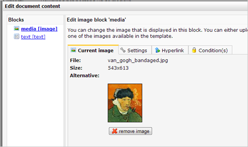
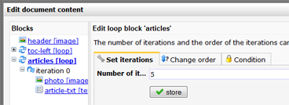
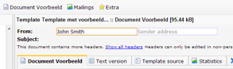

Zodra je een e-mailtemplate gereed hebt, kun je starten met het maken
van een e-maildocument.

Standaard is Copernica uitgerust met een aantal voorbeeldtemplates, die
je ook mag gebruiken voor je eigen mailings.

Heb je nog geen template? [Lees ons helpartikel over dit
onderwerp](https://www.copernica.com/nl/blog/een-eigen-template-maken-voor-gebruik-in-e-mailings)

Zoals je inmiddels weet vormt de e-mailtemplate de blauwdruk voor de
documenten die je onder het template aanmaakt. Met behulp van tekst-,
afbeelding,- en loopblokken die je in je template broncode definieert,
kan je op documentniveau content toevoegen. Dit artikel bevat alle
basisinformatie die je nodig hebt voor het opmaken van een e-mail
document.

### Nieuw document maken

-   Selecteer de template die je wilt gebruiken
-   In het document menu kies je vervolgens **'Nieuw document'**
-   Kies een naam en geef eventueel een beschrijving voor het nieuwe
    document.
-   Klik op **opslaan**.

Het document wordt direct aangemaakt en getoond. Het document is
natuurlijk nog leeg, dus laten we beginnen met het toevoegen van wat
content.

### Content toevoegen aan het document

Als het goed is heb je in de template HTML-broncode de tekst-,
afbeelding,- en loopblokken toegevoegd. Onze standaard templates zijn
hier ook mee uitgerust. Deze kun je nu gaan vullen met content.

-   Klik in de onderste werkbalk op **Bewerkmodus**. De blokken worden
    nu aanklikbaar.
-   Klik op een blok om de inhoud ervan de bewerken.

*Afbeelding: de standaardtemplate, met links het document in
**Voorbeeldweergave**, en rechts in **Bewerkmodus**.*

### Tekstuele content toevoegen

Voor het toevoegen van tekstuele content kan je zowel de **Uitgebreide
editor \*\* als de \*\*Beknopte HTML editor** gebruiken. Je kan tussen
beiden schakelen middels de zogenoemde knop rechtsonderin het
dialoogvenster.

-   [Lees hoe je tekstblokken maakt in je
    template](https://www.copernica.com/nl/blog/template-blokken-het-tekstblok)

Klik vanuit bewerkmodus op de naam van het blok om de inhoud ervan te
bewerken.In het scherm dat verschijnt kun je direct teksten invoeren.

-   De **uitgebreide editor** doet denken aan bijvoorbeeld Microsoft
    Word, en heeft soortgelijke functionaliteiten
-   De **Beknopte editor** doet denken aan Kladblok en is het meest
    geschikt om rauwe HTML in te voeren.

### Afbeeldingen toevoegen

Als je in de template broncode afbeeldingblokken hebt toegevoegd, kan je
hier op documentniveau afbeeldingen in laden.

-   [Lees hoe je afbeeldingblokken maakt in je
    template](https://www.copernica.com/nl/blog/template-blokken-de-afbeelding-tag)

Om een afbeelding toe te voegen, klik vanuit je **bewerkmodus** op het
desbetreffende blok. In het scherm dat verschijnt kun je een afbeelding
selecteren die je hebt ge-upload naar de afbeeldingenmap van het
template of document, of uit een [Media
Library](https://www.copernica.com/nl/blog/beheren-van-afbeeldingen-en-bestanden)
als je die hebt (deze kun je aanmaken in het onderdeel Content).

Zit je afbeelding er nog niet tussen? Dan kun je deze direct uploaden
naar het afbeeldingblok.

-   In het tabblad **Instellingen** kun je de alt-text (dit is de tekst
    die wordt getoond als de afbeelding niet wordt ingeladen) voor de
    afbeelding instellen en het formaat aanpassen (let op, de afbeelding
    wordt niet daadwerkelijk verkleind of vergroot. Eventueel kun je
    vanuit de tabbladen **Formaat** en Uitsnijden\*\* de afbeelding
    verder bewerken.

-   In het tabblad **Hyperlink** kan je de afbeelding aanklikbaar maken.

-   In het tabblad **Formaat** kun je een afbeelding kleiner maken.
-   In het tabblad **Uitsnijden** kun je een deel van de afbeelding
    uitsnijden.
-   In het tabblad **Condities** kan je de [condities
    instellen](https://www.copernica.com/nl/blog/de-eenvoudige-script-editor)
    voor het wel of niet tonen van de afbeelding, op basis van gegevens
    van de ontvanger. Je kunt bijvoorbeeld een andere afbeelding laden
    voor vrouwelijke nieuwsbriefabonnees (als je het geslacht van je
    ontvangers weet).

### Content herhalen met loopblokken

Als je in een e-mail document verschillende artikelen onder elkaar wilt
tonen in dezelfde lay-out, dan hoef je hiervoor maar 1 keer de benodigde
HTML-code met afbeelding en tekstblokken te schrijven. Hiertoe voeg je
een loopblok toe aan de HTML broncode van de template. In het document
geef je vervolgens aan hoevaak je de content binnen het loopblok in het
document wilt herhalen.

-   [Lees hoe je loopblokken maakt in je
    template](https://www.copernica.com/nl/blog/template-blokken-de-loop-tag)

-   Klik vanuit **Bewerkmodus** op een loop-blok.

-   Geeft bij 'iteraties' aan hoevaak het loopblok herhaald moet worden.
-   Tekst- en afbeeldingblokken die binnen de loop zijn gemaakt, zijn nu
    individueel aanklikbaar in het linkeroverzicht in het
    dialoogvenster.
-   Klik op een blok om deze van inhoud te voorzien.

Je kunt een loopblok zoveel herhalen als je wilt. Het is zelfs mogelijk
om een loopblok in een ander loopblok op te nemen. Bijvoorbeeld een loop
die tabelrijen maakt en hierbinnen een loop waarmee je tabelcellen
maakt.

### Document gepersonaliseerd weergeven

Om het document gepersonaliseerd weer te geven, schakel je vanuit
**bewerkmodus** over naar **voorbeeldweergave**. Je ziet het document nu
zoals het verstuurd zou worden. Als je gebruik maakt van Smarty
personalisatie, dan zie je de voorvertoning met gegevens uit jouw
[standaardbestemming](https://www.copernica.com/nl/blog/standaardbestemming-instellen-of-wijzigen).

Om weer terug te keren naar bewerkmodus, klik je op **Bewerkmodus**.

### Onderwerp en afzender toevoegen

Elke e-mail die je verstuurt, heeft ten minste een *afzenderadres*, een
*afzendernaam* en een *onderwerpregel*.

Deze stel je bij het document in, direct boven het document.

### Testmail versturen

Voordat je een e-mail naar je hele adressenbestand stuurt, wil je het
natuurlijk eerst testen. Om een testmail te sturen kies je in het menu
Mailings voor **Testmail versturen...**

De testmail wordt nadat je op verzenden hebt geklikt direct verstuurd
naar het e-mailadres uit je standaardbestemming.

[Meer lezen over het versturen van
testmails](https://www.copernica.com/nl/blog/een-test-e-mail-versturen)
