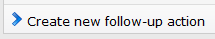
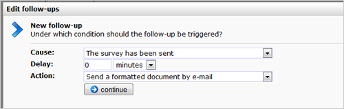

Enquete-opvolgacties zijn geautomatiseerde reacties op het invullen en
verzenden van een enquete. Je vindt het dialoogvenster om
enquete-opvolgacties in te stellen in het Enquete menu in het onderdeel
Content.

Aanleiding en actie
-------------------

Een opvolgactie bestaat altijd uit twee delen: de aanleiding en de
actie. Bij opvolgacties voor enquetes kan je kiezen uit twee
aanleidingen:

1.  **De enquete is verzonden:** de opvolgactie wordt geactiveerd nadat
    de invuller de enquete heeft verstuurd
2.  **Er is een specifiek antwoord gegeven:**de opvolgactie wordt alleen
    geactiveerd als door de invuller een specifiek antwoord is gegeven
    in de enquete.

Wachttijd
---------

Hier stel je in hoe lang na de *aanleiding*, de opvolgactie in werking
moet treden. Bij een directe actie is dat uiteraard 0 minuten.

Actie
-----

Kies de actie die moet volgen. Dit kan bijvoorbeeld het versturen van
een e-maildocument zijn of het versturen van een sms-bericht.

Condities voor opvolgacties
---------------------------

Als je niet wilt dat een opvolgactie onder specifieke omstandigheden
wordt ingeroosterd of uitgevoerd, dan kan je dit instellen met condities
voor opvolgacties. Je kan zo bijvoorbeeld voorkomen dat een e-mail wordt
verstuurd terwijl de ontvanger zich reeds heeft uitgeschreven.

[Lees meer over condities voor
opvolgacties](./condities-voor-opvolgacties-beperk-het-activeren-of-uitvoeren-van-een-opvolgactie.md)

Beschikbare variabelen in opvolgacties voor enquetes
----------------------------------------------------

In opvolgacties naar aanleiding van een enquête, en ook in de e-mails
die naar aanleiding van deze opvolgacties worden opgestart, zijn
variabelen beschikbaar met gegevens over de ingevulde enquête.

De variabele '*survey.xml*' bevat een XML representatie van de ingevulde
enquête. '*survey.html*' bevat een HTML representatie van de ingevulde
enquete, en 'survey.questions' bevat een *array* van alle vragen die
zijn ingevuld. Elke vraag uit dit array bestaat op zijn beurt uit een
variabele 'question' waarin de oorspronkelijke vraag staat, een
variabele 'type' met het type van de vraag ('open' voor open vragen,
'multi' voor meerkeuzevragen en 'grid' voor gridvragen). Elke vraag
heeft ook een member 'answer' met het gegeven antwoord. Indien de vraag
een open vraag is, bevat deze variabele de door de gebruiker ingevoerde
tekst. Voor meerkeuzevragen is dit een array met aangevinkte antwoorden
en voor gridvragen is dit een associatief array met als index het label
van de geselecteerde rij en als waarde het label van de geselecteerde
kolom.

### Een voorbeeld

Een voorbeeld zegt waarschijnlijk meer dan bovenstaande tekst. Als je
een opvolgactie alleen wilt uitvoeren indien op vraag drie van een
enquete een antwoord is gegeven waarin de tekst 'ja' voorkwam, kun je
dit met de volgende conditie doen:

`survey.questions[2].answer.match(/ja/);`

Let op: als computers en programmeurs gaan tellen beginnen ze bij nul.
Vraag drie voor een mens is dus vraag twee voor een computer. Echter,
door een fout in de software is er één uitzondering: de enquêtevraag
(questions) begint bij 1 met tellen.

Als je een opvolgactie alleen wilt uitvoeren indien er bij
meerkeuzevraag 7 minstens 3 antwoorden zijn ingevoerd, kan dit op de
volgende manier:

`survey.questions[7].answer.length >= 3`

### Antwoorden opvragen met smarty personalisatie

Zoals hierboven al geschreven zijn alle variabelen in de conditie ook
beschikbaar als smarty variabelen! Je kunt dus in een document dat naar
aanleiding van een ingevulde enquete wordt verstuurd deze variabelen ook
uitlezen! Zo kun je een notificatie naar iemand sturen waarin je meldt
welke vragen zijn ingevoerd:
Op vraag 2 heb je geantwoord: {\$survey.questions.2.answer.1|escape}

Met behulp van smarty is het ook mogelijk om in een opvolgactie de
[gegeven antwoorden te tonen](./antwoorden-enquete-mailen-in-opvolgactie.md)
in een e-mail.
