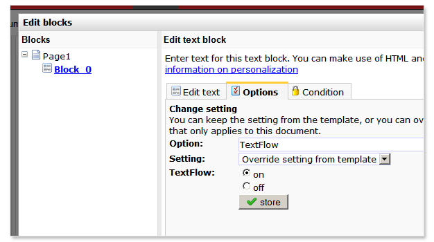
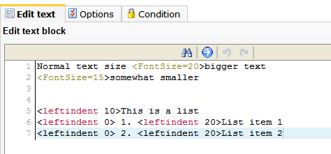
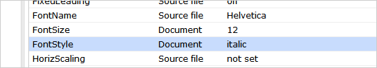
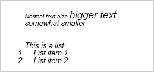

PDFlib biedt vele mogelijkheden om de lay-out van een PDF tekst blok op
documentniveau aan te passen. De gebruikte syntax lijkt erg op die van
HTML, maar verschilt tegelijkertijd ook wezenlijk. Raadpleeg voor meer
informatie hoofdstuk 7 uit de [tutorial/documentatie van PDF
lib](http://www.pdflib.com/fileadmin/pdflib/products/pdflib/info/PDFlib-blocks-E.pdf).

**Wanneer je besluit de opmaak van een tekstblok aan te gaan passen,
houd dan met de volgende punten rekening.**

1.  **Wijzigingen in de opmaak leiden niet tot het gewenste resultaat**
     Voor ieder blok dat je op documentniveau van een eigen opmaak wilt
    voorzien, moet je **TextFlow**op ‘on’ zetten, en deze moet de
    instelling van het template overschrijven. Deze instelling vind je
    achter het tabblad *'opties'*. Klik **TextFlow**aan (achtste optie
    van onder) en sla de nieuwe instellingen op.
2.  **Wijzigingen in de opmaak zijn niet zichtbaar in de PDF**
     Ieder element/attribuut dat je op documentniveau gebruikt voor de
    opmaak (bijvoorbeeld TextSize) dien je eerst op documentniveau te
    activeren. Anders wordt automatisch de instelling van de template
    gebruikt. Dit doe je in het tabblad 'Opties'. Zoek de optie en
    selecteer de optie ‘**instelling van de template overschrijven**’.
3.  **Wijzigingen zijn eerst niet zichtbaar, maar later ineens wel**
     Wanneer je de opmaak verandert, zal het resultaat hiervan niet
    direct zichtbaar zijn. Dit is geen fout, maar heeft te maken met de
    tijd die het systeem nodig heeft de voorvertoning op te bouwen. Om
    het resultaat van wijzigingen direct te testen/bekijken, raden wij
    aan het document naar je harde schijf te downloaden. Dit kan via
    document menu \> **document downloaden…**
4.  **Ik heb de opmaak veranderd, maar na het opslaan/downloaden is de
    inhoud volledig verdwenen**
     De syntax van PDFlib is behoorlijk streng en foutgevoelig. Als er
    een syntaxfout in staat (TekstSize in plaats van TextSize) zal de
    inhoud van het blok niet worden getoond (je ziet een leeg blok). 

Afbeelding: De opmaak van een tekst veranderen

De cursieve letter is tevens op documentniveau ingesteld, maar als
standaardwaarde ingesteld in het opties tabblad; alle tekst in het
contentblok is cursief.

**Dit komt er uiteindelijk als volgt uit te zien:**

