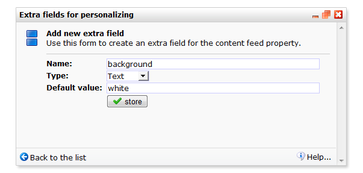

# Extra personalisatievariabelen

Je kunt op templateniveau extra *personalisatievariabelen* aanmaken, die je
vervolgens op documentniveau van een waarde kunt voorzien. Dit kun je gebruiken
om op documentniveau de template te beÏnvloeden.

## Waarom is dit handig?

De extra personalisatievariabelen zijn ingevoerd naar aanleiding van verzoeken
van onze gebruikers. Sommige Copernicagebruikers werken met verschillende 
sterk op elkaar lijkende templates: templates met een gelijke indeling en 
vormgeving, maar waarin alleen het bovenste logo of de footertekst anders is. 
Voor hen is het handiger om al deze templates te combineren tot een enkele 
template, om dan bij het aanmaken van een document in te stellen in welke modus
de template moet worden gebruikt. Dit kan met extra personalisatievariabelen.

Via je het dialoogvenster voor de extra personalisatievariabelen kun je de
variabelen aanmaken. Elke variabele krijgt een naam, type en standaardwaarde.

Binnen de HTML code van de template kun je deze personalisatievariabelen
gebruiken. Elke personalisatievariabele is benaderbaar via een 
{$property.*naam*}. Voorbeeld: als je bedrijf in de winter een ander logo
gebruikt en andere openingstijden heeft, dan kun je bijvoorbeeld een variabele
"seizoen" gebruiken. Bovenaan de template laat je het logo afhankelijk zijn
van de waarde van deze variable:

    {if $property.seizoen == "winter"}
        
    {else}
        
    {/if}

In de footer doe je iets soortgelijks:

    {if $property.seizoen == "winter"}
        Alleen op donderdag en vrijdag open van 09:00 tot 17:00 uur.
    {else}
        Zeven dagen per weeg geopen van 08:00 to 20:00 uur.
    {/if}

