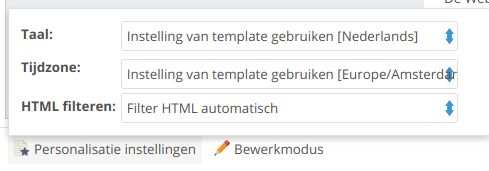

# Personalisatieinstellingen

Bij elk document en template kun je de personalisatie-instellingen wijzigen. 
Met deze instellingen bepaal je onder meer in welke taal [datums](./using-the-smarty-date-function.md)
worden weergegeven. Je vindt deze instelling linksonder de geopende
template of document.

Het formulier voor de instellingen vind je zowel bij templates als bij documenten.
Als je geen expliciete keuze voor deze instellingen op documentniveau maakt, dan valt
het document terug op de instellingen van de template. Je kunt de volgende
vier settings veranderen:

* taal: de taal die wordt gebruikt voor het weergeven van datums
* tijdzone: de tijdzone om te bepalen hoe tijdstippen worden opgemaakt
* html filteren: moeten personalisatievariabelen automatisch worden gefilterd?

## Taal en tijdzone

In het artikel over het [weergeven van datums en tijden](./using-the-smarty-date-function.md)
hebben we dit ook al behandeld: als je de huidige datum wilt weergeven is daar
een speciale |date_format modifier voor. Deze modifier kun je gebruiken om een 
tijdstip in computernotatie om te zetten naar een tijdstip in mensennotatie. De
taal en tijdzone settings worden hierbij gebruikt om te bepalen in welke taal
een datum wordt getoond (elke taal heeft immers andere namen voor de maanden en
de dagen), en welke tijdzone moet worden gebruikt (*nu* in Tokyo is iets anders
dan *nu* in New York).

## Bewerkmodus

Als je een document bewerkt, zit naast het menu met de personalisatieopties 
een button om de bewerkmodus in te stellen. Deze knop is handig bij het
[testen van de personalisatie](./personalization-testing.md).

## Meer informatie

* [Personalisatie](./personalizing-your-newsletter-in-the-publisher)
