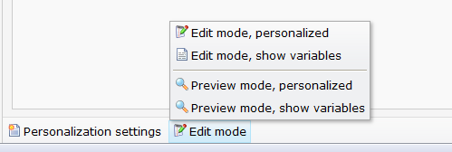
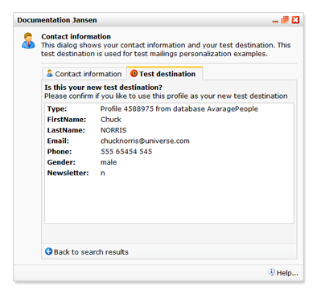

# Personaliseren testen

Als je bezig bent met het ontwikkelen van een gepersonaliseerde mailing, dan
wil je vaak even een *sneak preview* zien om te controleren of de personalisatie 
wel uitpakt zoals je dat hebt bedoeld. Voor dit doel is er een *standaardbestemming*.

## De bewerkmodus instellen

Onderaan een document, naast de button voor de 
[personalisatieinstellingen](./personalization-settings.md), vind je de button
voor de bewerkmodus. Met deze button kun je de weergave van het document
veranderen.

Er zijn vier mogelijke instellingen, en ze spreken allemaal nogal voor zich:

    * bewerkmode, met gepersonaliseerde content
    * bewerkmode, nog niet gepersonaliseerd (smarty variabelen zijn zichtbaar)
    * preview mode, met gepersonaliseerde content
    * preview mode, nog niet gepersonaliseerd
    
Eigenlijk zijn het twee verschillende instellingen: (1) wil je het document 
weergeven in bewerkmodes of previewmodus, en (2) wil je dat de smarty variabelen
direct worden ingevuld of niet?

Als je het document in bewerkmodus weergeeft, dan zijn de contentblokken 
aanklikbaar. Dit is meestal de handigste mode omdat je direct de teksten die 
je wilt wijzigen kunt aanklikken. Af en schakel je over naar de previewmodus 
om te zien hoe de ontvanger het bericht zal zien.

Daarnaast kun je kiezen of je de ruwe Smarty variabelen wilt zien of niet. 
Als je kiest voor het tonen van variabelen, dan zie je de variabelen
precies zoals je ze hebt ingevoerd (dus {$voornaam}, {$achternaam}, enzovoort).
Als je echter omschakelt naar de gepersonaliseerde modus, dan worden al deze
variabelen vervangen door de echte waardes van een profiel uit je database.

## De standaardbestemming instellen

In je database kun je één profiel aanwijzen als *standaardbestemming*. Dit
is het profiel dat wordt gebruikt om de variabelen in te vullen. Als je
variabelen in een document opneemt (zoals {$voornaam} en {$achternaam}), en
je schakelt de gepersonaliseerde modus in, dan zullen de voor- en achternaam
van dit profiel worden getoond op de plaats van de variabelen.

Je kunt op twee manieren de standaardbestemming invoeren: vanuit het profielenbeheer
en vanuit het helpmenu. In het profielenbeheer open je het profiel dat je voor
de standaardbestemming wilt gebruiken, en daarna kies je voor de optie 
"standaardbestemming instellen".

Vanuit het helpmenu kan het ook. Als je de de link "welkom <jouw naam>" klikt,
kom je bij een dialoogvenstertje met jouw persoonlijke instellingen. Hier is
ook een tabblad om de standaardbestemming in te stellen.

De standaardbestemming is gekoppeld aan je persoonlijke login. Een collega
die toegang heeft tot hetzelfde account zou een heel andere standaardbestemming
kunnen hebben.
