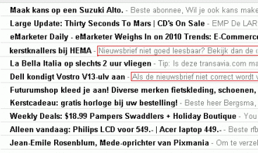

Zorg jij ervoor dat alle elementen van je e-mail goed zijn ingesteld
voor je op die verzendknop drukt zoals je afzendadres, je
authenticatiegegevens (SPF, SenderID, DKIM) of je onderwerpregel?
Misschien heb je ook al het ideale tijdstip van verzending bepaalt. Maar
daarnaast kan je ook je preheader aanpassen om je e-mails nog
aantrekkelijker te maken.

Snippet: Wat is dat?
--------------------

De snippet of preheader is de benaming voor de eerste paar regels van je
`<body>`-tag in
je [HTML](./opmaak-van-html-nieuwsbrief-enkele-belangrijke-richtlijnen.md "HTML Broncode") broncode.
Deze bevat meestal standaard zinnetjes zoals:

-   Is deze mail niet goed leesbaar? Klik hier voor de webversie
-   U ontvangt deze nieuwsbrief omdat u bent ingeschreven voor…
-   Bekijk deze e-mail met afbeeldingen

Omdat het de eerste tekst in je e-mail is, zullen e-mailclients als
Gmail, Outlook en de e-mailclient op de iPhone deze tekst (of een
gedeelte hiervan) na het onderwerp laten zien.

Waarom is de preheader belangrijk?
----------------------------------

Meeste marketeers gebruiken de preheader om lezers te verwijzen naar de
webversie van de e-mail, naar een mobiele versie of nemen een afmeldlink
op. Vooral de laatste twee opties zijn absoluut geen slechte praktijken.
Maar indien je ontvanger de mail niet opent dan hebben deze links geen
nut. Maak gebruik van de preheader om je onderwerpregel kracht bij te
zetten en de ontvanger te overtuigen jouw e-mail te openen.

Hoe kan ik het instellen?
-------------------------

Zoals reeds vermeld, voeg je een snippet toe bovenin je `<body>` -tag.
Dat ziet er dan ongeveer als volgt uit:

    <body>
        <table>
            <tr>
                <td> Dit is een voorbeeld van een snippet</td>
            </tr>
            <tr>
                <td align="center">
                    <a href="#" title="Bekijk de webversie">
                        Bekijk de webversie als de nieuwsbrief niet goed wordt getoond &raquo;
                    </a>
                </td>
            </tr>
        </table>
    </body>  

Waarna de rest van je HTML-code volgt.\
 Je kan er ook voor kiezen een extra tekstblok in je template mee te
nemen als je gebruik maakt van marketingsoftware. Dan ziet de code er zo
uit:

    <body>
        <table>
            <tr>
                <td align="center">
                    [text name="preHeader"]
                </td>
            </tr>
        </table>
    </body>

Zo ook in bovenstaande code. Maar is dat nog wel nodig? Verschillende
e-mailprogramma’s zoals Thunderbird en Windows Live maken gebruik van
een verticaal previewvenster. In dit geval zou een gecentreerde snippet
maar gedeeltelijk te zien zijn. Vandaar is het ook belangrijk altijd te
testen hoe jouw e-mails eruit zien in verschillende e-mailclients.

Verschillende gebruiksmethodes
------------------------------

Er zijn ook verschillende manieren waarop je de snippet kan gebruiken
binnen je e-mail.

### Zichtbare tekstmethode

Bij de **zichtbare tekstmethode** voeg je een leesbare tekst
(contrasterende kleur en goede tekstgrootte) toe waarin je de e-mail
kort samenvat of alvast een call-to-action verwerkt. Zo zie je de tekst
achter de onderwerpregel in de e-mailclients en zie je deze in de e-mail
zelf. Deze tekst is ook bij het printen leesbaar.

Probeer het in je preheader altijd zo kort mogelijk en to-the-point te
houden. Je hebt niet veel ruimte (in Gmail heb je met onderwerpregel en
snippet ongeveer 100 karakters).

### Onzichtbare tekstmethode

De **onzichtbare tekstmethode** houdt in dat je de tekst in de kleinste
lettergrootte plaatst en deze de achtergrondkleur van je e-mail
meegeeft. De tekst wordt dan wel getoond na de onderwerpregel in je
e-mailclients maar zal niet te zien zijn in de geopende mail. Daarnaast
zorgt deze methode ervoor dat je e-mail ‘netter’ oogt omdat er geen
tekst bovenin je e-mail te zien is.

Deze methode raden wij af. Spamfilters zijn namelijk gevoelig voor tekst
die geen contrast met zijn achtergrond heeft. Door gebruik te maken van
deze methode kan
je [spamrating](./verlaag-je-spamrating-enkele-aandachtspunten.md "Spamrating") omhoog
schieten waardoor je e-mail terecht komt in de spambox of erger, niet
meer wordt toegelaten tot de inbox.

Vergeet je preheader niet te testen
-----------------------------------

Test verschillende uitvoeringen van je snippet. Zo kom je te weten welke
het beste werkt in jouw e-mails. Maak hierbij gebruik van  [split-run
tests](./split-run-test-enkele-praktische-tips.md "Split run test").
Vergeet ook niet geregeld je snippet te veranderen. Iemand die al
meerdere malen jouw e-mail heeft geopend, hoeft na 10 keer niet meer te
lezen dat hij “deze mail ontvangt omdat hij is ingeschreven op die en
die website”. Het is ook zonde van ruimte die je goed kan gebruiken voor
andere tekst.
