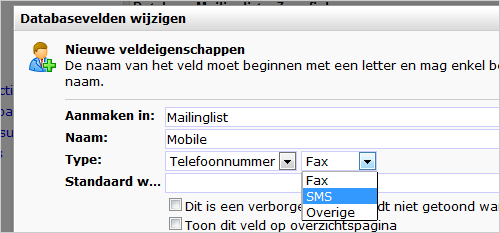

Voor het versturen van sms-campagnes, beschik je vanzelfsprekend over
het mobiele nummer van de relaties die je wilt bereiken. Sms-nummers sla
je op in een speciaal hiervoor bedoeld veld.

Database telefoonveld
---------------------

Voor het opslaan van mobiele telefoonnummers gebruik je een [database-
of
collectieveld](./database-and-collection-field-types.md)
van het type telefoonnummer -\> **SMS**

Selectie authoriseren voor sms-bulkmailings
-------------------------------------------

Bij elke selectie of miniselectie waaraan je een mailing wilt richten,
dient apart te worden aangegeven dat deze voor dit doel gebruikt mag
worden. Zo voorkom je dat een mailing per ongeluk aan een verkeerde
(mini)selectie wordt verzonden.

Om de selectie of miniselectie te authoriseren, ga je in het onderdeel
**Profielen** naar **Databasebeheer -\>
[Gebruiksmogelijkheden](./gebruiksmogelijkheden-instellen-voor-databases-en-selecties.md)**.
Kies de selectie die je wilt gebruiken, en vink het vakje bij **SMS
mailings** aan.
