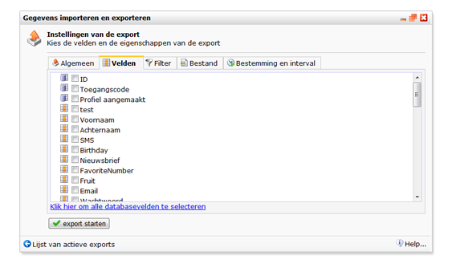

Profiel- en subprofielgegevens kunnen worden geëxporteerd. Je kan een
hele database ineens exporteren, of alleen de (sub)profielen uit een
(mini)selectie. Er wordt een bestand in het formaat naar keuze
(bijvoorbeeld tabgescheiden txt-bestand) gegenereerd die je kan
downloaden of laten e-mailen.

Je vindt de exporteerfunctie in het menu *Huidige weergave*

-   Kies de database/collectie/selectie/miniselectie die je wilt
    exporteren
-   Voer een *naam* in voor de export
-   Selecteer de velden waarin de gegevens staan die je wilt exporteren
-   Ga naar het tabblad *Bestemming en interval*als je de export
    periodiek wilt laten uitvoeren of wilt versturen naar een
    e-mailadres of FTP-locatie.
-   Klik op *export starten*om de export te starten

#### Opmerkingen

-   De velden *ID*, *Toegangscode*en *Profiel aangemaakt*zijn velden
    waarvan de waarde door het systeem is toegekend.
-   Je kan maximaal 1 collectie ineens exporteren. Als je meerdere
    collecties tegelijk wilt kopiëren, kies dan XML als bestandstype.

