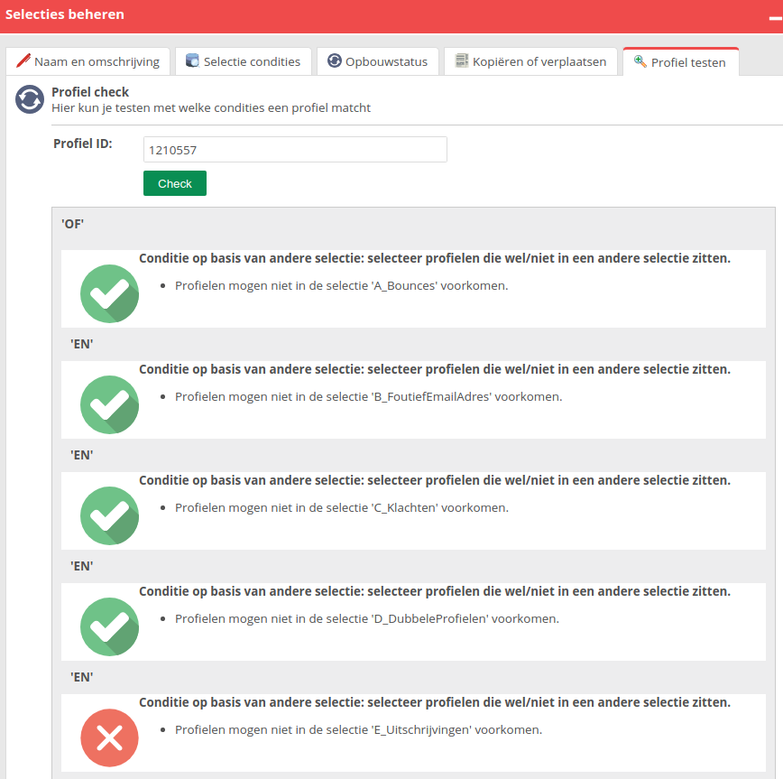

# Profielen: Waarom komt mijn profiel niet terug in mijn selectie?

Het komt regelmatig voor dat wij de vraag krijgen waarom een bepaald profiel niet in een selectie voorkomt terwijl de klant dit wel verwacht. In onderstaand artikel zullen wij laten zien hoe je snel in een aantal stappen kunt inzien waarom dit het geval is.

## Stap 1:
Een selectie is niets anders dan een filter op de database. Hierdoor zal je profiel aan alle bovenliggende selectie condities moeten voldoen om in de uiteindelijke selectie te vallen. 

Wanneer je een selectiestructuur van meerdere lagen diep hebt dien je dus eerst te kijken of het profiel in de bovenste selectie zit. Om dit te bekijken kun je op een specifieke eigenschap van het profiel zoeken, bijvoorbeeld het e-mailadres (let op: zoeken op ID werkt niet binnen selecties), in deze selectie. Als het profiel hierin zit, ga je naar de selectie daaronder etc… 

## Stap2:
Mocht je bij de selectie aangekomen zijn waar je profiel niet in zit, maar waar je deze wel in verwacht kun je de optie '*Profiel testen*' gebruiken om te zien aan welke condities je profiel wel / niet voldoet. Deze optie is te vinden onder **Databasebeheer -> Selecties beheren -> [kies selectie] -> Profiel testen**.

In bovenstaand voorbeeld kun je zien dat het profiel niet voldoet aan de conditie "*Profielen mogen niet in de selectie 'E_Uitschrijvingen' voorkomen*". Vervolgens zou je in deze selectie kunnen kijken waarom je profiel niet aan de condities van deze selectie voldoet.
