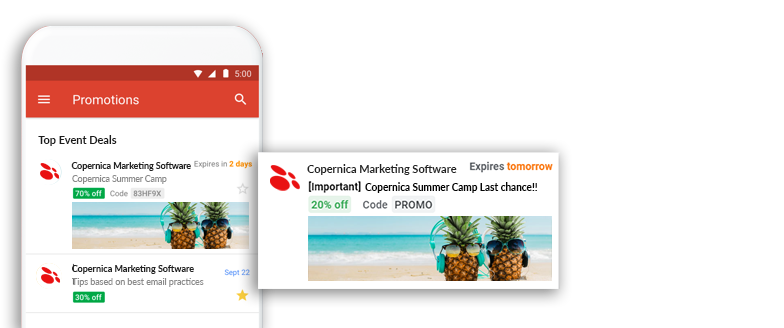

# Promotionele annotations in Gmail
Momenteel werken promotionele annotations alleen in de Android en iOS versies van Google. Ook zal Gmail alleen van de bovenste twee e-mails die in de zogenaamde promotions tab van Gmail terecht komen de annotation opmaak laten zien. Welke e-mails bovenaan komen en of ze standaard in de promotions tab terechtkomen wordt bepaald door een algoritme van Google waar voor zover bekend geen invloed op uit te oefenen is. Om deze reden kan het zo zijn dat de annotation bij persoon A wel wordt weergeven maar bij persoon B niet. Om te testen of de annotations goed zijn ingesteld is het het beste om als volgt te werk te gaan.



## Voorbereiding
In Gmail is er een bepaalde groep met e-mail adressen die terug gehouden wordt van het weergeven van annotations. Om zeker te weten dat je annotations kan ontvangen kan je het beste een nieuw e-mail adres aanmaken.

* Maak een e-mail adres aan dat eindigt op [promotabtesting@gmail.com](https://accounts.google.com/signup), bijvoorbeeld [bedrijfsnaam_promotabtesting@gmail.com](https://accounts.google.com/signup).

* Installeer de Android of iOS app van Gmail en log met het zojuist aangemaakte profiel in op de app.

* Voeg dit profiel toe aan een Copernica database en stel deze in als [standaardbestemming](https://www.copernica.com/nl/documentation/emailings-publisher-testing#de-standaardbestemming-instellen).

## Template opzetten
Om eerst te testen of de annotations goed ingesteld staan testen we dit met een standaard formaat. 

* Maak een nieuwe lege template met een document aan.

* Vul de template met de volgende code

* Onder de comments CHANGE 5 en CHANGE 6 vind je "YYYY-MM-DD". Pas de eerste aan naar twee dagen geleden en de tweede naar twee dagen in de toekomst. 

```
<!DOCTYPE html PUBLIC "-//W3C//DTD HTML 4.01//EN">
<html>
  <head>
    <{'script'} type="application/ld+json">
    [literal]
      [{
        "@context": "http://schema.org/",
        "@type": "Organization",

      // CHANGE 1 Logo image
        "logo": "https://www.gstatic.com/images/branding/product/1x/googleg_48dp.png"
      },{
        "@context": "http://schema.org/",
        "@type": "EmailMessage",

      // CHANGE 2 Alternative subject line for annotations version
        "subjectLine": "Alternative subject line for annotated version"
      },{
        "@context": "http://schema.org/",
        "@type": "DiscountOffer",

      // CHANGE 3 Badge discount description
        "description": "20% off",

      // CHANGE 4 Discount code
        "discountCode": "PROMO",

      // CHANGE 5 Start date
        "availabilityStarts": "YYYY-MM-DDT00:00:00-01:00",

      // CHANGE 6 End date
        "availabilityEnds": "YYYY-MM-DDT00:00:00-01:00"
      },{
        "@context": "http://schema.org/",
        "@type": "PromotionCard",

      // CHANGE 7 image, 538x138 pixels is best, 3.9 aspect ratio is recommended, use png file format
        "image": "https://www.google.com/gmail-for-marketers/promo-tab/markup-tool/sample.png"
      }]
    [/literal]
  </script>
  </head>

  <body>
    <p>Email Body</p>
  </body>
</html>
```

## Testen
Om te testen of de annotations werken is het belangrijk om het volgende stappenplan nauwkeurig te volgen.

* Verwijder alle e-mails in de promotions tab van Gmail en leeg de prullenbak.
* Verstuur het document naar het zojuist aangemaakte Gmail adres.
* Ga naar de inbox op je Android of iOS apparaat.
* Als de mail niet direct in de promotions tab terecht komt, verplaats deze dan handmatig.
* Refresh de promotions tab net zolang totdat de annotation verschijnt.

Mocht dit na meermaals proberen niet lukken raadpleeg dan de [troubleshooting](https://developers.google.com/gmail/promotab/troubleshooting) pagina van de documententatie van Gmail.

## Aanpassen en personaliseren
De code van de test e-mail kan vervolgens getest worden in een al bestaande e-mailing.

* Voeg alles tussen de '<head>' tag toe aan de head van een al bestaande e-mailing.
* Verstuur deze zonder de annotation aan te passen als test naar het Gmail account.
* Pas item voor item de inhoud aan, verwijder tussendoor telkens de vorige mail en leeg de prullenbak.
* Als je gebruik wilt maken van smarty personalisatie dan dient de '[literal]' tijdelijk te worden afgesloten. Voor CHANGE 3 zou dit het volgende inhouden;
  
```
// CHANGE 3 Badge discount description
  "description": "[/literal]{$profile.VELDNAAM}[literal]",
```

Op de website van Google bevindt zich een [test](https://developers.google.com/gmail/promotab/overview) tool om een voorbeeld te krijgen hoe de annotation eruit komt te zien.
