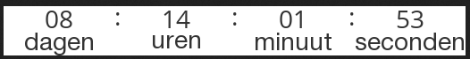
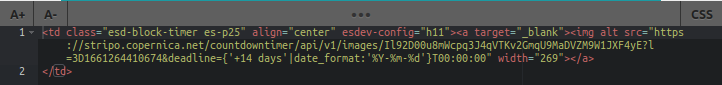
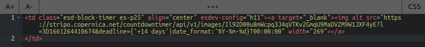

# Instellen van een variabele timer

Binnen een drag-and-drop-template bestaat de mogelijkheid om een variabele starttijd aan het timerblok toe te voegen. Dit kan je doen door een extra parameters toe te voegen aan de URL van de timer. In dit artikel leggen we je stap voor stap uit hoe je dit voor elkaar kunt krijgen.

## Een variabele timer toevoegen aan je timerblok
Om het timerblok variabel te kunnen maken moet je de URL van de timer uit de broncode van een ontvangen (test)mail halen.

### Hoe kun je de broncode ophalen?

1. Ga naar je template binnen de Marketing Suite en voeg het timerblok aan je template toe. Style jouw template zoals gewenst.
2. Sla de template op. Als je op `code bekijken` klikt, zie je dat de URL van het timerblok de volgende parameters heeft:
```https://stripo.copernica.net/countdowntimer/api/v1/images/i0uVKKl25tQcWj0MhvcsUZyphaJL8mT6H3vKRs5YkG0```
3. Verstuur een (test)mail naar je eigen e-mailadres.
4. Open de ontvangen e-mail in je e-mailclient.
5. Afhankelijk van je e-mailclient ga je op zoek naar de optie 'view source' of 'bekijk broncode'.
6. In de broncode zoek je naar de URL van de afbeelding van het timerblok. Dit kan het makkelijkst door met `CTRL+F` te zoeken naar 'timer'. De URL ziet er bijvoorbeeld zo uit: ```https://stripo.copernica.net/countdowntimer/api/v1/images/Il92D00u8mWcpq3J4qVTKv2GmqU9MaDVZM9W1JXF4yE?l=3D1661264410674```. Deze URL is niet meer hetzelfde als in stap 2. 
7. Kopieer deze URL. Als je deze nu opent in je browser, wordt de timer weergegeven: 



8. Plaats de gekopieerde URL op de plaats van de oude URL in het timerblok van je template. In onderstaande afbeelding kan je zien hoe de code in het template eruit komt te zien nadat je dit hebt gedaan:



### Timerblok variabel maken met Smarty

Om het timerblok nu variabel te maken moet je de extra parameter **deadline** toevoegen aan de URL binnen je timerblok. 
Wanneer je wilt dat de timer iedere dag af gaat tellen vanaf 14 dagen in de toekomst, kun je dit bijvoorbeeld zo 
`https://stripo.copernica.net/countdowntimer/api/v1/images/Il92D00u8mWcpq3J4qVTKv2GmqU9MaDVZM9W1JXF4yE?l=3D1661264410674&deadline={'+14 days'|date_format:'%Y-%m-%d'}T00:00:00.`

Voorbeeld:



**Let op:** De timer is nu niet meer zichtbaar in de template. Je kunt deze nog wel inzien in de voorvertoning van je e-mail.
