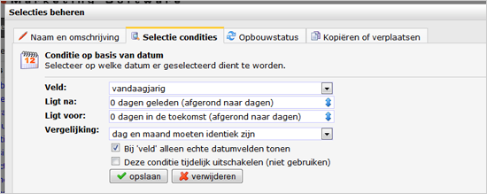

Vergelijk de waarde van een (datum)veld met een specifieke datum of
periode. Hiervoor kan een vaste periode, een variabele periode of een
combinatie van beiden worden gebruikt.

Een vaste datum gebruiken
-------------------------

Profielen worden alleen in de selectie opgenomen wanneer de datum in het
datumveld valt binnen de periode die je specificeert door middel van de
twee kalenders.

**Voorbeeld: **selecteer profielen die een auto kochten tussen 1 april
2013 en 13 april 2013

Een variabele datum gebruiken
-----------------------------

Gebruik een variabele datum als je profielen wilt selecteren aan de hand
van een datumveld, gerelateerd aan de huidige datum. Bijvoorbeeld
wanneer je automatisch een mail wilt versturen aan relaties waarvan het
abonnement volgende maand afloopt. Omdat selecties dynamisch zijn, zal
de selectie dagelijks andere relaties bevatten.

### Een geautomatiseerde verjaardagsmail.

Voor een verjaardagsmail wil je alleen de huidige dag (**vandaag**)
selecteren.

-   Kies het veld met hierin de geboortedatum van jouw relaties, en
    selecteer in beide kalenders ‘**gebruik variabele datum**’.
-   Het profiel moet geboren zijn 0 dagen geleden en voor 0 dagen in de
    toekomst. Zorg ervoor dat **dag en maand identiek zijn** vergelijkt
    en dat je de datum **afrondt op dagen**. 

Een dagelijks ingeroosterde mailing naar deze selectie verstuurt alleen
naar relaties die op die dag jarig zijn.

Combinatie van een vaste en een variabele datum
-----------------------------------------------

Voorbeeld: Je wil een andere mailing versturen naar profielen die zich
voor 2013-05-01 hebben geregistreerd, dan mensen die zich na deze datum
hebben geregistreerd.
