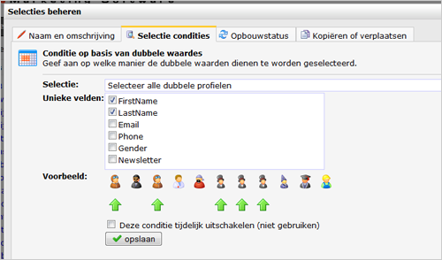

Met dit conditietype selecteer je profielen die dubbel voorkomen in de
database, of profielen die juist één enkele keer voorkomen in uw
database.

Er zijn verschillende wijzen waarop je deze dubbele of unieke profielen
kunt filteren.

-   Kies eerst de eerst welke profielen moeten worden opgenomen in de
    selectie.
-   Kies vervolgens een veld met een unieke waarde (zoals e-mailadres)
    of meerdere velden die gecombineerd uniek zijn (bijvoorbeeld
    postcode en huisnummer).

Lage en hoge id's
-----------------

Het profiel met het laagste ID is het oudste profiel. Als je dubbele
profielen wilt verwijderen na een import die niet goed is gegaan, dan
kan je het beste kiezen voor de optie ‘**selecteer alle dubbele
profielen, behalve diegene met het laagste ID**’. Vervolgens verwijder
je de profielen uit de selectie. Zo voorkom je dat er belangrijke
informatie verloren gaat die gekoppeld is aan het profiel: de profiel
geschiedenis, campagnegeschiedenis, contactgeschiedenis en
enquêteresultaten.

Bij het maken van de selectie zie je handige icoontjes die
verduidelijken welke profielen in de selectie komen. **Wees altijd
voorzichtig met weggooien.** Maak bijvoorbeeld eerst een export van de
gegevens en bewaar deze een tijdje.
