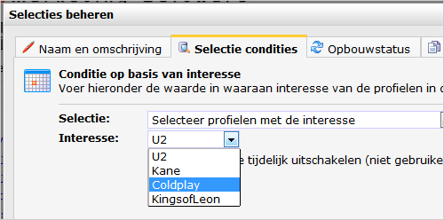

Als je aan je database interessevelden hebt toegevoegd, kan je hierop
selecties maken. Een interesseveld is een speciaal soort veld dat alleen
de waarden ‘*ja*’ en ‘*nee*’ kan bevatten. Interesses zijn altijd
gegroepeerd.

Een interessegroep is bijvoorbeeld ‘*bomen*’ welke de interessevelden
‘*iep*’, ‘*eik*’ en ‘*dennenboom*’ heeft.

Profielen kunnen worden geselecteerd op basis van de **interesses** die
ze hebben of op de **groep** waarin het interesseveld is opgenomen.

Afb. Ontvangers van de bovenstaande muzikale nieuwsbrief hebben niet
veel geluk; zij konden alleen kiezen tussen vier kwaden toen hen de
vraag werd gesteld welke artiest of artiesten zij interessant vinden.
