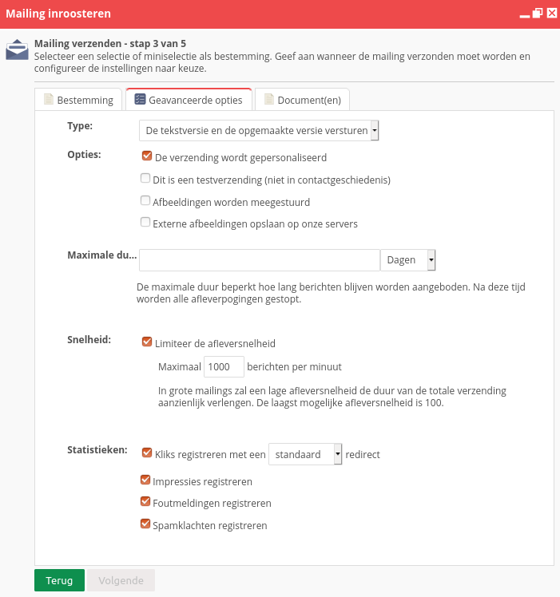
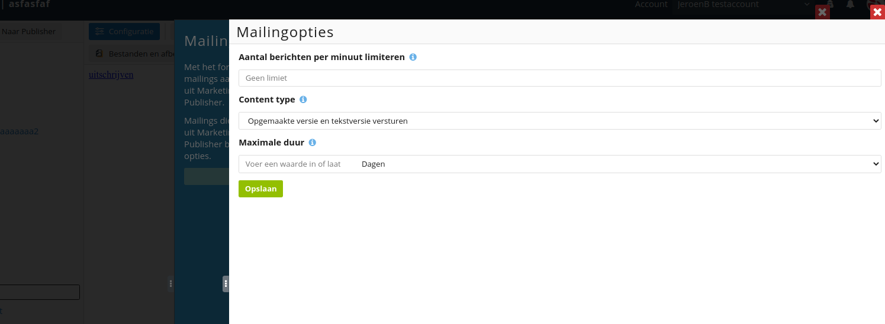

# Opwarmen van verzendreputatie

Grote schommelingen in e-mailvolume hebben een negatieve impact op je
[verzendreputatie](./send-reputation.md).
Het versturen van je eerste e-mails vanuit een nieuw IP-adres veroorzaakt
zo'n schommeling.

De ontvangende mailservers moeten wennen aan het nieuwe e-mailverkeer
en het volume dat vanuit jouw afzenderdomein wordt verstuurd. We bouwen
het volume daarom geleidelijk op. Dit noemen we het 'opwarmen van
verzendreputatie'.

## Relevante factoren

De snelheid waarmee je verzendreputatie wordt opgewarmd is onder andere
afhankelijk van het beoogde e-mailvolume en de verwachte verzendfrequentie.
Daarnaast spelen ook de onderstaande factoren een rol:

### De IP-structuur

Verstuur je vanuit een dedicated (niet-gedeeld) IP-adres of vanuit een
pool met meerdere (gedeelde) IP-adressen? Een 'koud' dedicated IP-adres
moet voorzichtiger worden opgewarmd dan een gedeeld IP-adres waarover al
e-mailverkeer verstuurd wordt. Wanneer je start met Copernica krijg je
automatisch gedeelde IP-adressen toegewezen.

### Eerdere e-mails vanuit het afzenderdomein

Als je al e-mails vanuit het betreffende afzenderdomein verstuurd hebt is
er doorgaans sprake van een opgebouwde domeinreputatie.

### De kwaliteit van de verzendlijst

Hebben profielen in de verzendlijst een dubbele opt-in gegeven? Zijn de
e-mailadressen recentelijk toegevoegd of staan deze er al jaren (ongemaild)
in? Wat waren de openratios van eerder verstuurde mailings via andere ESPs?

### Opwarmresultaten

Wanneer de resultaten van het opwarmproces tegenvallen moet er mogelijk
gas terug worden genomen. De opwarming van je verzendreputatie is dus een
doorlopend proces: de eerstvolgende mailing is afhankelijk van de resultaten 
van de voorgaande mailing.

Door de verscheidenheid aan factoren is het opstellen van een generiek
opwarmschema niet eenvoudig. Om die reden vragen we je gedurende het
onboardingproces om zoveel mogelijk informatie aan te leveren.
Het is daarbij belangrijk om alle verzendingen goed te evalueren en onze
hulp in te schakelen bij calamiteiten. Ons deliverability-team ontwikkelt
zo een verantwoord opwarmtraject.

## Verschillen tussen mailboxproviders

Je verzendreputatie wordt per mailboxprovider bepaald. De resultaten van
het opwarmproces verschillen dus per provider. Achterblijvende resultaten
bij Hotmail hoeven geen invloed te hebben op de opschaling bij Gmail.
Bepaalde problemen (zoals het gebruik van een verouderde verzendlijst)
beïnvloeden het opwarmproces wel voor alle providers.

## Verzenden in batches

De opwarming vindt plaats in batches. Deze spreiden we uit over
verschillende verzenddagen.

Stel dat je verzendlijst 20.000 e-mailadressen bevat. Je mailt de
verzendlijst vanaf een pool met gedeelde IP-adressen. Het opwarmschema zou
er dan als volgt uit kunnen zien:

| Verzenddag | Volume | Aantal gemailde adressen |
|------------|--------|--------------------------|
| 1          | 1000   | 1000                     |
| 2          | 2000   | 3000                     |
| 3          | 3000   | 6000                     |
| 4          | 5000   | 11000                    |
| 5          | 9000   | 20000                    |

**Let op:** Het bovenstaande schema betreft een voorbeeld. Stel je eigen opwarmschema
altijd op in overleg met je accountmanager.

## Opbouw van batches

Bij het verzenden van batches houd je altijd een tussentijdse wachttijd
van 24 uur aan. Dat geeft je de tijd om het volume van de volgende batch af te stemmen
op eventuele foutmeldingen (bounces). 

Wanneer de inhoud zich ervoor leent kan de content voor elke batch gelijk blijven. 
Daarbij is het extra belangrijk om ervoor te zorgen dat profielen de e-mails niet 
meerdere keren ontvangen.

Stel dat je dagelijks e-mails verstuurt waarvan de content steeds verschillend is.
In dat geval kun je profielen die op de eerste verzenddag een mail hebben ontvangen
ook weer meenemen in de batch van de tweede verzenddag. Je voegt dan per keer x-aantal
profielen toe.

## Sorteer op kwaliteit en activiteit

Wanneer je informatie hebt over de kwaliteit van een profiel (bijvoorbeeld in de vorm
van een leadscore) raden we aan om het opwarmproces met de meeste actieve
adressen te beginnen. Deze bieden namelijk de grootste kans op opens en
interactie. Spamfilters worden zo op positieve wijze vertrouwd gemaakt met
jouw verzendingen. Ook vergroot je hiermee de kans dat e-mailverkeer naar
minder betrokken ontvangers in de inbox wordt geplaatst, wat op zijn beurt
weer meer opens tot gevolg heeft.

**Let op:** Wanneer je alle actieve profielen gemaild hebt kan het zijn dat je een groot aantal
inactieve profielen overhoudt. Het is belangrijk dat je deze profielen niet in één keer mailt. 
Je kunt hierover advies vragen bij je accountmanager.

## Het spreiden van batches

Bij het opwarmen van het e-mailvolume raden we aan om batches
te spreiden over de verzenddag. In plaats van 10.000 e-mails binnen enkele
minuten af te leveren doe je dat bijvoorbeeld gedurende een uur. Zo zorg
je ervoor dat mailboxproviders niet in één keer overspoeld worden met de
gehele batch, zelfs al is deze nog relatief klein. 

In Copernica kan de afleversnelheid geleidelijk en per verzenddag worden
verhoogd. Bij het versturen van een Publisher-mailing tref je deze optie
aan bij stap 3 van het verzendproces (onder **'Geavanceerde opties'**):

Je stelt de afleversnelheid van Marketing Suite-mailings in bij het aanmaken
van een mailing. Je vindt de benodigde optie in de slider onder **'Mailingopties'**.
Hier heb je de mogelijkheid om het aantal berichten per minuut te limiteren.

Wanneer er geen afleverlimieten zijn ingesteld wordt de mailing zo snel
mogelijk afgeleverd. Daarbij wordt er rekening gehouden met de voorgeschreven
richtlijnen van mailboxproviders.

## Aanmaken van opwarmselecties

Wanneer het opwarmschema is vastgesteld zet je de desbetreffende batches om naar 
selecties. Lees het [bijbehorende artikel](./warmup-selections.md) voor meer informatie.
