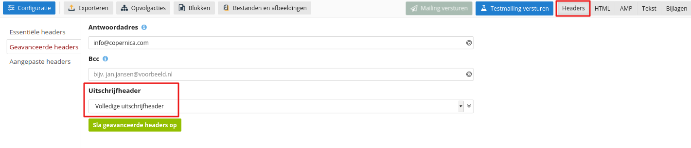
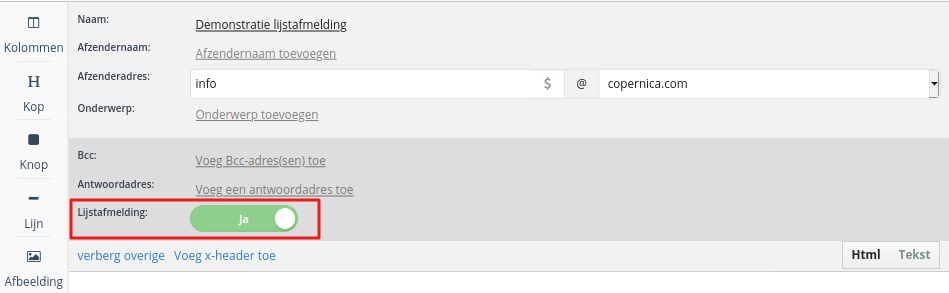

# Verzendreputatie

Als e-mailverzender bouw je bij verschillende mailboxproviders een verzendreputatie op. 
Op basis van die reputatie plaatst een mailboxprovider jouw e-mails in de inbox of spamfolder.

Wanneer je verzendreputatie slecht is kan het zijn dat verstuurde e-mails niet worden aangenomen. 
Door je verzendreputatie te verbeteren verhoog je de kans dat e-mails succesvol de inbox bereiken.

De factoren die je verzendreputatie bepalen worden steeds dynamischer. Mailboxproviders kijken 
niet langer alleen naar blacklists of spamklachten, maar ook naar interactie met de ontvanger. 
In dit artikel bespreken we de factoren die invloed hebben op je verzendreputatie zodat jouw
e-mailcampagnes het gewenste bereik hebben.

## Hoe wordt verzendreputatie bepaald?

Hoe verzendreputatie exact wordt berekend is niet bekend. Mailboxproviders houden dit geheim 
zodat hun algoritmes niet eenvoudig omzeild kunnen worden. Daarnaast hanteert iedere mailboxprovider
een eigen methode. Je verzendreputatie verschilt dus per mailboxprovider.

De factoren waarop de algoritmes zich baseren zijn deels bekend. Verzendreputatie is gekoppeld
aan de verzendende IP-adressen, het afzenderdomein en de combinatie daartussen. Ook wordt er 
rekening gehouden met de mate waarin e-mailcontent overeenkomt met eerdere e-mails die als 
spam gemarkeerd zijn (‘fingerprinting’).

Welke factoren door welke mailboxproviders gehanteerd worden (en welke drempelwaardes ze daarbij 
aanhouden) is onduidelijk. Een laag interactiegehalte wordt bij de ene mailboxprovider dus 
zwaarder aangerekend dan bij de andere.

## Basisbegrippen

De onderstaande punten vormen de basis van een goede verzendreputatie:

* __[Lijstmanagement](https://www.copernica.com/nl/blog/post/deliverability-101-deel-1-de-invloed-van-lijstmanagement-op-deliverability)__: Het is belangrijk om je verzendlijst up-to-date te houden. Dat doe je door de gebouncete-, klagende-, uitgeschreven- en inactieve profielen uit je verzendlijst te filteren.

* __Relevantie__: Relevantie is voor mailboxproviders de belangrijkste factor bij het bepalen of jouw e-mail gewenst is. Het versturen van relevante content helpt je om zo veel mogelijk interactie van ontvangers uit te lokken. Ook kun je KPIs opstellen met betrekking tot het aantal opens, [openratio’s](./definitions) en [CTO-ratio’s](./definitions). Relevantie is belangrijker dan verzendvolume.

* __Monitoring__: Het loont om de open-, bounce-, uitschrijf-, klachten- en CTO-ratio goed in de gaten te houden. Wanneer deze bepaalde drempelwaardes overschrijden is er actie nodig. Denk bijvoorbeeld aan het terugdringen van het e-mailvolume dat verstuurd wordt naar inactieve profielen.

## Wat draagt bij aan een goede verzendreputatie?

### Consistentie in e-mailverkeer

Een consistente e-mailflow helpt je verzendreputatie te verbeteren. Het is daarom nuttig om e-mails met een vaste regelmaat te versturen, bijvoorbeeld op een dagelijkse- of wekelijkse basis. We raden aan om daarbij rekening te houden met het e-mailvolume.

Door duidelijke patronen te vertonen schep je verwachtingen bij spamfilters. Het omgekeerde is ook waar: wanneer je (sterk) van het patroon afwijkt of er geen patroon herkenbaar is heeft dat een negatief effect op je verzendreputatie.

Wanneer je begint met mailen moeten de juiste patronen nog worden vastgesteld. Het is daarom belangrijk om met lage volumes te beginnen en deze vervolgens langzaam op te schalen. Zo warm je je verzendreputatie op. Dit is ook van belang wanneer je van ESP wisselt: de combinatie tussen domein en IP-adressen verandert daarbij.

### Interactie met e-mails

Als verzender heb je het aantal opens en kliks niet volledig in de hand. Wel kun je deze maximaliseren door de juiste personen van relevante content te voorzien.

Het versturen van mailings aan ontvangers die de e-mails niet openen is voor mailboxproviders een signaal dat jouw e-mails niet interessant zijn. Dat kan er uiteindelijk toe leiden dat een mailboxprovider jouw e-mails als ongewenst beschouwt. 

Het idee hierachter is simpel: hoe relevanter de content is, hoe meer opens de mailing zal genereren. De onderwerpregel en timing van het bericht spelen daarin een rol. Berichten van verzenders die lage openratio’s scoren zijn doorgaans minder relevant en hebben daardoor een grotere kans om in de spamfolder te belanden. Op deze manier waarborgen mailboxproviders de gebruikerservaring van hun ‘klanten’: de mailboxhouders.

De gevolgen van een lage open-ratio worden groter zodra het aantal ongeopende berichten een bepaalde grens overschrijdt. In dat geval wordt de inboxplaatsing van e-mails ook bemoeilijkt bij ontvangers die je e-mails wel openen. Het is daarom belangrijk om inactieve profielen uit te sluiten van je verzendselectie.

### Whitelisting

Wanneer een ontvanger jou toevoegt aan het adresboek heeft dat een positief effect op je verzendreputatie. In tegenstelling tot de impliciete terugkoppeling van een non-open geeft een ontvanger hiermee actief aan jouw e-mails te willen ontvangen. Het kan dus voordelig zijn om ontvangers te verzoeken jou toe te voegen aan het adresboek. Een [welkomstcampagne](https://www.copernica.com/nl/blog/post/campagne-uitgelicht-editie-5-welkomstcampagnes) biedt hier de ideale gelegenheid voor.

Het is als verzender niet mogelijk om te meten hoeveel ontvangers jou hebben toegevoegd aan het adresboek. Datzelfde geldt voor gevallen waarbij ontvangers op ‘dit is geen spam’ klikken.

### Verwerken van spamklachten

De meeste e-mailclients maken gebruik van een ‘dit is spam’-knop. Deze staat los van de ‘dit is spam’-link in de e-mail zelf. Door gebruik te maken van de knop geeft een ontvanger duidelijk aan dat de mail ongewenst is. 

Wanneer een e-mail als spam gemarkeerd wordt heeft dat negatieve gevolgen voor je verzendreputatie. Het effect hiervan wordt groter wanneer je e-mails blijft versturen aan het adres in kwestie. Dit verhoogt de kans dat je als spammer wordt aangeduid. Het is dus belangrijk om e-mailadressen die een spamklacht hebben ingediend te filteren uit je verzendlijst. 

Spamklachten komen bij Copernica binnen via feedback loops (FBLs). Deze worden automatisch verwerkt en triggeren het ingestelde uitschrijfgedrag. Maak je voor databasemanagement gebruik van de standaardfilter? Dan worden spamklachten ook automatisch uit de verzendlijst gefilterd.

__Let op__: Niet alle providers bieden FBLs aan, dus niet elke melding van spam komt bij Copernica aan. Gmail doet dit bijvoorbeeld niet. Het filteren van inactieve adressen wordt daarmee extra belangrijk.

Spamklachten zijn nooit volledig te voorkomen. Over het algemeen wordt een spampercentage tot 0.1% als acceptabel gezien. Een enkele spamklacht biedt dus geen reden tot zorg. Wel is het belangrijk om spamklachten goed te filteren en je klachtenratio in de gaten te houden.

### Verwerken van uitschrijfverzoeken

Als verzender ben je wettelijk verplicht om uitgeschreven ontvangers te filteren uit je verzendlijst. Naast de wettelijke verplichting leidt het mailen van uitschrijvers ook tot meer spamklachten en een verslechtering van je verzendreputatie.

Ontvangers kunnen zich ook buiten de e-mail zelf uitschrijven van mailings. Dat gebeurt via een knop in de e-mailclient. Deze geeft een terugkoppeling aan het e-mailadres dat gespecificeerd staat in de uitschrijfheader.

In Publisher-documenten kan de uitschrijfheader worden ingesteld door rechtsbovenin naar __‘Headers’__ te navigeren. Via __‘Geavanceerde headers’__ kun je hier de uitschrijfheader activeren. We bevelen je aan om voor de volledige header te kiezen. Daarbij triggeren alle terugkoppelingen automatisch het ingestelde uitschrijfgedrag.

In Marketing Suite-templates klik je op __‘Overige headers’__. Vervolgens activeer je de lijstafmelding.

### Verkeer naar niet-bestaande of onbekende adressen (hard bounces)

Het aanbieden van een groot aantal e-mails aan e-mailadressen die niet bestaan is voor de ontvangende mailserver een indicatie dat er iets mis is met je verzendlijst. Dit probleem kan grotendeels worden vermeden door te werken met een dubbele opt-in. Daarmee wordt de kans op hard bounces kleiner. 

De kans dat je een niet-bestaand e-mailadres mailt wordt groter naarmate je verzendlijst ouder wordt. Het is daarom belangrijk om aandacht aan databasemanagement te besteden.

### Spamtraps

Spamtraps zijn e-mailadressen die geen bounces veroorzaken maar ook geen interactie vertonen met binnenkomende e-mails. Deze adressen zijn dan ook niet (meer) aan personen gebonden. In plaats daarvan worden ze door mailboxproviders en blacklistdiensten ingezet om te meten in hoeverre een verzender goed databasemanagement hanteert.

Spamtraps zijn bijvoorbeeld gerecyclede adressen van mensen die hun mailbox hebben opgezegd of verlaten. Hierdoor wordt het voor een blacklistdienst mogelijk om te bepalen of je inactieve adressen op de juiste manier filtert. 

Daarnaast kunnen spamtraps ook adressen bevatten die nooit aan een persoon gekoppeld zijn geweest (honeypots). Dergelijke adressen kunnen dus ook niet uit eigen beweging op een verzendlijst terecht zijn gekomen.

Net als in het geval van spamklachten is een enkele spamtrap-hit geen reden tot zorg. Wanneer het aandeel spamtrap-hits groeit en deze adressen stelselmatig gemaild blijven worden kan dat echter leiden tot opname in een blacklist of blokkade door een mailboxprovider.

### Authenticatie

Om je domeinreputatie te verbeteren is het belangrijk om het afzenderdomein goed in te stellen. Dat gebeurt door middel van [authenticatie](https://www.copernica.com/nl/blog/post/deliverability-101-deel-3-verzenden-en-authenticatie). Afzenderdomeinen worden in Copernica [sender domains](./sender-domains) genoemd. 

Authenticatie omvat in ieder geval het gebruik van [SPF](./spf), [DKIM](./dkim) en [DMARC](./dmarc). Het correct instellen hiervan beschermt je domein tegen misbruik en de bijbehorende verslechtering van je verzendreputatie. Zo geef je kwaadwillenden geen kans. 

Het instellen van een afzenderdomein is een technisch proces. De sender domains in Copernica helpen je daarbij.

### Onzichtbare factoren

Naast de resultaten die een ESP als Copernica meet (opens, spamklachten etc.) hebben mailboxproviders ook inzicht in andere statistieken. Voorbeelden daarvan zijn:

* Het aantal berichten dat verwijderd wordt zonder ze te openen;
* Het aantal ongeopende berichten dat verplaatst wordt naar andere mappen. Gezien de ontvanger deze mogelijk later wilt lezen kan dit ook als een positief signaal worden beschouwd;
* Leesratio en opens die de ESP niet kan meten door het gebrek aan een trackingpixel;
* Spamklachten bij providers die geen terugkoppeling geven via FBLs;
* Het aantal berichten dat wordt doorgestuurd;
* Berichten die gemarkeerd worden als niet-spam;
* Afzenders die toegevoegd worden aan het adresboek;
* De betrouwbaarheid van ontvangers die een e-mail als spam markeren. Daarbij wordt bijvoorbeeld gekeken naar hoelang de gebruiker het e-mailaccount beheert en of deze goed wordt bijgehouden.

De bovenstaande punten benadrukken het belang van databasemanagement. Daarbij is het vooral belangrijk om op de juiste manier met inactieve profielen om te gaan. Het mailen van inactieve profielen weegt zwaarder dan andere factoren, waaronder het ongeopend laten van e-mails.
