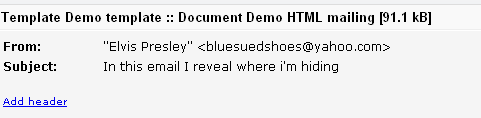
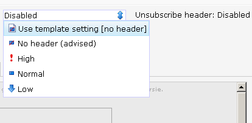

Een e-mail header is informatie die aan uw e-mail wordt toegevoegd en
kan worden uitgelezen door ontvangende mailservers. Sommige van deze
informatie is niet zichtbaar voor de ontvangers. Enkele bekende headers
zijn het afzenderadres, de onderwerpsregel en het CC-adres.

E-mail headers toevoegen en bewerken
------------------------------------

De e-mail headers kunnen worden bewerkt en aangemaakt direct boven de
geopende template of het e-mail document.

Linksboven vind je de reguliere headers. Klik op de bestaande invoer om
deze direct te bewerken. Als er nog geen invoer is, klik je op dezelfde
plaats om nieuwe invoer toe te voegen.

E-mail headers personaliseren
-----------------------------

De meeste headers, zoals de onderwerpregel of het afzenderadres kunnen
worden gepersonaliseerd met smarty code.

Zo kunt u bijvoorbeeld bij iedere klant automatisch de juiste account
manager tonen.

De meest zichtbare en bekende headers zijn:

### Afzendernaam en adres

Dit zijn de naam en het adres van de afzender en zijn zichtbaar voor de
ontvanger van de e-mail. De naam van de afzender mag maximaal 255 tekens
zijn en je kan in dit veld gebruik maken van smarty personalisatie.

Let op. Soms is door de accountbeheerder ingesteld dat alleen bepaalde
adressen zijn toegestaan. In dat geval zal er een lijst met adressen
worden getoond waaruit kan worden gekozen.

Het e-mailadres dient te voldoen aan een geldig opgemaakt e-mailadres
met @ en . , Wanneer je gebruik maakt van personalisatie zal een
waarschuwing getoond worden. Deze kan je uiteraard negeren.

Het is aan te raden een e-mailadres te gebruiken dat echt bestaat
(waarop geantwoord kan worden), omdat spamfilters hierop kunnen
controleren. Dus ook als je een NOREPLY@ adres gebruikt.

### De onderwerpregel (subject line)

Een korte omschrijving van de inhoud van de e-mail. Het onderwerp mag
maximaal 255 tekens lang zijn en kan gebruik maken van personalisatie.
De karakterlimiet geldt vóór personalisatie, dus op basis van de
ingevoerde tekens.

Tip: voorkom lange onderwerpregels. In de meeste e-mailprogramma’s is
slechts beperkte ruimte beschikbaar voor de onderwerpregel. Beperk deze
daarom tot maximaal 45 karakters voor de beste weergave in de inbox van
de ontvanger.

### Reply-to adres (antwoordadres)

Wanneer een ontvanger jouw e-mail beantwoordt, gaat het antwoord naar
het reply-to adres. Laat het reply-to adres leeg wanneer je wilt dat
hiervoor het afzenderadres wordt gebruikt.

### Blind carbon copy (BCC)

Wanneer je een BCC adres gebruikt, gaat een kopie van elke e-mail die je
verstuurt naar dit adres. Wees daarom erg voorzichtig met het gebruik
van een BCC adres. Het BCC adres is niet zichtbaar voor jouw relaties.

### Prioriteits header

Sommige e-mailprogramma’s kunnen een kleine indicator tonen bij elke
e-mail, om een zekere importantie aan de e-mail toe te schrijven
(meestal in de vorm van een klein rood vlaggetje). Gebruik geen priority
header wanneer dit niet absoluut nodig is, en gebruik ze nooit bij het
versturen van commerciële mailings. Dit kan bij uw ontvangers tot
ergernis leiden. Gebruik ze bij uitzondering alleen voor interne
communicatie mails. Beter gebruik je een goede onderwerpregel als je
wilt opvallen!

### X-mailer

Deze (optionele) header wordt gebruikt om informatie mee te sturen over
het software pakket waarmee de e-mail is verstuurd.

Extra (custom) header toevoegen
-------------------------------

U kunt zelf extra headers toevoegen aan uw mailings. Deze zullen niet
zichtbaar zijn voor de ontvanger, maar worden bijvoorbeeld gebruikt om
te communiceren met de e-mail service provider.

Klik op ‘header toevoegen’ om een extra header aan het document of
template toe te voegen.

Je kunt zo veel extra headers toevoegen als je wil.

Om er voor te zorgen dat de toegevoegde headers niet kunnen conflicteren
met reguliere headers zoals 'from', 'reply-to' en 'subject' is het
verplicht dat elke extra header begint met de karakters 'X-'. Headers
die niet met deze karakters beginnen worden genegeerd. De extra headers
kunnen bovendien worden gepersonaliseerd worden met de reguliere Smarty
code die in de applicatie van toepassing is.

Enkele fictieve voorbeelden van extra headers:

-   X-mijnheader: mijnwaarde
-   X-Geadresseerde: {\$profile.ID}

### Uitschrijfheaders (List-unsubscribe header)

De uitschrijfheader (List-unsubscribe header) bevat informatie over het
afhandelen van uitschrijfverzoeken. Ontvangers zien deze informatie zelf
niet: zij zien een uitschrijfknop waarmee ze zich eenvoudig kunnen
uitschrijven van uw mailing. Dit kan de spamknop zijn, maar in enkele
e-mailprogramma's (waaronder Hotmail) kan de spamknop automatisch worden
vervangen door een ‘schrijf-mij-uit-knop’.

Het meesturen van een uitschrijfheader verkleint de kans aanzienlijk dat
je e-mail in de spamfolder terecht komt en is dus goed voor je
verzendreputatie!

Wanneer een ontvanger zich uitschrijft, ontvangt ons systeem een
uitschrijfverzoek van bijvoorbeeld Hotmail. Dit uitschrijfverzoek wordt
verwerkt op de manier zoals u dit heeft ingesteld op de database ([lees
meer over het instellen van
uitschrijfopties](./uitschrijfgedrag-instellen-op-database-of-collectie.md)).
Er kan bijvoorbeeld een veldwaarde worden veranderd van ‘ja’ naar ‘nee’.
Dit uitschrijfgedrag stelt u in bij *Profielen* \> *Databasebeheer*
\> **Uitschrijfgedrag…**

We adviseren om altijd een volledige uitschrijfheader mee te sturen.
Standaard is deze geactiveerd voor nieuwe documenten en templates.

*Afbeelding: het instellen van de prioriteitsheader, met daarnaast de
uitschrijfheader.*
