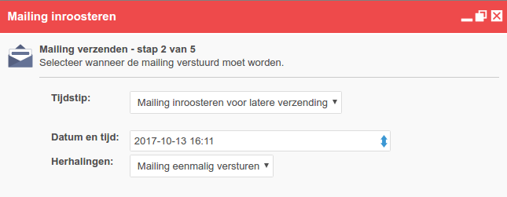
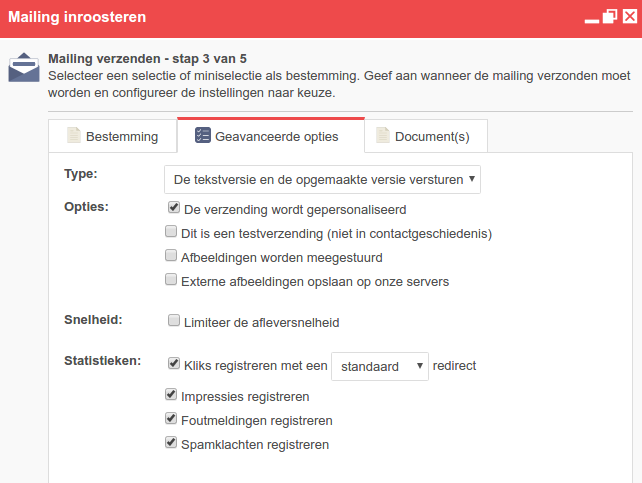
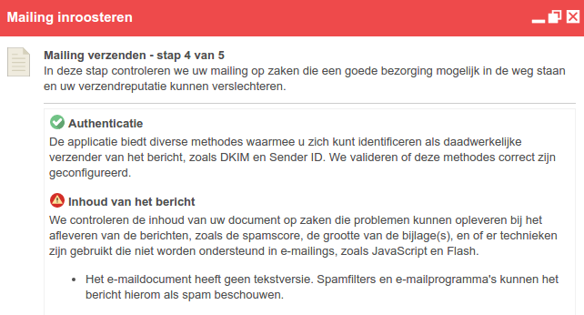
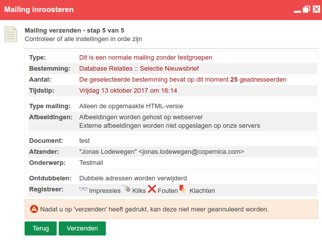

# Een mailing versturen

Het versturen van een e-mailings doe je vanuit het onderdeel
*E-mailings*. Kies in het menu *Mailings*de optie **Bulkmailing
verzenden**.

Let op: het versturen van een e-mailing is een onomkeerbaar proces. Zorg
er dus goed voordat je alle instellingen goed controleert, en dat er
bijvoorbeeld geen onnodige typefouten in het e-maildocument staan.

En dan nu versturen...

## Het onderwerp en afzenderadres instellen

Elke email die je met Copernica verstuurt moet zijn voorzien van een afzenderadres, een afzendernaam en een onderwerpregel.

Het onderwerp en het afzenderadres van een e-maildocument stel je per document afzonderlijk in, direct boven het geopende document.

Je kan in deze velden Smarty code gebruiken.

Gebruik altijd een afzenderadres dat daadwerkelijk bestaat. E-mailprogramma's en spamfilters kunnen hier namelijk op controleren, en je e-mails blokkeren als het adres niet daadwerkelijk bestaat.

Bij het invoeren van het afzenderadres wordt door ons eveneens een controle uitgevoerd of het adres bestaat. Hiervoor sturen we een dummy e-mail naar het adres. Het komt voor dat er wordt gemeld dat het adres niet bestaat, ook al bestaat het wel. Het kan zijn dat het e-mailadres tijdelijk niet bereikbaar is. Soms is er sprake van greylisting op het adres.

## Afzenderadres personaliseren

Met behulp van smarty is het mogelijk om de afzender en het afzendadres
te personaliseren. Als elke klant automatisch een mailtje van zijn
accountmanager ontvangt (een bekende), dan komt dat erg professioneel
over.

In deze korte tutorial bespreken we een bedrijf met 3 accountmanagers.
Het bedrijf verstuurt een nieuwsbrief en wil graag de afzender en het
afzendadres als volgt personaliseren:

-   Klanten van accountmanager A.Arends zien als afzender 'A.Arends |
    Bedrijf' en als afzendadres arends@bedrijf.com
-   Klanten van accountmanager B.Boer zien als afzender 'B.Boer|Bedrijf'
    en als afzendadres boer@bedrijf.com
-   Klanten van accountmanager C.Clinton zien als afzender 'C.Clinton |
    Bedrijf' en als afzendadres clinton@bedrijf.com
-   Klanten zonder accountmanager zien als afzender 'Bedrijf' en als
    afzendadres nieuwsbrief@bedrijf.com

Het instellen van afzenders en afzenderadressen gebeurt op
template-niveau. Per template kan een hele lijst hiervan worden
ingesteld, waarbij er bij elk document onder dat template een van de
lijst kan worden geselecteerd. Let op, het is belangrijk om dit eerst
goed in te stellen in de template om vervolgens een document aan te
maken. We gaan er in dit voorbeeld van uit dat de database van Bedrijf
een veld 'Accountmanager' bevat met daarin de achternaam van de
accountmanager behorende tot dat profiel (oftewel, die klant).

De volgende regels code gebruiken we voor het instellen van de
personalisatie. De bovenste is voor de afzender, de onderste voor het
afzendadres.

~~~~ {.language-javascript}
{if $Accountmanager =="Arends"}A.Arends | Bedrijf{elseif $Accountmanager=="Boer"}B.Boer | Bedrijf{elseif $Accountmanager=="Clinton"}C.Clinton | Bedrijf{else}Bedrijf{/if}

{if $Accountmanager =="Arends"}arends@bedrijf.com{elseif $Accountmanager=="Boer"}boer@bedrijf.com{elseif $Accountmanager=="Clinton"}clinton@bedrijf.com{else}nieuwsbrief@bedrijf.com{/if}
~~~~

Als er nu een nieuw document onder deze template wordt aangemaakt, zal
deze optie in de keuzelijst verschijnen. De werking is direct te
controleren als de gepersonaliseerde weergave staat ingeschakeld.

## Een testmail versturen

Het is belangrijk dat je documenten die je in een bulkmailing gaat
versturen vooraf goed test. Werkt de personalisatie naar behoren, wordt
het document goed weergegeven in verschillende e-mailprogramma's en
staan er geen slordigheidsfoutjes meer in?

**De software biedt 3 verschillende methodes om een mailing te testen**

-   De snelle methode: een testmail versturen naar de ingestelde
    standaardbestemming
-   Een testmail versturen naar meerdere ontvangers ineens
-   De weergave van je document laten controleren in verschillende
    e-mailprogramma's en internet browsers

### Een testmail versturen naar de standaardbestemming

Er wordt een testmail verstuurd naar het e-mailadres van de ingestelde
standaardbestemming.

-   Ga in het onderdeel **Emailings**. Kies in het menu **Mailings**
-   Controleer het e-mailadres en de instellingen van de verzending.
    Klik op **verzenden**.
-   Het document zal direct worden verstuurd.

### Een testmail versturen naar meerdere ontvangers ineens

De normale testmail functionaliteit stuurt een testmail naar maximaal 1
persoon tegelijk (het adres van de standaardbestemming).

Als je een testmail wilt sturen naar meerdere personen tegelijk, maak
dan een selectie in de database met hierin de personen aan wie je de
testmail wilt sturen.

Stuur het document vervolgens als een normale bulkmail naar deze
selectie. Je kan voor de bulkmailing indien gewenst instellen dat deze
moet worden behandeld als testmailing. De mailing wordt dan niet
opgenomen in de geschiedenis van de profielen aan wie de mailing gericht
was. Dit kan je instellen in het tabblad **opties** van het *Bulkmailing
verzenden* dialoogvenster.

### De weergave van het document testen in verschillende e-mailprogramma's en browsers

E-mailprogramma's hanteren afwijkende regels voor de weergave van HTML
en CSS. Het is daarom belangrijk om het document van te voren goed te
testen in deze programma's. De software biedt de mogelijkheid dit met
een druk op de knop te doen. Je ontvangt dan screenshots van de weergave
van het document in de meest voorkomende e-mailprogramma's en browsers.

## Bulkmailing verzenden

Het mailen van meerdere relaties ineens noemen wij een bulkmailing.
Onder deze vernoeming van het menu Mailings vind je de opties voor het
verzenden van een e-mail aan meerdere relaties.

Het versturen van een bulkmailing verloopt in 4 stappen:

1.  Je dient eerst akkoord te gaan met de verzendvoorwaarden die wij
    hanteren. Je hebt je adressen op een legale manier verkregen, en
    houdt je aan de algemene gedragscodes die gelden voor het versturen
    van commerciele emails.
2.  Vervolgens geef je aan naar welke selectie of miniselectie de
    mailing verstuurd moet worden, wanneer de mailing verstuurd moet
    worden en met welke instellingen.
3.  In deze tussenstap wordt de mailing op een aantal zaken
    gecontroleerd, zoals de aanwezigheid van een uitschrijflink en of de
    spamscore niet te hoog is.
4.  In de laatste stap kun je de instellingen nog even nalopen en als je
    tevreden bent kun je de mailing definitief versturen.

**Let op:** Als je eenmaal op de verzendknop hebt gedrukt en hebt
bevestigd, wordt de mailing definitief verstuurd. De mailing kan dan
niet meer worden geannuleerd.

Voor het versturen van een bulkmailing dient het volgende in orde te
zijn

-   Er bestaat in de database of collectie een veld dat je hebt
    aangewezen als e-mailveld. In dit veld zijn de e-mailadressen van de
    ontvangers opgeslagen.
-   Je hebt toegangsrechten voor het versturen van bulkmailings. Anders
    zal je alleen de optie zien om een mailing aan te vragen.
-   Je hebt de gebruiksmogelijkheden ingesteld voor de doelselectie of
    -miniselectie.

### De bestemming van de mailing instellen

-   Kies bij *selectie* de bestemming van een mailing. Dit kan een
    database, selectie, collectie of minicollectie zijn.
-   Selecteer de optie om de mailing niet te versturen naar adressen die
    dubbel voorkomen in de database.

Voer optioneel een omschrijving in.

### Tijdstip van verzenden

Je kan een mailing eenmalig en direct versturen. Maar het is ook
mogelijk om een mailing in te roosteren voor latere verzending. Het is
tevens mogelijk de mailing periodiek te versturen. Bijvoorbeeld
wekelijks.

Ga naar het tabblad **Wanneer** om de datum en tijd van de verzending te
bepalen. Ook kan je in dit tabblad bepalen hoe vaak de mailing herhaald
moet worden en met welke interval.

### Extra instellingen voor bulkmailings

Bepaal de instellingen voor de verzending. Deze zijn standaard zo
ingesteld dat ze volstaan voor de meeste gebruikers.

**Types**: Verzend alleen de HTML versie, alleen platte tekst of beiden.
In het laatste geval wordt de platte tekst getoond wanneer een ontvanger
geen HTML kan weergeven.

-   **Personaliseer** de mailing wanneer je gebruik maakt van
    personalisatie variabelen.
-   De statistieken van een **testverzending** worden niet gekoppeld aan
    het profiel van de ontvanger.
-   Externe afbeeldingen kunnen automatisch worden opgeslagen op onze
    servers. Zo blijft de afbeelding altijd beschikbaar. Ook als de
    originele locatie later wordt opgeheven of de afbeeldingen van de
    externe server worden verwijderd.
-   Vertraag eventueel de aflevering van de e-mail door de
    verzendsnelheid te beperken. Hiermee kan je tegengaan dat de server van jouw website
    overbelast raakt omdat te veel ontvangers naar uw website klikken.
    De verzendsnelheid is van toepassing op de gehele bulkmailing. Voor
    het instellen van afleverlimieten per ontvangende server kan je de
    afleverinstellingen van het account beter wijzigen.

### Split-run mailing

Bij een split-run e-mailing is het mogelijk verschillende documenten op
te stellen voor dezelfde bulkmailing. De verschillende versies worden
eerst naar een beperkt aantal contacten verstuurd om te zien welke
versie het meeste resultaat oplevert onder die contacten. Op basis van
de resultaten van deze testgroepen, stuurt de applicatie vervolgens de
hoogst scorende versie naar de overige contacten.

### Controle van de mailing

Voordat je de mailing kan versturen, worden er nog een aantal controles
uitgevoerd op je document, je instellingen en dergelijke. Voor de beste
resultaten, is het beter dat je volledig schoon door de controle komt.
Krijg je een waarschuwing, maar weet je niet hoe je deze kan verhelpen?
Raadpleeg dan het artikel over de issue checker.

### Overzicht van de instellingen

In de laatste stap heb je nog de mogelijkheid al je instellingen nog
even te doorlopen. Nadat je dit hebt gedaan kun je de mailing gaan
versturen. Zodra je de opdracht hebt gegeven en bevestigd, zal de
mailing direct beginnen met versturen.

## Het instellen en verzenden van een split-run mailing

Bij een split-run e-mailing (vaak ook A/B-test genoemd) is het mogelijk
verschillende documenten op te stellen voor dezelfde bulkmailing. De
verschillende versies worden eerst naar een beperkt aantal contacten
verstuurd om te zien welke versie het meeste resultaat oplevert onder
die contacten. Op basis van de resultaten van deze testmailings, stuurt
de applicatie vervolgens de hoogst scorende versie naar de overige
contacten.

Test bijvoorbeeld eens:

-   Hoe verschillende onderwerpregels scoren
-   Twee compleet verschillende lay-outs van de e-mail nieuwsbrief.
    Bijvoorbeeld een oude versus een nieuwe lay-out
-   Een andere tone of voice of benadering
-   Een gepersonaliseerde en een niet-(of minder uitgebreid)
    gepersonaliseerde versie
-   Of jouw relaties eerder geneigd zijn op een blauwe dan op een groene
    knop te drukken
-   Vul hier een eigen creatief idee in…

Je kan het winnende document laten bepalen aan de hand van kliks,
impressies of fouten. Ook is het mogelijk zelf een script te schrijven
met de Javascript editor.

De resultaten van de testdocumenten en de individuele mailing zijn
natuurlijk terug te vinden bij de statistieken.

### Opzetten van een split-run mailing

Zorg eerst dat je de verschillende documenten klaar hebt staan. Je kan
zoveel documenten in de test betrekken als je zelf wilt. Maar drie
documenten lijkt ons wetenschappelijk het meest verantwoord (twee
testversies, en een controleversie).

Geef de documenten onderscheidende namen, bijvoorbeeld document A,
document B, en document C, zodat je later goed kunt terugzien welk
document het meest succesvol was.

Zorg dat alle documenten zijn voorzien van afzenderinformatie en een
onderwerp

### Instellen van de split-run mailing

Het versturen van een split run werkt hetzelfde als het versturen van
een normale bulk e-mailing, maar met een extra stap. Selecteer een van
de documenten, en open het bulk-mailing venster. Selecteer de
doelselectie of –miniselectie, en selecteer rechts onderin de optie
split-run. Er verschijnt een nieuw tabblad Split-run. Open deze.

### Documenten toevoegen

In de bovenste helft van het split-run dialoogvenster staan de
documenten die worden gebruikt voor de split-run mailing. Klik op
*'toevoegen'* om documenten toe te voegen. 

Selecteer een document en kies de omvang van de testgroep en de interval
van versturen van het document.

**Omvang groep:** stel de grootte van de testpopulatie in.

**Interval:** hiermee geef je aan na hoeveel tijd er moet worden
overgegaan tot de definitieve verzending.

-   Als je een document A instelt met een interval van 1 uur, dan wordt
    het document 1 uur voor de definitieve verzending verstuurd.
-   Als je een document B instelt met een interval van 2 uur, dan wordt
    dit document 2 uur voor de definitieve verzending verstuurd.
-   Wanneer je beide documenten een gelijke interval geeft, dan worden
    deze tegelijkertijd verzonden naar de testgroep. 

**Let op:** wanneer je een mailing inroostert voor latere verzending,
wordt er teruggerekend vanaf het tijdstip waarop de mailing voor
verzending ingeroosterd staat. Dus wanneer je een mailing inroostert
voor verzending op dinsdag 12u00, met een interval van 1 uur, dan wordt
het test-document op dinsdag om 11u00 verzonden.

Optioneel kan je een omschrijving geven aan het testdocument. De
omschrijving is alleen voor gebruikers van de applicatie inzichtelijk.

### Versturen van de split-run

Om het document te versturen, klik je in het dialoogvenster op
**volgende**. Is deze knop nog gedeactiveerd? Bekijk alle instellingen nog
even na.

Controleer voordat je gaat versturen de gegevens en instellingen in het
overzicht, en als je zeker van je zaak bent, geef je een tedere aai over
de verzendknop. Na bevestiging van deze actie, zal de mailing verstuurd
worden.

### Bekijken van de resultaten

Om de resultaten van de split-run mailing te bekijken, ga je naar
*Mailings \>***Statistieken**. Zoek de mailing in de lijst, en open het
rapport. Hier kan je per document informatie terugvinden over de kliks,
impressies, fouten en dergelijke. Uiteraard zie je ook welk document
gewonnen heeft, en hoe deze uiteindelijk heeft gescoord.

## De verzending van een mailing (periodiek) inroosteren voor later

Een bulkmailing kan direct worden verzonden, maar je kan de mailing ook op ieder ander gewenst tijdstip verzenden. Je kan er zelfs voor kiezen de mailing periodiek te herhalen, zoals dagelijks of wekelijks.

Tip: als je een mailing inroostert, kies dan een tijdstip diep in de nacht of tijdens je vakantie. Je baas zal denken dat je zelfs in de speciale uurtjes of vrije tijd nog voor de zaak in de weer bent, en dat zie je weer terug in de jaarlijkse herwaardering van je salaris.

De instellingen voor de mailing

Om een mailing in te roosteren en/of periodiek te herhalen, volg je dezelfde stappen als bij het instellen van een normale bulkmailing.

In stap 2 vind je achter het tabblad Wanneer de instellingen voor het inroosteren van de mailing.

- Kies de datum en het tijdstip van de (eerste) mailing
- Kies vervolgens of je de mailing periodiek wilt herhalen
- Kies de grootte van de interval tussen de mailings, en hoe vaak de mailing moet worden herhaald.
- Vervolg de stappen die je neem bij het verzenden van een normale bulkmailing.

Vlak voordat een mailing uit een periodieke of ingeroosterde mailing wordt verstuurd, bouwt Copernica de doelselectie of miniselectie opnieuw op. De mailing wordt dus altijd naar de juiste groep mensen verstuurd.

## Een ingeroosterde mailing bewerken of annuleren

Wanneer je een mailing hebt ingeroosterd, kan je enkele instellingen van
de mailing wijzigen. Het is natuurlijk ook mogelijk de mailing af te
breken. Het is niet mogelijk om de bestemming (selectie of miniselectie)
van de mailing te veranderen.

### Ingeroosterde mailing bewerken

-   Ga in het onderdeel Emailings naar Mailings \> *Ingeroosterde
    mailings*
-   Selecteer in het overzicht de mailing die je wilt bewerken
-   Ga wederom naar het onderdeel E-mailings en klik vervolgen op
    *Ingeroosterde mailing bewerken*

### De bestemming van de ingeroosterde mailing wijzigen

De bestemming van een ingeroosterde mailing kan **niet** gewijzigd
worden. Als je de mailing voor de verkeerde selectie of miniselectie
hebt ingeroosterd, dan moet je deze mailing deactiveren en een nieuwe
mailing inroosteren.

Het is wel mogelijk om de selectieregels te wijzigen. De mailing wordt
verzonden naar de personen die op het moment van verzenden in de
doelselectie of -miniselectie zitten.

### Het document onderhouden wanneer het ingeroosterd is

Je kan het ingeroosterde document onderhouden en aanpassen. Het document
wordt verstuurd zoals het is op het moment van verzending.

### Een ingeroosterde mailing afbreken

Een ingeroosterde mailing kan worden geannuleerd

-   Ga in het onderdeel Emailings naar Mailings \> Ingeroosterde
    mailings
-   Selecteer in het overzicht de mailing die je wilt bewerken
-   Ga wederom naar het onderdeel E-mailings en klik vervolgen op
    *Ingeroosterde mailing bewerken*
-   Klik vervolgens op *deactiveren*. De mailing wordt niet verzonden.

Dit geldt nadrukkelijk niet voor mailings die al bezig zijn met
versturen. Deze kunnen niet meer worden afgebroken.

## Versturen aan profielen of subprofielen

In Copernica maken we onderscheid tussen profielen en subprofielen. Profielen bestaan op het database-niveau, en deelprofielen op collectie niveau. Als je geen gebruik maakt van collecties, kun je altijd je mailings rechtstreeks versturen naar de profielen (en kun je dit artikel overslaan).

### Wanneer verzend je mailings naar subprofielen?

Wanneer de individuele abonnee die je wilt bereiken is opgeslagen in een collectie. Bijvoorbeeld, je wilt de werknemers van alle bedrijven benaderen, dus alle individuele werknemers die zijn opgeslagen in een collectie in het bedrijfsprofiel.

Je hebt altijd een mini-selectie nodig, van waaruit je de mogelijke uitschrijvingen hebt weggefilterd. Bij het configureren van de mailing, selecteer je deze mini selectie. De mailing wordt dan verstuurd naar alle subprofielen in de mini selectie. Op het database-niveau vindt er geen segementering plaats. Geen enkel database profiel zal een e-mail ontvangen als het doel van de mailing een mini-selectie is.

Je kunt ook selecties aanmaken om alleen e-mails te versturen naar subprofielen die behoren aan profielen die aan bepaalde voorwaarden voldoen. Stel je hebt een selectie gemaakt die alleen bedrijven in Amsterdam bevat. Je kunt dan nu een mailing versturen naar alleen de werknemers (subprofielen) van deze Amsterdamse bedrijven, door eerst de Amsterdam selectie, dan de Medewerker collectie en uiteindelijk de mini-selectie uit te breiden.

Deze mini-selectie herbergt nu alleen de medewerkers van bedrijven in Amsterdam. Alleen zij zijn gelukkig genoeg om je mail te krijgen!

## Geavanceerde e-mail verzendinstellingen

In het onderdeel *Beheer*, onder *Account \>***Verzendinstellingen**,
vind je de instellingen voor het versturen van alle berichten vanuit dit
account. Deze kunnen voor een deel verder geconfigureerd worden.

Waarschuwing: De instellingen gelden voor alle mailings verzonden met
dit account.

### Envelopedomein

Het *envelopedomein* is het domein waar via alle e-mail van een licentie
wordt verzonden. Deze kan een beheerder aanpassen in verband met
*deliverability*of *whitelabeling*. Let in dat geval op dat:

Het envelopedomein moet een een geldig domein zijn, en er moet voor dit
domein een geldig *MX record*bestaan dat verwijst naar *mailservers* met
het *IP adres* dat wordt getoond in het dialoogvenster. De ingevoerde
domeinnaam mag geen *CNAME* zijn.

### IP adres

Geeft aan vanaf welk IP-adres de mailing verzonden wordt. Deze kan door
een gebruiker niet aangepast worden.

### Wachtrij

De *wachtrij* geeft het aantal e-mailberichten aan dat momenteel in de
wachtrij staat om direct te verzenden. De wachtrij die je ziet staan
gaat over **alle mailingen** die nog verstuurd gaan worden vanuit jouw
account.

### Afleverlimiet

De *afleverlimiet* bepaalt het maximum aantal e-mails dat bij een enkele
mailserver (hotmail, xs4all, ...@bedrijf.nl) per minuut wordt
afgeleverd. De afleverlimiet is niet bedoeld om de totale
verzendsnelheid te beperken, maar om te voorkomen dat een ontvangende
server overbelast raakt met e-mailberichten. Als de afleverlimiet op
1000 staat, zullen niet meer dan 1000 berichten bij 1 specifieke
mailserver (lees: IP adres) worden afgeleverd. Dit aantal van 1000 is
een erg hoge bovengrens: verreweg de meeste ontvangende servers zijn
helemaal niet snel genoeg om zoveel berichten te accepteren, zodat deze
grens eigenlijk nooit wordt behaald.

### Verzendlimiet

Dit kunt je instellen bij het versturen van een mailing. Als deze niet
wordt ingesteld (want het is optioneel), dan wordt de afleverlimiet
gebruikt. Als je deze wel instelt dan kun je aangeven hoeveel berichten
er in zijn totaliteit verstuurd mogen worden per minuut. Als jew
bijvoorbeeld 500 instelt, dan kan het zijn dat er 300 berichten voor
hotmail, 100 berichten voor gmail en 100 berichten voor yahoo verstuurd
worden in die ene minuut. De volgende minuut pakt het systeem weer 500
willekeurige berichten. Deze functionaliteit is voor het verspreiden van
de verzending, als je veel ontvangers heeft en hierin verwijst naar een
website die daardoor overbelast kan raken, dan is het handig om dit in
te stellen. Indien een website daar geen last van heeft, kun je de
standaardinstellingen hanteren.

### Nieuwe verbindingen

Het aantal nieuwe verbindingen bepaalt het maximum aantal connecties dat
tegelijkertijd met een ontvangende e-mailserver wordt gemaakt. De
standaardinstelling biedt de veiligste marge om overbelasting van de
ontvangstserver te voorkomen en om het risico om als spam gelabeled te
worden te minimaliseren. Ook het aantal verbindingen heeft hier invloed
op, 2 verbindingen biedt de veiligste marge.

### Pogingen

Geeft aan hoeveel pogingen met tussenpozen van 1 uur moeten worden
ondernomen om een server te bereiken. Dit geeft aan dat indien er een
fout optreedt bij het afleveren van de mail, bijvoorbeeld doordat de
ontvangstserver overbelast of offline is, de mail een uur later opnieuw
wordt aangeboden. Standaard wordt een mail 20 maal aangeboden voordat
onze verzendserver de bezorging opgeeft.

### Controle op het e-maildocument en instellingen

In stap 3 van het instellen van een bulkmailing voert Copernica
verschillende controles uit. We controleren natuurlijk het
e-maildocument zelf (bijvoorbeeld op spamgevoeligheid), maar ook de
verzendinstellingen (bijvoorbeeld het afzenderadres) en op technische
zaken die -indien zij niet goed zijn ingesteld- een correcte aflevering
zouden verslechteren.

### Resultaten van een e-mailing bekijken

Copernica verzamelt uitgebreide statistieken over alle mailings die je
verstuurt. De (voorlopige) resultaten zijn direct na het verzenden van
een mailing beschikbaar. Je kan ondermeer bekijken hoe vaak en door wie
de e-mail is geopend. De resultaten van een mailing kan je opvragen via
*Mailings \>***Statistieken**. Selecteer hier de mailing, en kies
vervolgens **'Uitgebreid rapport weergeven**'

### Veelgestelde vragen

#### Q. Hoe lang duurt het voordat mijn e-mailing verzonden is?

A. Dit verschilt per mailing. Een mailing wordt in principle direct nadat
je op verzenden klikt verstuurd. 

Het is verder afhankelijk van het aantal ontvangers. We kunnen een maximum aantal berichten per minuut leveren aan de mailservers. Als we meer versturen beginnen ze te klagen, of zelfs erger je berichten te blokkeren.

Mailings met zeer intensieve personalisatie duren in de regel ook wat langer. Het kost onze servers meer tijd om voor alle bestemmingen unieke berichten samen te stellen. Personalisatie heeft geen invloed op het versturen van de berichten zelf.

Er zijn ook e-mails die niet direct worden geleverd door (tijdelijke) fouten bij de ontvanger. Omdat we meer dan 20 levering pogingen doen, verspreid over 48 uur, kan het gebeuren dat iemand de e-mail dan pas één of twee dagen later ontvangt. Als je dit niet wilt, (omdat je bijvoorbeeld dagaanbiedingen verstuurd), kun je het aantal pogingen tot bezorging zelf via Beheer> Account> Verzendinstellingen

#### Q. Ik heb een mailing ingeroosterd voor latere verzending. Als ik het e-maildocument nu aanpas, wordt deze versie dan verstuurd?

A. Ja, de nieuwste versie wordt uiteindelijk verstuurd.

#### Q. Kan ik een mailing annuleren als deze al aan het versturen is?

A. Nee, een mailing kan nadat je op verzenden hebt geklikt niet meer
worden geannuleerd, en waarschijnlijk is deze al grotendeels aangeboden
aan de ontvangers.

Mocht het om een erg grote mailing gaan, neem dan contact op met onze
support afdeling. Zij kunnen verdere verzending eventueel annuleren.

#### Q. Hoe kan ik een ingeroosterde mailing annuleren?

Een mailing die je (periodiek) hebt ingeroosterd kan achteraf nog worden
bewerkt of geannuleerd.

-   Ga in het onderdeel Emailings naar Mailings \> Ingeroosterde
    mailings
-   Selecteer in het overzicht de mailing die je wilt bewerken
-   Ga wederom naar het onderdeel E-mailings en klik vervolgen op
    *Ingeroosterde mailing bewerken*
-   Klik vervolgens op *deactiveren*. De mailing wordt niet verzonden.

Dit geldt nadrukkelijk niet voor mailings die al bezig zijn met
versturen. Deze kunnen niet meer worden afgebroken.