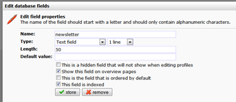

Per databaseveld kan je aangeven of deze moet worden geindexeerd of
niet. Geindexeerde velden zijn sneller doorzoekbaar, waardoor
bijvoorbeeld selecties die hierop zijn gebaseerd sneller kunnen worden
opgebouwd.

Het is echter niet aan te raden om rücksichtslos alle velden in je
database te indexeren; dit zal de performance van je database juist
negatief beinvloeden.

-   Indexeer alleen velden waar je selecties op maakt. Gebruik ze met
    name op de velden die je gebruikt in de selectiecondities *Check op
    veldwaarde*en *Profielen sorteren en selecteren*
-   Indexes werken het beste op numerieke velden.
-   Je kan maximaal 64 velden indexeren per database en per collectie,
    maar nogmaals, beperk het aantal tot wat je *echt*nodig hebt.
-   Een veld van het type 'groot veld' kan niet worden geindexeerd

#### Een veld indexeren

-   Ga naar Databasebeheer \> **Velden bewerken**
-   Klik het veld aan dat je wilt indexeren
-   Selecteer de optie 'Dit veld is geindexeerd' en klik op opslaan

 
