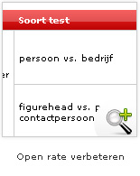
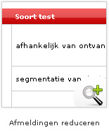
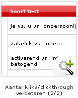

Splitrun- en A/B-tests zijn een effectieve methode om e-mailmarketing te
optimaliseren. Deze tests stellen je in staat om de doelgroep te
verkennen, ROI te verhogen en effectievere [e-mailings te
verzenden](./send-emailings-to-relations.md "E-mailings verzenden").
Zolang de open en clickrate dus niet op 100% staat en je onderbuik zegt
dat er meer in zit, kun je uit elke nieuwe campagne een verbetering
halen door een grotere of kleinere split-run test te doen.

Lijstgrootte
------------

Een split-run test is in feite niets meer dan het maken van twee of meer
versies van een e-mailing, waarbij (bij voorkeur) één factor varieert.
Verzend de testmails naar verschillende delen van je adreslijst om te
kijken wat het beste werkt. Beschik je over een grote relatiedatabase,
zeg +5000, maak dan testgroepen met een percentage van de database en
verzend de meest succesvolle e-mailing aan de rest van de database.

Is het bestand (te) klein, verstuur dan elke versie naar de helft van
het bestand en leer hieruit voor de volgende e-mailing. Of voer
eenzelfde type test een maand lang door op alle e-mailings en analyseer
de resultaten gecombineerd. Herhaald testen maakt de test
betrouwbaarder, ook bij kleine aantallen geadresseerden en meer
variaties.

Doelen van split-run tests
--------------------------

Testen heeft alleen zin als je een doel voor ogen hebt. Hoe bepaal je
anders welk soort test tot resultaat leidt? Denk na wat je wilt
optimaliseren:

-   Meer mensen moeten de e-mails openen
-   Er moet meer geklikt worden op de hyperlinks
-   Er moet meer geklikt worden op een specifieke hyperlink
-   Er moet meer gedeeld worden via [social
    media](./integration-with-social-media.md "Integratie met social media")
-   Minder afmeldingen
-   Etc.

Je ervaring als marketeer en het onderbuikgevoel moeten helpen bepalen
welke split-run test het meest effectief zal zijn. Heb je het idee dat
de onderwerpen te saai zijn, nieuwsbrief te lang, plaatjes te overdadig
of de timing verkeerd? Probeer het dan uit en zet dat gevoel om in
tastbare cijfers.

Tests
-----

Zoals gezegd, verschillende doelen leiden tot verschillende
testmogelijkheden. Doe één test bij elke campagne om erachter te komen
welke factor de meeste invloed heeft op jouw doelen en doelgroep.
Onderstaand schema reikt aan wat voor factoren zoal te testen zijn bij
elke doelstelling, maar uiteraard varieert dit per campagne.

Winnaarsfactor
--------------

Bedenk van tevoren wat het belangrijkste testresultaat is, om te bepalen
welke variant de uiteindelijke winnaar van de split-run is. De
winnaarsfactor kan enkelvoudig zijn, bijvoorbeeld zoveel mogelijk kliks
in de e-mail, of een combinatie van specifieke resultaten. Bijvoorbeeld
als je meer opens wilt, maar de kliks belangrijker vindt. Stel dan een
formule op waarbij de kliks (bijv.) twee keer zo zwaar wegen als de
opens. De hoogste score op deze schaal is de winnaar. Goede software
maakt het je makkelijk om dit soort condities te gebruiken.

### Mogelijke winnaarsfactoren:

-   Totaal aantal opens
-   Totaal aantal kliks
-   Aantal kliks op een specifieke link
-   Conversie (gemeten buiten de e-mail in bijv. websiteconversie,
    verkoop)
-   Minste foutmeldingen
-   Minste afmeldingen

Resultaten van de split-run test
--------------------------------

Door slechts een variabele per test te variëren weet je precies wat de
voorkeur van de doelgroep is. Let op: kijk niet alleen naar 'wat doet
het beter', maar ook naar 'waarom doet die het beter', om zo structureel
de e-mailings te verbeteren.

Soms voeren we split-run tests te gehaast uit. De resultaten wijzen dan
een andere winnaar aan wanneer je de statistieken bekijkt 1 week of 1
maand nadat de test al is afgerond. Het is daarom belangrijk altijd een
redelijke runtijd in acht te nemen. Blijf de strategie controleren.

Daarnaast kunnen de resultaten van de test ook aanleiding zijn om de
doelgroepen te herformuleren. Bekijk resultaten eens op individueel
niveau en je zou bijvoorbeeld kunnen ontdekken dat een specifieke groep
ontvangers een afwijkend effect vertoont. Hebben zij een overeenkomstige
factor? Voeg dit dan toe aan je database en gebruik dit bij een volgende
e-mailing.

Bij elke nieuwe campagne kun je een stap verdergaan in de optimalisatie.
Het is belangrijk dat je blijft kijken waar de meeste winst te behalen
valt en wat voor jouw marketingdoelen de belangrijkste verbetering is.
