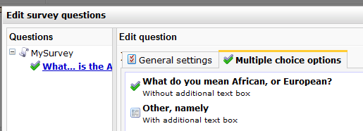
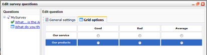

# Enquêtes: Vraag types

Als je een vraag aanmaakt kun je kiezen uit vier verschillende 'vraag' types:
open vraag, multiple choice, grid vraag of tussentekst.

## Tussentekst

Tekst tussen de vragen neemt dezelfde ruimte in als een vraag, maar kan geen 
antwoorden opslaan. Het kan gebruikt worden om een uitleg te geven over een 
vraag of een opdeling te maken tussen onderdelen. Als je slechts toelichting 
wilt geven kun je dit doen in de textbox bij het aanmaken van de vraag.
(Zie [nieuwe enquête maken](./surveys.md))

## Open vraag

Een open vraag geeft de invuller de optie om zelf een antwoord te typen. 
Na het aanmaken van de vraag kun je een aantal lijnen instellen waarop de 
deelnemer zijn antwoord mag typen.

## Multiple-choice vragen

Een multiple choice vraag geeft de deelnemer de mogelijkheid uit een aantal
opties te kiezen. Na het opslaan van de vraag zul je een aantal opties zien.

De multiple choice antwoorden kunnen weergeven worden als **selectielijst**
waardoor de deelnemer uit een lijst kan kiezen. Er is in dit geval maar 
een antwoord toegestaan.
Multiple choice vragen kunnen ook weergeven worden als **selectievakjes** 
die de verschillende opties laat zien met vierkantjes om aan te vinken. 
Meestal kun je bij dit soort vragen meerdere antwoorden kiezen, maar je 
kunt er ook voor kiezen om maar een antwoord toe te laten.

De verschillende opties kunnen in een apart tabje aangemaakt en verplaatst 
worden. Er is ook de mogelijkheid om een deelnemer zelf een antwoord te 
laten typen door een text box toe te voegen bij de multiple choice opties.

*Afbeelding: Multiple choice vraag met een optie en een tekstvak om zelf 
antwoord te geven.*

Om standaard een antwoord aangevinkt te hebben voor de deelnemer kun je 
een \\\* toevoegen aan de optie (voor of na tekst). Dit zal zichtbaar zijn 
in de tekst en het vakje zal vast aangevinkt zijn.

## Grid vragen

Een grid geeft de optie uit meerdere opties te kiezen, meestal in het formaat
van een reeks, zoals slecht/neutraal/goed of 1 /tm 5. Deze vragen zijn erg
geschikt voor beoordelingsformulieren. Na het opslaan van de vraag verschijnen 
er meer opties voor deze vraag.

- Kies of de vraag horizontaal of verticaal wordt weergegeven
- Verticaal betekent dat er maar een antwoord uit elke colom gekozen mag 
worden. Een horizontale vraag laat meerdere antwoorden per rij toe.
- In een apart tabblad kun je de opties en variabeles voor de vraag toevroegen.
Je kunt hier ook de volgorde van de opties aanpassen.

*Afbeelding: Grid vraag met twee rijen en drie kolommen om een rating 
te kunnen geven.*

## Meer informatie

* [Enquêtes](./surveys)
* [Enquêtes vraag opties](./surveys-question-options)
* [Enquêtes aanpassen](./surveys-edit)
