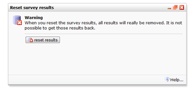

# Enquêtes: Resultaten resetten.

Je kunt om verschillende redenen resultaten willen resetten, bijvoorbeeld 
om test data te verwijderen. 

Om de resultaten te wissen ga je naar het zogenoemde dialoogvenster via 
het **Enquête** menu. Als je de resultaten wilt bewaren en de enquête 
opnieuw wilt gebruiken, [exporteer](./surveys-export-results) de 
resultaten dan voordat je deze wist. Het is ook mogelijk om een kopie te 
maken van de enquête zonder antwoorden.

De software zal je altijd vragen of je zeker weet dat je de data wil 
verwijderen. Wanneer je deze verwijderd hebt is dit definitief.

## Meer informatie

* [Enquêtes](./surveys.md)
* [Resultaten bekijken](./surveys-view-results.md)
* [Resultaten exporteren](./surveys-export-results.md)
