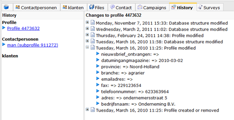

De gegevens van een profiel kunnen regelmatig veranderen. Deze
veranderingen worden opgeslagen vanaf het moment dat het profiel wordt
aangemaakt en zijn inzichtelijk via het tabblad Geschiedenis bij het
profiel.

Dit overzicht kan van pas komen bij het herstellen van verkeerde
wijzigingen, of om selecties te maken op basis van wijzigingen.

Let op, bij het kopieren van een profiel, wordt de profielgeschiedenis
niet meegekopieerd.

