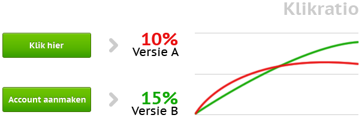

Het is belangrijk net zo lang te sleutelen aan en testen met je e-mails
tot je het ultieme document heb samengesteld. Maar hoe doe je dat bij
een kleine verzendlijst waar splitrunmailings niet zo veel nut hebben?

Bij een kleine verzendlijst, zeg minder dan 5.000 respondenten, heeft
het niet zoveel nut om split-runmailings te versturen. De testgroepen
zijn dan zo klein dat er geen representatieve steekproef kan worden
gemaakt en de resultaten dus niet betrouwbaar zijn.

Maar dat betekent niet dat je met een kleine verzendlijst niet kan
testen.

A/B-test
--------

In de wereld van e-mailmarketing worden splitrun- en A/B-tests vaak in
een adem genoemd. Wat veel mensen niet weten is dat er weldegelijk een
verschil bestaat tussen de twee:

-   Bij een splitrunmailing verstuur je twee versies van dezelfde
    mailing aan een klein deel van je verzendlijst, waarna je de best
    presterende versie verstuurt naar de rest.\
    \
-   Met een A/B-test verstuur je de ene keer versie A, en bijvoorbeeld
    een week later versie B. Aan de hand daarvan bepaal je vervolgens
    welke mailing je vaker inzet.

Zoals gezegd is een splitrun-mailing minder geschikt voor kleinere
verzendlijst, maar een A/B-test is een prima middel om ook voor een
lager aantal ontvangers de juiste versie van je e-mailing te bepalen.

Zorg voor vergelijkbare omstandigheden
--------------------------------------

Als je met een A/B-test de prestaties van twee verschillende e-mailings
met elkaar vergelijkt, is het natuurlijk van belang dat je dit in beide
gevallen onder vergelijkbare omstandigheden doet.

Als je versie A bijvoorbeeld op een maandag verstuurt, en versie B op
een donderdag, kan het ook aan de dag liggen dat de ene beter presteert
dat de andere. Hetzelfde geldt voor het tijdstip van de dag, of het
soort product dat je aanbiedt in je mailing.

### Bekijk ook

-   [Case: Transactionele e-mails: haal meer uit je
    klantcontact](http://www.copernica.com/nl/over-ons/nieuws/transactionele-e-mails-haal-meer-uit-je-klantcontact "Case: Transactionele e-mails: haal meer uit je klantcontact")
-   [Test voor je
    verzendt](http://www.copernica.com/nl/functies/e-mailings/test-voor-je-verzendt "Test voor je verzendt")

